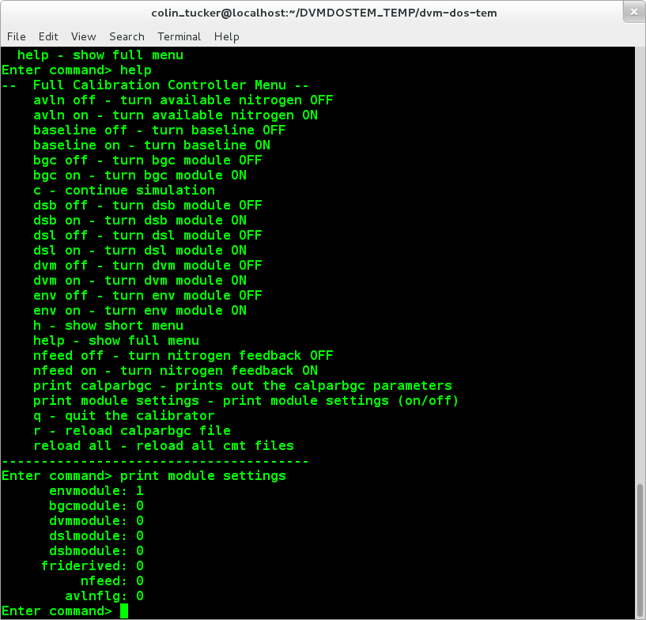
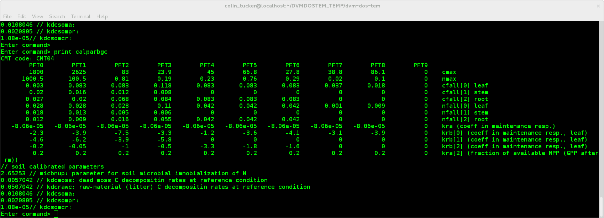

# Using the DVM-DOS-TEM calibrator

In general, here are the steps:

1. Pull latest version from github. 
2. Install correct software. (matplotlib, jsoncpp, readline, other?) 
3. Make some minor edits to the Makefile, and run the env-setup script.
4. Set up all of the configuration files before working with the calibrator: the ecosystem will crash with some of the default values.
5. Set up the correct climate, soil, etc., `.nc` files for the site where you are calibrating.
6. Run the model in calibration mode while running the plotting script in multiple other windows.       

Details for each step are in the sections below.

## Github DVMDOSTEM

1. Pull from UA-SNAP/dvm-dos-tem devel into your local devel branch.
  - (a) `cd ~/dvm-dos-tem`
  - (b) `git remote add upstream git@github.com:ua-snap/dvm-dos-tem`
  - (c) `git checkout –b devel`
  - (d) `git pull –ff-only upstream devel`

2. Push this version into *your* fork on github.
  - (a) `git remote add origin git@github.com:my-github-username/dvm-dos-tem`
  - (b) `git push origin devel`

3. IF you plan to make any edits to the code that you want to save on github, CREATE A NEW BRANCH:
  - (a) `git checkout –b my-new-branch-descriptive-title`

4. After making edits, save (commit) them locally:
  - (a) `git add path/to/files/*  # you can specify one or many files` 
  - (b) `git commit –m “message saying what these commits do."`

5. Push these commits to your personal github repository (fork).
  - (a) `git push origin my-new-branch-descriptive-title`

6. If your changes are awesome and should be shared, issue a pull request into UA-SNAP devel. From there the process for testing and acceptance is a little fuzzy.

## Images for above steps

Overview:


Step 1:


Step 2a:


Step 2b:


Step 3a:



Step 3b:




##Install some extra packages
1. Install python, matplotlib, numpy (for dynamic plotting):
    ```
    sudo yum install python-devel numpy scipy python-matplotlib ipython
    ```

1. Install Boost 1.55. For now this is a manual install (takes awhile):
    ```
    wget –O boost_1_55_0.tar.gz http://sourceforge.net/projects/boost/files/boost/1.55.0/boost_1_55_0.tar.gz/download 
    tar xzvf boost_1_55_0.tar.gz 
    cd boost_1_55_0/ 
    ./bootstrap.sh 
    ./b2 install
    ```
1. Install jsoncpp and readline:
    ```
    sudo yum install jsoncpp-devel readline-devel
    ```

2. Edit the Makefile for these packages (when want the defaults to be for ATLAS, so don’t commit these changes)
   
    ```  
    LIBS=-lnetcdf_c++ -lnetcdf -lpthread -lboost_system -lboost_filesystem \
    -lboost_program_options -lboost_thread -lboost_log -ljsoncpp -lreadline 
    LIBDIR=$(SITE_SPECIFIC_LIBS)
    ```

##Set up configuration files

1. There will be default configuration files for each of the community types in the Alaska Integrated Ecosystem Model on github.These still need to be setup for the forest types, but the formatting is there. PLEASE don’t push your local edits of these files to github, unless you are really sure you should be. It is tedious to track these changes down. Non-AIEM communities should be stored in your own repository. ???

2. These files include all the files in dvm-dos-tem config. To match these with the input data files, CMT 00 = VEGTYPE 0 = VEGID 1.  VEGID is an indexing variable that starts at 1, vegtype and CMT refer to the specific plant communities.

  ```
  0 = blank
  1 = black spruce forest
  2 = white spruce forest
  3 = boreal deciduous forest
  4 = shrub tundra
  5 = tussock tundra
  6 = wet sedge tundra
  7 = heath tundra
  8 = maritime forest
  ```

## Set up environment variables for your local machine

1. Look thru the scripts in the `env-setup-scripts` folder and see if one of the existing scripts might work for you or provide a starting point to create your own custon setup script. For relatively "clean" installations of Fedora, and Ubuntu, it should be possible to just set a few environment variables. Here is an example for Fedora from Colin:
  ```
  echo "Setting up site specific includes..."
  export SITE_SPECIFIC_INCLUDES="-I/home/colin_tucker/boost_1_55_0 -I/usr/include/jsoncpp"
  echo "Setting up site specific libs..."
  export SITE_SPECIFIC_LIBS="-L/home/colin_tucker/boost_1_55_0/stage/lib -L/user/lib64"
  echo "Setting the path for loading libraries..."
  export LD_LIBRARY_PATH="/usr/lib64:/home/colin_tucker/boost_1_55_0/stage/lib:$LD_LIBRARY_PATH" 
  ```
For other systems, the setup may be more complicated and may require a less straightforward setup script.

2. Run your setup script:
  ```
  source setup-env-for-ctucker-Fedora19.sh
  ```

  > NOTE: This needs to be run each time you start the model in a new window.

## Set up input data files

1. You will need to know the site you are calibrating to, because you will need to extract the grid, cohort and climate ids for that site.

2. This will allow you to pull the correct data from the full regional netcdf files, without having to reformat all the files each time.

3. There is an R script that will tell you the correct grid id for you site based on the x and y coordinates of the site (wgs64 decimal degrees). This is currently in `Pre_Post_processing_scripts/SelectSite.R`. This file contains both the R script and the NCOS commands to edit the files. Also, it is for DOSTEM. As is stands, you have to think through this a little bit to make it work for DVM-DOS-TEM.

4. You will need to have R and NCO installed for this, obviously:
`sudo yum install R nco` this should work, actually it probably ends up being more complicated to install nco.  (where are my notes???)

## Set up the target values

1. For now, the target values are being read from `calibration_targets.py`. 

2. Eventually we probably need to be reading these from text file or spreadsheets rather than having python tables.

  > NOTE: There is a start at a function in `calibration_targets.py` that can write Excel workbooks. 

## Run the model in calibration mode

1. (I had to do some branch management on the fly this morning, so some of this stuff is not current on github, sorry)

2. The calibrator relies on having multiple terminals open while running the model, one for each suite of outputs * each pft being observed.  These can be opened and closed at what ever time and all prior data for the current run will be plotted.

3. The command line arguments are very well documented, just use the `-–help` flag to see a menu.

4. The default module settings should be as follows:
  - 1st 100 years – env module only
  - Press continue
  - env and bgc modules only

  The dvm, dsb and nfeed/avln modules can be turned on dynamically as calibration proceeds.

5. The calibrated parameter file (calparbgc) is manipulated directly during the calibration process.  Save yourself a headache by saving a master copy, and then saving a descriptively named copy at key steps in the calibration process.

### Example: Calibrating shrub tundra with no disturbance.

1. Open several terminals, 1 for each pft, 1 for soil, 1 for running the model. Also open cmt_calparbgc.txt

2. Start the python plotting script for each pft and soil in separate terminals.  Use ./Expandingwindow.py --help for menu.

3. Start the model. Remember to set –calibrationmode=on

4. Press ‘c’ to continue.

5. It is good at this point to press crtl+C (pause) right away to check the all the settings are correct. 
  - print module settings will show which modules are on or off.
  - print calparbgc will show the current values of the calibrated parameters.
  - help will explain everything.

6. Calibrate Cmax and Krb as described elsewhere.  This can be done coarsely at first for all pfts. 
  - To calibrate, pause the model using crtl+c
  - edit the parameters in cmt_calparbgc.txt, save the file
  - press r (reload) in the model terminal
  - press c (continue) in the model terminal

7. Turn dvm on, calibrate cmax and krb more precisely.
8. Increase Nuptake higher than you expect it to be.
9. Turn nfeed on and avln on.
10. Calibrate N cycle.


