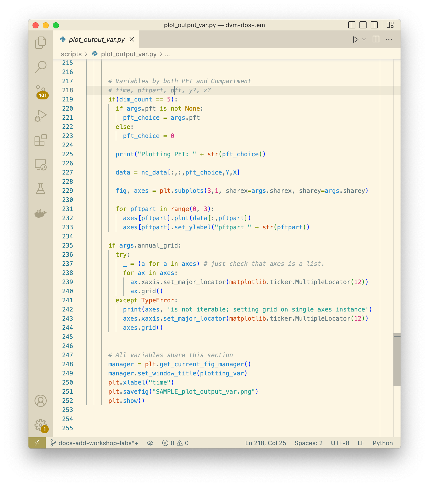
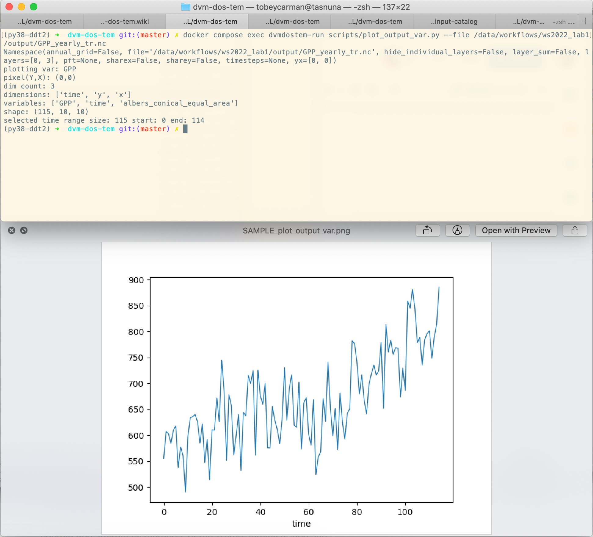
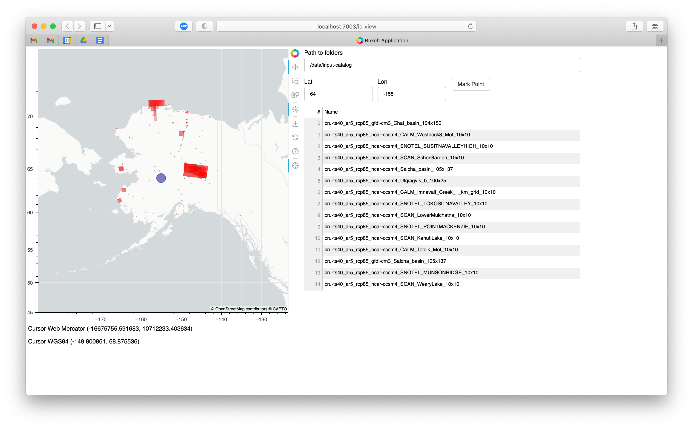
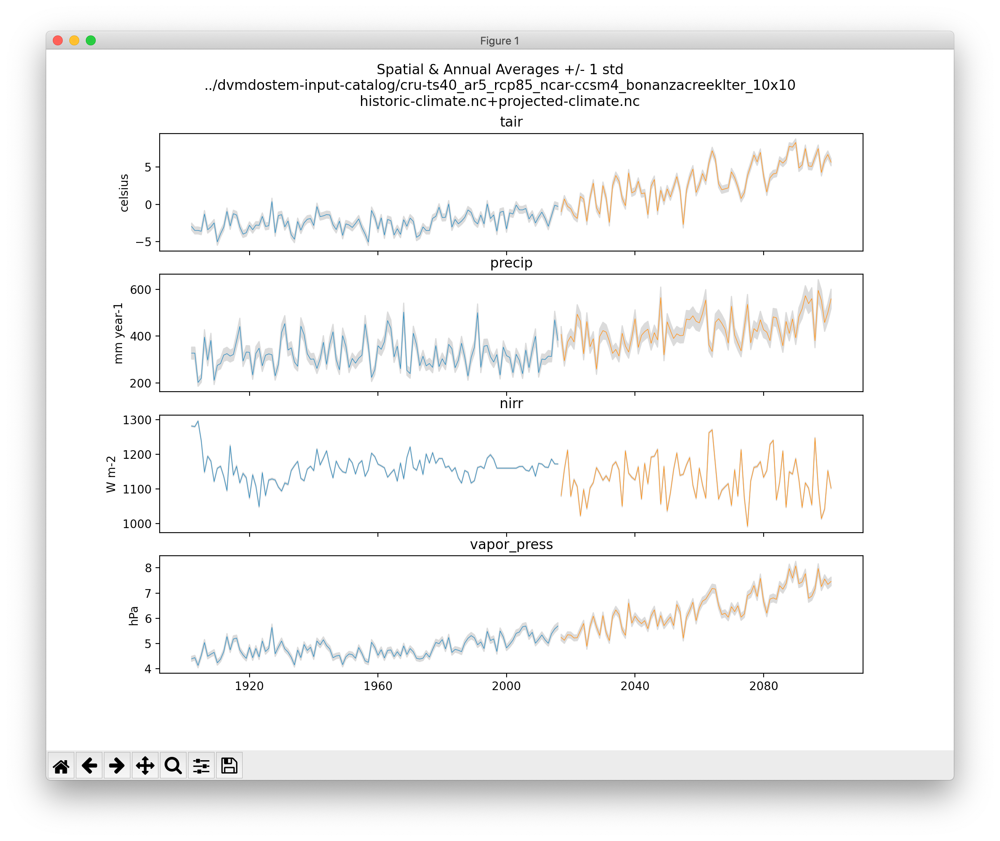

.. # with overline, for parts
  * with overline, for chapters
  =, for sections
  -, for subsections
  ^, for subsubsections
  ", for paragraphs

################
Plotting
################

Plotting is a natural and essential step in the modeling process. The use-cases
and limitations are numerous and there is not a single silver bullet plotting
solution that is sure to work for you.

For more general information on the different approaches to plotting, please see
the :ref:`Prelude - Plotting and Graphical Outputs<prelude:Plotting and
Graphical Outputs>` section.

**********************************
Existing Tools and Patterns
**********************************

(As of Jan 2023)

  - There is lots of existing code in the project's ``scripts/`` directory.

    - The assumption is generally that you are able to display interactive
      windows (Xquartz, X11, Xwindows, native windowing environment, etc).

    - The ``scripts/`` directory is getting messy; we are planning to re-factor
      and re-organize soon!

  - By default it is difficult to display the traditional ``matplotlib``
    interactive window from inside a Docker container, see warning here: `docker
    interactive plotting`_ .

    - Many of the existing scripts have command line options allowing you to
      save to static files.

      - When these options are not present, it is usually easy to adjust the
        code slightly to achieve this (i.e. ``plt.show(...)`` ->
        ``plt.savefig(..)``)

        Frequently the largest inconveniene here is that it creates friction
        with the version control as you have to maintain a growing list of small
        changes to paths, file names, etc.

  - There are several IPython (Jupyter) Notebooks lingering in the ``scripts/``
    directory. While the project has used Notebooks on occasion, in general we
    prefer to avoid them for the following reasons:
    
    - The notebook format is very challenging to work with in a version
      controlled environment.
 
    - Notebooks can produce ambiguous or unrepeatable outputs due to the ability
      to execute cells out of order.

Details
==========
There are several plotting tools buried in the ``scripts/`` directory but none
of them are particularly polished or fine tuned. Many, but not all, of the
scripts have decent info with the ``--help`` flag. There is not a consistent
pattern for whether plots are saved or shown in an interactive window, and in
the cases where the plots are saved, the file names are not standardized. In
other words, as a user, you will likely need to look at the script code to
determine whether your plot will be displayed or saved. For example, looking at
script ``plot_output_var.py`` with a text editor, approximately lines 250-252,
we can see that in fact both ``plt.savefig()`` and ``plt.show()`` are being
called. 

This actually works nicely because when the command is run on the Docker
container, the ``plt.show()`` call is essentially ignored and the resulting plot
is saved to a file. The name of the saved plot is not currently configurable, so
it would be up to the user to rename the file and move it somewhere appropriate.

Also note that there is a script, ``util/output.py``, that is designed to be
imported into other Python scripts and has a bunch of functions for summarizing
variables over various dimensions (layers, pfts, etc).

The existing plotting tools rely on a variety of specific Python libraries, and
not everything has been tested with the versions specified in the
``requirements.txt`` file, so you might encounter small issues with the scripts
that have to be resolved before they will run. Frequently this is just a matter
of updating deprecated function calls for libraries like ``matplotlib`` or
``pandas`` that have been changed since we first wrote the plotting tools.
Please submit a Github pull request if you encounter and fix any of these
issues!

While all of the existing plotting tools are written in Python, users are free
(and encouraged!) to write their own plotting tools using whatever language they
prefer. We have made a lot of effort to make our outputs conform to the `CF
Conventions`_, especially with respect to the time dimensions, data units, and
geo-referencing. The output files are generally viewable at a basic level using
standard tools like `ncview`_ as well.

.. _docker interactive plotting:
.. warning::

  Working with Docker provides advantages for standardizing the Python
  environment and folder structure amongst developers, but provides one
  significant hurdle for plotting: it is difficult to display the standard
  Matplotlib interactive plotting window due to the need for the XWindows system
  to be installed on your host computer and the ``DISPLAY`` environment variable
  to be set correctly. Typically when plotting with ``matplotlib`` natively on
  your computer, when you run ``plt.show(...)`` you are presented with a window
  showing the plot and including some panning and zooming controls. From inside
  a Docker container this will not work - nothing will show up and you may get
  error messages.

  There several possible solutions/workarounds we have discovered:

  #. Avoid using ``plt.show(...)`` and instead modify plotting scripts to use
     ``plt.savefig(...)``.

  #. Install XWindows on the host system, Python TKinter inside Docker container
     and set the ``DISPLAY`` environment variable appropriately when executing
     commands in Docker container. See more info here:
     https://stackoverflow.com/questions/46018102/how-can-i-use-matplotlib-pyplot-in-a-docker-container.
  #. Run a Jupyter Notebook Server inside the Docker container and do plotting
     inline in Jupyter Notebook.
  #. Run a Bokeh Server inside the Docker container and do plotting with Bokeh.
  #. Perform plotting and analysis on your host system.

  Plotting using the Docker runtime is helpful because you are saved from having
  to setup and manage the requsite Python environment. On the flip side,
  plotting directly on your host sytem allows you to create exactly the
  environment you need (but you will have to maintain it as well).

Off the Shelf Tools
======================

 - ``ncview`` https://cirrus.ucsd.edu/ncview/
 - ``panlopy`` https://www.giss.nasa.gov/tools/panoply/
 - Paraview ??

***************************
General Process
***************************

 - Difficult to write re-usable code, sometimes even for yourself...always
   starts simple, then you end up 

 * start in REPL
 * move to notebook
 * Factor code out to script
 * go back to REPL, but using script/functions you just made

********************
Example Plots
********************

Following are bunch of examples showing how you might plot and interact with 
``dvmdostem`` related data.

Basic 1 pixel time-series
==========================
One of the easiest things we might want to look at is a time series plot of GPP
for a single pixel in a run. This can easily be done with ``ncview``, but you
will almost certainly encounter the problems described in the note about Docker
and interactive plotting `docker interactive plotting`_. If you run ``ncview``
on your host machine (from which the output files should be accessible thanks to
the Docker volume), you will see something like this:

.. image:: ../images/examples_and_tutorials/plotting_discussion/ncview.png
  :width: 600
  :alt: example ncview

Note that while the ``ncview`` interface appears a bit antiquated, it is an
extremely functional program that allows exploration of NetCDF files.

We can create a very similar plot to the ``ncview`` plot using our
``plot_output_var.py`` script, for example. Notice that we have used the Docker
one-off style of command here, and that we are viewing the saved file after the
script has exited. For more info on the different ways to interact with Docker,
see :ref:`Note on Docker commands <two-ways-to-run-docker-commands>` and the
:ref:`Prelude - Docker<prelude:Docker>` sections.

Interactive map of inputs using Bokeh
=======================================

The most robust example of using the web server and interactive browser plotting
is in the ``io_view.py`` script.

As the tooling has become more robust for this approach, it is becoming more
attractive. Some of the advantages are:

 - interactivity,
 - rich javascript front-end tools,
 - ubiquity of web browsers, and
 - decoupling of plot generation computing environment and display environment.
 
The final point is particularly helpful in a Docker environment or when working
on a remote computer via only the console. It is even possible, using an ``ssh
tunnel`` to view pages that are generated on a computer behind a firewall that
are not typically web-accessible.

The concept is as follows:

 - On the computing environment where you have the data and can generate plots,
   start a web-server that is running your plotting application.
 - From the computing environment where you have a web-browser, make requests to
   the server application started above.

Then access the web browser which should display the plots.

The challenge to this approach mainly lie in debugging and understanding the
source of errors when things don't work. Not only do you have the plotting code
to think about, but you also must be cognizant of the networking and the
web-server.

Starting the server
--------------------

.. code:: 

  $ docker compose exec dvmdostem-mapping-support bash

  $ develop@0c903d0c11e8:/work$ bokeh serve scripts/io_view.py --port 7003
  2023-02-08 01:29:58,134 Starting Bokeh server version 3.0.3 (running on Tornado 6.1)
  2023-02-08 01:29:58,333 User authentication hooks NOT provided (default user enabled)
  2023-02-08 01:29:58,336 Bokeh app running at: http://localhost:7003/io_view
  2023-02-08 01:29:58,336 Starting Bokeh server with process id: 283
  BokehDeprecationWarning: tile_providers module was deprecated in Bokeh 3.0.0 and will be removed, use add_tile directly instead.
  Looking in the following folders for datasets to map:
  []
  feature_collection: <class 'dict'>
  feature collecton bounds in wgs84:  [0. 0. 0. 0.]
  feature collection bounds in web mercator:  [0. 0. 0. 0.]
  2023-02-08 01:30:01,012 W-1005 (FIXED_SIZING_MODE): 'fixed' sizing mode requires width and height to be set: Row(id='p1111', ...)
  2023-02-08 01:30:01,013 W-1005 (FIXED_SIZING_MODE): 'fixed' sizing mode requires width and height to be set: TextInput(id='p1062', ...)
  ...
  ... 

View in your browser
----------------------

This application is designed to plot ``dvmdostem`` input datasets on a map so
that you can see where a given site is. This is useful for deciding what input
set to use as well as double checking the input preparation process. There are
some additional helper features:
 
 * Input boxes where you can enter coordinates and display a mark on the map.
 * Crosshairs and coordinate display in WGS84 and Web Mercator coordinate
   systems.
 * A table that shows the names of all the displayed input datasets.

  
Plot Driving Inputs
========================

This plot shows the data for an input dataset, summarized over the spatial
dimensions and for the full time-series. In this example, the historic and
projected time-series are stitched together.

.. code:: 

  ./scripts/util/input.py climate-ts-plot \
    --type spatial-temporal-summary \
    --yx 0 0 --stitch \
    ../dvmdostem-input-catalog/cru-ts40_ar5_rcp85_ncar-ccsm4_bonanzacreeklter_10x10

.. _ncview: https://cirrus.ucsd.edu/ncview/ 
.. _CF Conventions: https://cfconventions.org/