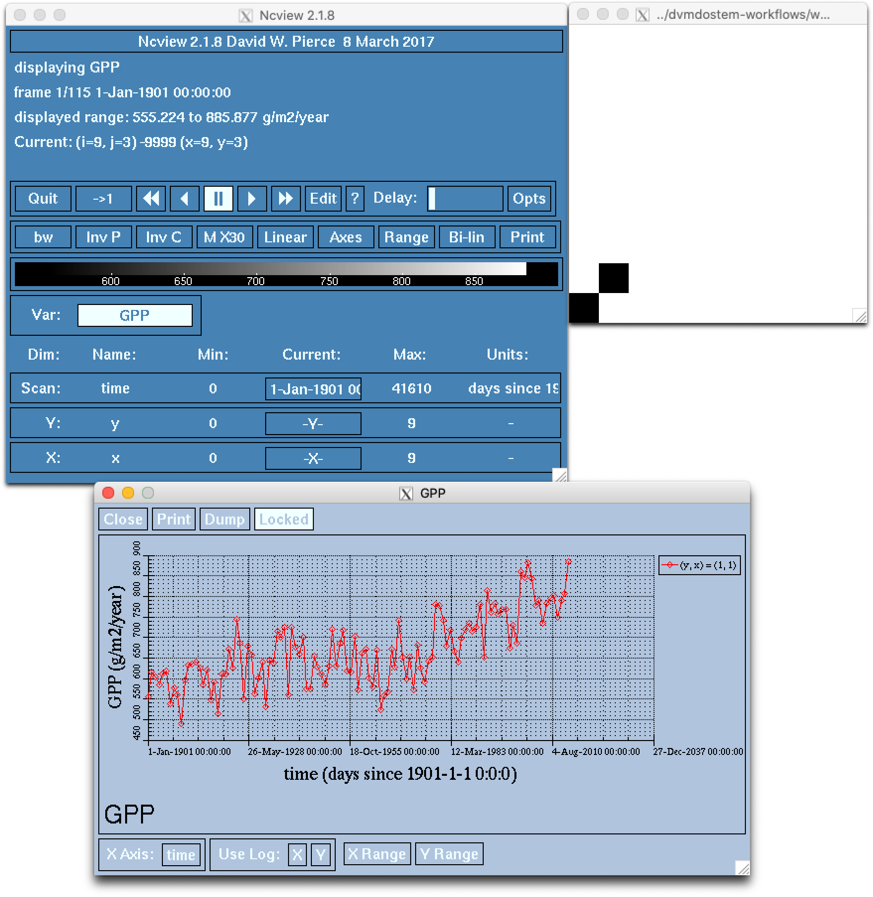

.. # with overline, for parts
   * with overline, for chapters
   =, for sections
   -, for subsections
   ^, for subsubsections
   ", for paragraphs

##################
Plotting 
##################

Plotting is a natural and essential step in the modelling process. There use
-cases and limitations are numerous and there is not a single silver bullet
plotting solution that is sure to work for you.

When working on or with plotting code, it is helpful to remember that problems
can arise in two overlapping spheres: *capability* and *environment*.

*Capability* refers to whether or not the analysis and visualisation you seek are
implemented in the code you are working with.

*Environment* referes to whether the computing environment(s) you work with have
the appropriate hardware, software, tools, etc to carry out the capabilities of
the code you are working with.

These concerns are sometimes totally distinct and sometimes arise in conflict
with each other. Ideally code is written to work with a wide variety of
environments as this makes it easier for other people to use the code in their
circumstances.

*****************************
Data summary and preparation
*****************************

Frequently a first step, before plotting, is to summarize the output data and or
reduce the dimensions. There are many ways to accomplish this and like the
plotting, there is no single silver bullet solution.

NetCDF Operators (NCOs)
========================

The NetCDF Operators (NCOs) are suite of command-line tools that can efficiently
manipulate well-formed NetCDF datasets (e.g. compute statistics, concatenate,
edit metadata, compression) and produce outputs or display results to your
console. To our knowledge, NCOs are among the most efficient tools to manipulate
large NetCDF files. You’ll  find a full description of the dozen existing
operators in the nco user guide (https://nco.sourceforge.net/#RTFM). If you have
questions on how to use an operator that is not addressed in the user guide, you
can post them on the nco help forum:
https://sourceforge.net/p/nco/discussion/9830. 

Collected here are a few examples that show some of the capabilities. The
examples here are far from exhaustive. If you encounter or develop a useful
solution that you'd like to see here, plese send us a Pull Request!

Subset netcdf files by dimensions
-----------------------------------

Example: we want to subset the last 10 years of an annual historical simulations
115 years long.

.. collapse:: ncks

  The flag ``-O`` will overwrite any existing output file. The flag ``-h`` will
  not include this command in the global attribute of the output file to
  document the history of its creation.

  .. code::

      $ ncks -O -h -d time,104,114,1 input.nc output.nc

  .. note::

    Caution: As in python, the indexing in nco starts at zero. So the index of
    the 115th time step is actually 114. 
  

.. collapse:: python.netCDF4

  .. code:: 

    >>> import netCDF4 as nc
    >>> ds = nc.Dataset('GPP_yearly_tr.nc')
    >>> last_10yrs = ds.variables['GPP'][-10:,:,:]

Display variable values to terminal
-------------------------------------

Example: we want to display the annual active layer depth (ALD) values for upper left corner pixel of a regional run.

.. code:: 

    $ ncks -d x,0 -d y,0 -v ALD input.nc

If you are not sure about the names of the dimensions and variables, you can
always display the files structure using ncdump as described below.

Compute sum, average and standard deviation across dimensions
--------------------------------------------------------------

Example: Model simulations produced monthly GPP time series partitioned by plant
functional types and compartments. We now want to compute GPP at the community
level by summing across plant functional types (dimension named pft) and
compartments  (dimensions named pftpart).

.. code::

    $ ncwa -O -h -v GPP -a pftpart, pft -y ttl input.nc output.nc

This command will produce sums of  GPP across two dimensions listed after the ``-a``
flag. The variable to be summed is specified after the flag ``-v``.  Finally, the
flag ``-y`` is used to indicate the type of operation to be done.

Computations can also be done across a subset of the data. For instance the
following command will compute the annual mean temperature for the months of
June, July and August. To do so, you will need to make the time dimension as
unlimited, as it is done with the ``ncks`` operator.

.. code::

    $ ncks -O -h --mk_rec_dmn time input.nc input1.nc
    $ ncra --mro -O -d time,5,,12,3 -y avg -v tair input1.nc output.nc

The ``-d`` flag indicate which dimension should the computation be done across.
The indices following the dimension name indicate how to group and subset the
dataset. The first index indicate where to start the operation (i.e. the month
of June of the first year). The second indicate where to end the operation
(nothing indicated means that the operation should be conducted across the
entire time series). The third index indicate how to group the data (i.e. 12
months chunks for yearly computations). Finally, the fifth index indicate the
number of time step to do the operation for for every group (i.e. 3 months, from
June to August). The ``-v`` flag indicate what variable to use for the operation.
The ``-y`` flag indicate what type of operation to conduct. The option ``--mro``
instructs ncra to output its results for each sub-group (in that case, each
year).

Append files of same dimensions
-------------------------------
``dvmdostem`` output variables are stored in single files. To append multiple
variables from the same simulation in a single file, you can use the following
command. 

.. code::

    $ ncks -A -h file1.nc file2.ncs

The ``-A`` flag indicate that the output file (file2.nc in this case), should
append (vs overwrite) data. Caution: the files need to be the same exact
structure (the dimensions in common between files should have the same length,
name and attributes). The data in file1.nc will be appended to file2.nc. This
command processes files twice at a time.

Operations with multiple variables
-----------------------------------
Example: model simulations produced annual thickness of the fibric and the humic
horizons (namely SHLWDZ and DEEPDZ) of the organic layer and you want to compute
the total organic layer thickness (OLDZ)

.. code::

    $ ncks -A -h SHLWDZ.nc DEEPDZ.nc
    $ ncap2 -O -h -s 'OLDZ = DEEPDZ + SHLWDZ' DEEPDZ.nc OLDZ.nc

The first command append the two variables in a single file. The second command
is the arithmetic processor, accepting short scripts to create new variables. In
this case, we create the variable OLDZ as the sum of two existing DEEPDZ and
SHLWDZ.

Concatenate files along the record dimension
----------------------------------------------
Whole model simulations consist of a succession of runs, i.e. pre-run,
equilibrium, spin-up, transient (i.e. historical) and scenario. For analysis
purposes, you may wat to concatenate the historical ad scenario runs into a
single file. To do so, you will need to make the time dimension as unlimited, so
additional records can be added to it, before you can do the concatenation.

$ ncks -O -h --mk_rec_dmn time input1.nc output1.nc
$ ncks -O -h --mk_rec_dmn time input2.nc output2.nc
$ ncrcat -O -h output1.nc output2.nc output.nc

Unidata tools, ``ncdump`` and ``nccopy``
=========================================

Unidata also provides several very useful command-line utilities to manipulate
NetCDF files. 

``ncdump`` to explore a netcdf file structure. This command will list the
dimensions, variables and metadata of a file. The ``-h`` specify to only display
headers.

.. code:: 

    $ ncdump -h input.nc

This command will list the dimensions, variables and metadata of a file AND the
values for the coordinate variables. 	

.. code::

    $ ncdump -c input.nc

Compress NetCDF files using ``nccopy``. This will copy and compress a netcdf
file without loss of data.

.. code::

    $ nccopy -u -d1 input.nc output.nc This command

 
Additional examples of file manipulation using nco can be found here
(http://research.jisao.washington.edu/data_sets/nco/). 

***********************************
Existing Tools, Code and Patterns
***********************************

 - existing code in the scripts directory 

  - assumption is generally that you can display interactive windows (Xquartz,
    X11, Xwindows, native windowing environment, etc)

  - directory is getting messy - need to re-factor in to some better patterns
    (i.e. move tests, move stuff into sub-directories) - means figuring
    out/understanding implicaitons with respect to packaging and ``import``

 - sometimes options exist to save to static files 

  - usually it is easy to adjust the code slightly to achieve this (i.e.
    ``plt.show(...)`` -> ``plt.savefig(..)``) - problems with version control
    when you have constant small customizaitons, i.e. file naming, or paths

 - table of existing tools columns: name, CLI implemented?, tests?, save?, show?

 - Notebooks

  - problems with version control

  - problems with out of order execution

***************************
Approches using webserver
***************************

This approach gets around the issue of needing a windowing system by using a
web-browser for display, and a web-server for generating the visualization. In
addition to de-coupling the generation and display conerns, this approach allows
for networking and enables plotting using and Docker container run-time or any
other network-accessible run-time!

Bokeh
=================
This is the current preferred approach - or rather the only approach that has
been tried in any significant capacity.

Other options
=================

 - RStudio, plotly, notebook server

********************
Third party tools
********************

 - ``ncview`` https://cirrus.ucsd.edu/ncview/
 - ``panlopy`` https://www.giss.nasa.gov/tools/panoply/

......................

*****************
Plotting outputs
*****************

There are several plotting tools buried in the ``scripts/`` directory but none
of them are particularly polished or fine tuned. Many, but not all, of the
scripts have decent info with the ``--help`` flag. There is not a consistent
pattern for whether plots are saved or shown in an interactive window, and in
the cases where the plots are saved, the file names are not standardized. In
other words, as a user, you will likely need to look at the script code to
determine whether your plot will be displayed or saved. For example, looking at
script ``plot_output_var.py`` with a text editor, approximately lines 250-252,
we can see that in fact both ``plt.savefig()`` and ``plt.show()`` are being
called. 

.. image:: ../images/workshop_march_2022/lab1/plot_output_var.png
   :width: 600
   :alt: plot_output_var script

This actually works nicely because when the command is run on the Docker
container, the ``plt.show()`` call is essentially ignored and the resulting plot
is saved to a file. The name of the saved plot is not currently configurable, so
it would be up to the user to rename the file and move it somewhere appropriate.

Also note that there is a script, ``output_utils.py``, that is designed to be
imported into other Python scripts and has a bunch of functions for summarizing
variables over various dimensions (layers, pfts, etc).

The existing plotting tools rely on a variety of specific Python libraries, and
not everything has been tested with the versions specified in the
``requirements.txt`` file, so you might encounter small issues with the scripts
that have to be resolved before they will run. Frequently this is just a matter
of updating deprecated function calls for libraries like ``matplotlib`` or
``pandas`` that have been changed since we first wrote the plotting tools.
Please submit a Github pull request if you encounter and fix any of these
issues!

While all of the existing plotting tools are written in Python, users are free
(and encouraged!) to write their own plotting tools using whatever language they
prefer. We have made a lot of effort to make our outputs conform to the `CF
Conventions`_, especially with respect to the time dimensions, data units, and
geo-referencing. The output files are generally viewable at a basic level using
standard tools like `ncview`_ as well.

.. _docker interactive plotting:
.. note::

  Working with Docker provides advantages for standardizing the Python
  environment and folder structure amongst developers, but provides one
  significant hurdle for plotting: it is difficult to display the standard
  Matplotlib interactive plotting window due to the need for the XWindows system
  to be installed on your host computer and the ``DISPLAY`` environment variable to
  be set correctly. Typically when plotting with ``matplotlib`` natively on your
  computer, when you run ``plt.show(...)`` you are presented with a window showing
  the plot and including some panning and zooming controls. From inside a Docker
  container this will not work - nothing will show up and you may get error
  messages.

  There several possible solutions/workarounds we have discovered:

  #. Avoid using ``plt.show(...)`` and instead modify plotting scripts to use
     ``plt.savefig(...)``.

  #. Install XWindows on the host system, Python TKinter inside Docker container
     and set the ``DISPLAY`` environment variable appropriately when executing
     commands in Docker container. See more info here:
     https://stackoverflow.com/questions/46018102/how-can-i-use-matplotlib-pyplot-in-a-docker-container.
  #. Run a Jupyter Notebook Server inside the Docker container and do plotting
     inline in Jupyter Notebook.
  #. Perform plotting and analysis on your host system.

Before we get to plotting we should first review the outputs that we have
specified for this model run and look at the files that were created. During the
setup, we requested three variables, GPP, RH and VEGC. We requested GPP and RH
at yearly resolution, and VEGC at monthly and PFT resolution. We also indicated
that we did not want output for the equilibrium stage, but we did want output
for all other run stages. We can easily verify these settings by looking at the
``config.js`` file for the run and using the ``--summary`` option for
``outspec_utils.py``, which you are encouraged to do on your own.

We can start by looking at the output files that were created by our run:

.. code:: bash

  $ docker compose exec dvmdostem-dev ls /data/workflows/ws2022_lab1/output
  GPP_yearly_sc.nc  RH_yearly_sp.nc     VEGC_monthly_tr.nc  restart-sp.nc
  GPP_yearly_sp.nc  RH_yearly_tr.nc     restart-eq.nc	  restart-tr.nc
  GPP_yearly_tr.nc  VEGC_monthly_sc.nc  restart-pr.nc	  run_status.nc
  RH_yearly_sc.nc   VEGC_monthly_sp.nc  restart-sc.nc

You can ignore the ``restart-*.nc`` files - these files help the model transition
from one stage to the next. And we can see that we have three files for each
variable - one file for each run-stage. If we inspect the GPP file we can see
that there is a single data variable (GPP), the dimensions are (time, y, x), and
the length of the time dimension is 25 which corresponds to the number of spinup
years we ran for.

.. code::bash

  $ docker compose exec dvmdostem-dev ncdump -h /data/workflows/ws2022_lab1/output/GPP_yearly_sp.nc 
  netcdf GPP_yearly_sp {
  dimensions:
    time = 25 ;
    y = 10 ;
    x = 10 ;
  variables:
    double GPP(time, y, x) ;
      GPP:units = "g/m2/year" ;
      GPP:long_name = "GPP" ;
      GPP:_FillValue = -9999. ;
  ...

One of the easiest things we might want to look at is a time series plot of GPP
for one of the pixels we ran. This can easily be done with ncview, but you will
almost certainly encounter the problems described in the note about Docker and
interactive plotting `docker interactive plotting`_. If you run ``ncview`` on
your host machine (from which the output files should be accessible thanks to
the Docker volume), you will see something like this:

Note that while the ncview interface appears a bit antiquated, it is an
extremely functional program that allows exploration of NetCDF files.

We can create a very similar plot to the ``ncview`` plot using our
``plot_output_var.py`` script, for example. Notice that we have used the one-off
style of command here, and that we are viewing the saved file after the script
has exited. 

.. image:: ../images/workshop_march_2022/lab1/plot_output_var_example.png
  :width: 600
  :alt: example output plot

