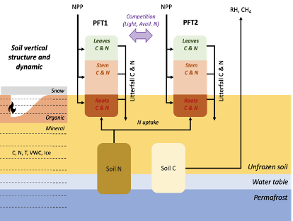

Welcome to ``dvmdostem``'s documentation!
==========================================

.. note::
     This project is under active development.
  
DVM-DOS-TEM is a process-based biosphere model, designed to simulate biophysical
and biogeochemical processes between the soil, the vegetation and the
atmosphere. The model is spatially explicit and focuses on representing carbon
and nitrogen cycles in high latitude ecosystems and how they are affected at
seasonal (i.e. monthly) to centennial scales by climate, disturbances and
biophysical processes such as permafrost, soil thermal and hydrological regimes,
snow cover or canopy development.

The code is available on Github: https://github.com/uaf-arctic-eco-modeling/dvm-dos-tem

.. note:: What’s with the name?
   DVM-DOS-TEM is the acronym for the Terrestrial Ecosystem Model (TEM) with
   Dynamic Vegetation Model (DVM) and Dynamic Organic Soil Model (DOS).
   Sometimes we write dvmdostem, sometimes we write dvm-dos-tem and sometimes we
   write DVM-DOS-TEM. These are all the same thing. The order is always the
   same, but sometimes we use capitals and sometimes lower case, sometimes with
   hyphens and sometimes without. This is a fluke of history. In some cases it
   looks better capitalized, sometimes it looks better lower case. The
   repository ended up with hyphens in the name, but the compiled binary
   executable does not have hyphens.

.. toctree::
   :maxdepth: 5
   :caption: Contents
   :numbered: 3
   
   model_overview
   running_dvmdostem
   software_development_info
   SA_UQ
   command_cheat_sheet
   common_acronyms
   calibration

.. toctree::
    :maxdepth: 5
    :numbered: 3
    :caption: Examples and Tutorials

    prelude
    examples_and_tutorials/basic_model_run
    examples_and_tutorials/example_experiment_0
    examples_and_tutorials/data_summary_processing
    examples_and_tutorials/plotting_discussion
    examples_and_tutorials/make_contribution
    examples_and_tutorials/using_github_features

.. toctree::
    :maxdepth: 5
    :caption: Python Scripts API

    scripts_API

.. scripts
.. modules

..  
  Indices and tables
  ==================

  * :ref:`genindex`
  * :ref:`modindex`
  * :ref:`search``vv
