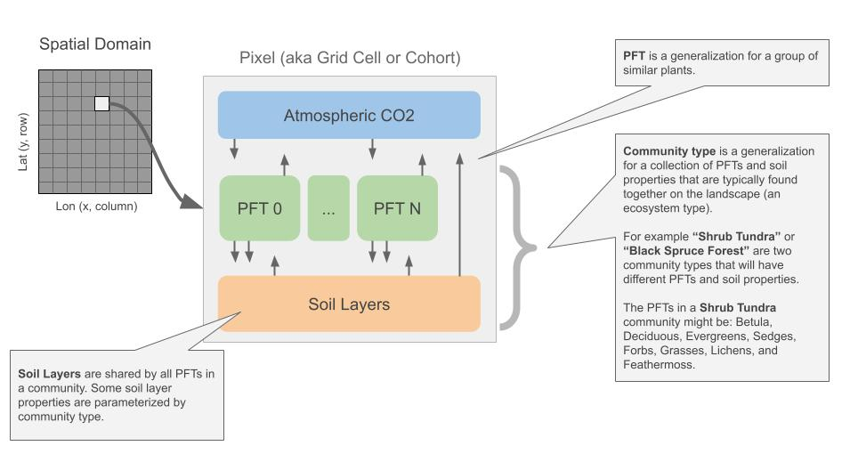

.. # with overline, for parts
   * with overline, for chapters
   =, for sections
   -, for subsections
   ^, for subsubsections
   ", for paragraphs

##############
Model Overview
##############

`DVMDOSTEM` is designed to simulate the key biophysical and biogeochemical
processes between the soil, the vegetation and the atmosphere. The evolution and
refinement of `DVMDOSTEM` have been shaped by extensive research programs and
applications both in permafrost and non-permafrost regions
(:cite:p:`genet2013modeling`; :cite:p:`genet2018role`;
:cite:p:`jafarov2013effects`; :cite:p:`yi2010dynamic`;
:cite:p:`yi2009interactions`; :cite:p:`euskirchen2022assessing`;
:cite:p:`briones2024exploring`). The model is spatially explicit and represents
ecosystem response to climate and disturbances at seasonal (i.e. monthly) to
centennial scales. The snow and soil columns are split into a dynamic number of
layers to represent their impact on thermal and hydrological dynamics and the
consequences for soil C and N dynamics. Vegetation composition is modeled using
community types (CMTs), each of which consists of multiple plant functional
types (PFTs - groups of species sharing similar ecological traits). This
structure allows the model to represent the effect of competition for light,
water and nutrients on vegetation composition :cite:p:`euskirchen2009changes`,
as well as the role of nutrient limitation on permafrost ecosystem dynamics,
with coupling between C and N cycles (:cite:p:`mcguire1992interactions`;
:cite:p:`euskirchen2009changes`). Finally, the model represents the effects of
wildfire in order to evaluate the role of climate-driven fire intensification on
ecosystem structure and function(:cite:p:`yi2010dynamic`;
:cite:p:`genet2013modeling`). The structure of `DVMDOSTEM` is represented
visually in :numref:`Fig. %s <modeloverview>` .

.. See shared drive, "Documentation Embed Images > dvmdostem-overview"
.. figure:: images/dvmdostem-overview-export_2024-08-19.jpg
    :name:  modeloverview
    :alt: Visual overview of DVMDOSTEM.

    Overview of `DVMDOSTEM` soil and vegetation structure. On the left is the
    soil structure showing the layers and different properties that are tracked
    (purple bubble: carbon (C), nitrogen (N), temperature (T), volumetric water
    content (VWC), ice). Each of the layers with properties described above is
    also categorized as organic (fibric or humic) or mineral. Additionally, the
    model simulates snow layers and the removal of soil organic layers due to
    fire. On the right is the vegetation structure showing plant functional
    types (PFTs) within a community type (CMT) and the associated pools and
    fluxes of C and N. Each PFT is split into compartments (leaf, stem and root)
    which track their own C and N content and associated fluxes. The fluxes are
    represented with red text while the pools are black. In addition, there is
    competition among the PFTs for light, water, and available N, shown with the
    purple arrow in the top center.

*********
Structure
*********

`DVMDOSTEM` is multi-dimensional. It operates across spatial and temporal 
dimensions, soil layers, and plant functional types.

.. See shared drive "Documentation Embed Images > dvmdostem-general-pixel"

    DVMDOSTEM is a spatially explicit. The base unit of computation is a pixel.
    There pixels are laid out in a grid. Each pixel is run based on the status
    of a run mask, which is one of the required input files. Each pixel is
    parameterized for both soil and vegetation properties. Together the
    parameterizaton values define a Community Type (CMT). Each pixel is modeled
    using Plant Functional Types (PFTs) and a layer stack for soil and snow.

=======
Spatial
=======
`DVMDOSTEM` can be applied at the site level or across large regions. Spatially,
`DVMDOSTEM` breaks up the landscape into grid cells, each of which is
characterized by a set of input forcing and parameterization values. Gridded
parameterization values describe soil and vegetation characteristics associated
with each Community Type (CMT). `DVMDOSTEM` does not include the lateral
transfer of information between grid cells. The CMT classification for each grid
cell is static across the time dimension of a model simulation. These two
factors limit the ability of the model to represent climate-driven biome shifts
or succession trajectories from disturbances such as wildfire
:cite:p:`johnstone2010changes`. Design discussions are in progress for adding
these capabilities to `DVMDOSTEM`.

`DVMDOSTEM` itself is agnostic to the spatial resolution - the resolution is
controlled by the input files provided. Recent work has been done with 1km
spatial resolution.

========
Temporal
========

`DVMDOSTEM` is a temporal model: a run consists of executing the ecologic
processes through consecutive time-steps. Much of the modeling is occurring at 
a monthly time step, although some process execute at a daily resolution and
some processes are yearly.

To initialize historical or future simulations, `DVMDOSTEM` needs to compute a
quasi steady-state (QSS) solution. This solution is forced by using averaged
historical atmospheric and ecosystem properties (e.g. soil texture) to drive the
model. QSS of physical processes (e.g. soil temperature and water content) are
usually achieved in less than 100 years, while QSS of biogeochemical processes
(e.g. soil and vegetation :math:`C` and :math:`N` stocks) are achieved in 1,000
to >10,000 years. However, to decrease overall run-times, `DVMDOSTEM` uses two
QSS stages: “Pre-run” and “Equilibrium”. The list of all `DVMDOSTEM` run stages
is as follows:

* Pre-run (pr): QSS computation for the physical state variables.
* Equilibrium (eq): QSS computation for the biogeochemical state variables. 
* Spinup (sp): introduction of pre-industrial climate variability and fire
  regime.
* Transient (tr): historical simulation.
* Scenario (sc): future simulation.

Model simulation requires advancing the model consecutively through all of the
run stages as needed (``pr -> eq -> sp -> tr ->``). It is possible to work with
any subset of the stages using the ``restart_from`` setting in the config file.

.. note:: Automatic equilibrium (QSS) detection.

   `DVMDOSTEM` does not have an internal test for whether or not equilibrium
   (quasi steady state; QSS) has been reached. In other words, if you specify
   ``--max-eq=20000``, the model will run for 20,000 years no matter what
   internal state it reached. It appears that some of the variable and constant
   names and the command line flag ``--max-eq`` are vestigial remains of an
   attempt at "automatic equilibrium detection".

.. collapse:: pre-run (pr)

    The pre-run is an equilibrium run for the physical variables of the model.
    It is typically 100 years, uses constant climate (typically monthly average
    computed from the [1901-1930] period). 

.. collapse:: equilibrium (eq)

    In the equilibrium stage, the climate is fixed. That is, the climate does
    not vary from year to year. There will be intra-annual variability to
    represent the seasons, but from year to year the calculations will be
    carried out using the same annual cycles. Equilibrium run stage is used in
    the calibration mode, and is typically the first stage run for any complete
    simulation. During the eq stage, the annual climate inputs used are actually
    calculated as the mean of the first 30 years of the historic climate dataset
    (specified in the config file), so the mean of the values from 1901-1930.

.. collapse:: spinup (sp)

    In the spinup stage, the climate is not fixed: the driving climate is used
    from the first 30 years of the historic climate dataset. Should the spstage
    be set to run longer than 30 years, the 30 year climate period is re-used.
    In the sp stage the fire date is fixed, occuring at an interval equal to the
    Fire Recurrence Interval (FRI).

.. collapse:: transient (tr)

    In the transient stage, the climate varies from year to year. The tr stage
    is used to run the model over the period of historical record. The input
    climate data for the tr stage should be the historic climate. This is
    typically the climate data for the 20th century, so roughly 1901-2009.

.. collapse:: scenario (sc)

    In the scenario stage, the climate also varies from year to year, but rather
    than observed variability, a predicted climate scenario is used.

=======================
Community Types (CMTs)
=======================
Each `DVMDOSTEM` grid cell can be assigned one “community type” (CMT). A
community type is essentially a parameterization that specifies many properties
for vegetation, and soil.

=======================
Vegetation Types (PFTs)
=======================
Each vegetation CMT (e.g. “wet-sedge tundra”, “white spruce forest”, etc.), is
modeled with up to ten PFTs (e.g., “deciduous shrubs”, “sedges”, “mosses”), each
of which may have up to three compartments: leaf, stem, and root. Vegetation
:math:`C` and :math:`N` fluxes are calculated at each time step based on
environmental factors and soil properties. Assimilation of atmospheric
:math:`CO_2` by the vegetation is estimated by computing gross primary
productivity (GPP) for each PFT. GPP is a function of foliage development
(seasonal and successional patterns), air and soil temperature, water and
nutrient availability, photosynthetically active radiation, and maximum
assimilation rate (a calibrated parameter) (:cite:p:`mcguire1992interactions`;
:cite:p:`euskirchen2009changes`). Changes in vegetation :math:`C` stocks are
calculated using GPP, autotrophic respiration (Ra), and litter-fall (transfer
from vegetation to soil). Vegetation :math:`N` stocks are calculated using plant
:math:`N` uptake and litter-fall. Vegetation :math:`C` and :math:`N` stocks may
also be modified as a result of wildfire burn.

.. raw:: html

   <!-- From Tobey Carman's google drawing "dvmdostem-general-idea-pft"-->
   

=======================
Soil and Snow (Layers)
=======================

The soil column is structured as a sequence of layers organized by soil horizons
(i.e. fibric, humic, mineral, and parent material). The number and physical
properties of layers may change throughout the simulation based on vegetation,
thermal, hydrologic, and seasonal properties that are calculated at each time
step (:cite:p:`zhuang2003modeling`; :cite:p:`euskirchen2014changes`;
:cite:p:`yi2009interactions`; :cite:p:`mcguire2018assessing`). The model uses
the two-directional Stefan algorithm to predict freezing/thawing fronts and the
Richards equation to predict soil moisture dynamics in the unfrozen layers
(:cite:p:`yi2009interactions`; :cite:p:`yi2010dynamic`;
:cite:p:`zhuang2003modeling`). Snow is also represented with a dynamic stack of
layers. The physical properties of the snowpack (density, thickness, and
temperature) are calculated from snowfall, sublimation and snowmelt. Snow cover
influences soil-thermal and hydrological seasonal dynamics. Changes in soil
:math:`C` stocks are a result of litter-fall from the vegetation and
decomposition of soil :math:`C` stocks by microbes (heterotrophic respiration or
Rh). Changes in soil organic and available :math:`N` stocks are a result of
litter-fall, net mineralization of organic :math:`N` , and plant :math:`N`
uptake. Soil organic layers and soil :math:`C` and :math:`N` stocks may also be
modified due to wildfire.

.. raw:: html

   <!-- From Tobey Carman's google drawing "dvmdostem-general-idea-soil"-->
   

   <!-- From Tobey Carman's google drawing "dvmdostem-soil-detail" -->
   

*********************
Inputs/Outputs (IO)
*********************

NetCDF files :cite:p:`rew1990netcdf` are used as model inputs and outputs,
conforming to the CF Conventions v1.11 :cite:p:`eaton2011netcdf` where possible.

========
Inputs
========

The input variables used to drive `DVMDOSTEM` include: drainage classification
(upland or lowland), CMT classification, topography (slope, aspect, elevation),
soil texture (percent sand, silt, and clay), climate (air temperature,
precipitation, vapor pressure, incoming shortwave radiation), atmospheric
:math:`CO_2` concentration, and fire occurrence (date and severity). All input
datasets are spatially explicit, except the time series of atmospheric
:math:`CO_2`. 

Generally TEM requires several types of inputs:

* Spatially explicit - varies over spatial dimensions.
    Examples are the topography variables, slope, aspect and elevation, which 
    change for geographic location, but are fixed through time.

* Temporally explicit - varies over time dimension.
    An example (and in fact the only such input for TEM) is atmospheric CO2 
    concentration, which is roughly the same across the globe, but varies 
    over time.

* Temporally and spatially explicit - varies over time and spatial dimensions.
    Examples are climate variables like air temperature and precipitation.

.. raw:: html

    <!-- From Shared Drives/DVM-DOS-TEM Documentation/drawings/input -->
    
 
The ``dvmdostem`` code is neither particularly smart nor picky about the input
files. There is minimal built-in error or validity checking and the program will
happily run with garbage input data or fail to run because of an invalid
attribute or missing input data value. It is up to the user to properly prepare
and validate their input data. There is a :ref:`helper
program<Running_dvmdostem:From ERA5>` specifically for generating inputs from
data provided by `SNAP <http://snap.uaf.edu>`_. This data was prepared as part
of the `Alaska IEM <https://akcasc.org/project/iem-project/>`_ project (more
info `here
<https://uaf-snap.org/project/iem-an-integrated-ecosystem-model-for-alaska-and-northwest-canada/>`_).
It remains an open project to generate input data from another source, e.g.
`ERA5 <https://www.ecmwf.int/en/forecasts/datasets/reanalysis-datasets/era5>`_
or a different soil database, etc. 

Here some things that are generally **assumed** (program will likely run; results will 
likely be invalid) or **expected** (program unlikely to run if condition not met) of 
dvmdostem input files:

* The model **assumes** the dimension order to be (time, Y, X), as per CF Conventions.
* The time axes of the files are **assumed** to align exactly.
* Input file spatial extents are **assumed** to align exactly.
* The model **expects** inputs in NetCDF format.
* The variables names are **expected** to exactly match the names as shown in the 
  table below.

While there is full support for geo-referenced files, this is not a requirement. 
Internally, the model requires the latitude for only a single calculation. 
The geo-referencing information is simply passed along to the output files. It 
is not used internally and is primarily for provenance and to enable pre and post 
processing steps. In the event that the file(s) are projected and or geo-referenced, 
they should contain extra variables and attributes for projection coordinate data, 
unprojected coordinate data, and grid mapping strings.

The complete list of required TEM input variables is shown below.

+--------------------+--------------------+--------------------+--------------------+
| file               | variable name      | dimensions         | units              |
+--------------------+--------------------+--------------------+--------------------+
| run-mask.nc        |                    |                    |                    |
+--------------------+--------------------+--------------------+--------------------+
|                    | run                | Y X                |                    |
+--------------------+--------------------+--------------------+--------------------+
| drainage.nc        |                    |                    |                    |
+--------------------+--------------------+--------------------+--------------------+
|                    | drainage\_class    | Y X                |                    |
+--------------------+--------------------+--------------------+--------------------+
| vegetation.nc      |                    |                    |                    |
+--------------------+--------------------+--------------------+--------------------+
|                    | veg\_class         | Y X                |                    |
+--------------------+--------------------+--------------------+--------------------+
| topo.nc            |                    |                    |                    |
+--------------------+--------------------+--------------------+--------------------+
|                    | slope              | Y X                |                    |
+--------------------+--------------------+--------------------+--------------------+
|                    | aspect             | Y X                |                    |
+--------------------+--------------------+--------------------+--------------------+
|                    | elevation          | Y X                |                    |
+--------------------+--------------------+--------------------+--------------------+
| soil-texture.nc    |                    |                    |                    |
+--------------------+--------------------+--------------------+--------------------+
|                    | pct\_sand          | Y X                |                    |
+--------------------+--------------------+--------------------+--------------------+
|                    | pct\_silt          | Y X                |                    |
+--------------------+--------------------+--------------------+--------------------+
|                    | pct\_clay          | Y X                |                    |
+--------------------+--------------------+--------------------+--------------------+
| co2.nc             |                    |                    |                    |
|                    |                    |                    |                    |
| projected-co2.nc   |                    |                    |                    |
+--------------------+--------------------+--------------------+--------------------+
|                    | co2                | year               |                    |
+--------------------+--------------------+--------------------+--------------------+
| historic-climate.n |                    |                    |                    |
| c                  |                    |                    |                    |
|                    |                    |                    |                    |
| projected-climate. |                    |                    |                    |
| nc                 |                    |                    |                    |
+--------------------+--------------------+--------------------+--------------------+
|                    | tair               | time Y X           | celcius            |
+--------------------+--------------------+--------------------+--------------------+
|                    | precip             | time Y X           | mm month-1         |
+--------------------+--------------------+--------------------+--------------------+
|                    | nirr               | time Y X           | W m-2              |
+--------------------+--------------------+--------------------+--------------------+
|                    | vapor\_press       | time Y X           | hPa                |
+--------------------+--------------------+--------------------+--------------------+
|                    | time               | time               | days since         |
|                    |                    |                    | YYYY-MM-DD         |
|                    |                    |                    | HH:MM:SS           |
+--------------------+--------------------+--------------------+--------------------+
| fri-fire.nc        |                    |                    |                    |
+--------------------+--------------------+--------------------+--------------------+
|                    | fri                | Y X                |                    |
+--------------------+--------------------+--------------------+--------------------+
|                    | fri\_severity      | Y X                |                    |
+--------------------+--------------------+--------------------+--------------------+
|                    | fri\_jday\_of\_bur | Y X                |                    |
|                    | n                  |                    |                    |
+--------------------+--------------------+--------------------+--------------------+
|                    | fri\_area\_of\_bur | Y X                |                    |
|                    | n                  |                    |                    |
+--------------------+--------------------+--------------------+--------------------+
| historic-explicit- |                    |                    |                    |
| fire.nc            |                    |                    |                    |
|                    |                    |                    |                    |
| projected-explicit |                    |                    |                    |
| -fire.nc           |                    |                    |                    |
+--------------------+--------------------+--------------------+--------------------+
|                    | exp\_burn\_mask    |                    |                    |
+--------------------+--------------------+--------------------+--------------------+
|                    | exp\_jday\_of\_bur |                    |                    |
|                    | n                  |                    |                    |
+--------------------+--------------------+--------------------+--------------------+
|                    | exp\_fire\_severit |                    |                    |
|                    | y                  |                    |                    |
+--------------------+--------------------+--------------------+--------------------+
|                    | exp\_area\_of\_bur |                    |                    |
|                    | n                  |                    |                    |
+--------------------+--------------------+--------------------+--------------------+
|                    | time               | time               | days since         |
|                    |                    |                    | YYYY-MM-DD         |
|                    |                    |                    | HH:MM:SS           |
+--------------------+--------------------+--------------------+--------------------+

.. note:: Example code to generate the above table.

    .. code-block:: python
       
        import os; import netCDF4 as nc
        indir_path = "demo-data/cru-ts40_ar5_rcp85_ncar-ccsm4_toolik_field_station_10x10"
        for f in filter(lambda x: '.nc' in x, os.listdir(indir_path)):
            ds = nc.Dataset(os.path.join(indir_path, f))
            print(f)
            for vname, info  in ds.variables.items():
                if 'units' in info.ncattrs():
                    us = info.units
                else:
                    us = ''
                print("  {:25s},{:15s},{:25s}".format( vname, ' '.join(info.dimensions),us))

==========
Outputs
==========

There are approximately 110 different variables available for output from
`DVMDOSTEM`. One file will be produced per requested output variable. Users can
specify the temporal and structural resolutions at which model outputs are
produced. This functionality allows users to consider their computational
resources and information needs when setting up a model run.

The outputs that are available for DVM-DOS-TEM are listed in the
``config/output_spec.csv`` file that is shipped with the repo. The following
table is built from that csv file:

.. hint:: Wide table, scroll right to see all columns!

.. csv-table:: output_spec.csv
    :file: ../../../config/output_spec.csv
    :header-rows: 1

********************
Parameterization
********************

`DVMDOSTEM` parameterization sets are developed for each CMT. Each CMT is
defined by more than 200 parameters. Parameter values are estimated directly
from field, lab or remote sensing observations, literature review or
site-specific calibration. Calibration is required when (1) parameter values
cannot be determined directly from available data or published information, and
(2) model sensitivity to the parameter is substantial. The calibration process
consists of adjusting parameter values until there is acceptable agreement
between measured field data and model prediction on the state variables most
influenced by the parameter to be calibrated. Due to the large number of
parameters requiring calibration, and the non-linear nature of the relationships
between parameters and state variables, model calibration can be
labor-intensive. We are actively developing a calibration process that allows
automation :cite:p:`jafarovINPREP2024`.

******************
Software Design
******************

The `DVMDOSTEM` software repository is a combination of tightly coupled
sub-components: 

 - the `DVMDOSTEM` model,
 - supporting tools, and
 - development environment specifications.

The core `DVMDOSTEM` model is written in C++ and uses some object-oriented concepts.
The model exposes a command line interface that allows users to start simulations 
manually or use a scripting language to drive the command line interface.

Surrounding the core model is a large body of supporting tools to assist the
user with preparing inputs, setting up and monitoring model runs and analyzing
model outputs. This collection of tools is primarily written in Python and shell
scripts, with some of the demonstration and exploratory analysis using Jupyter
Notebooks. The supporting tooling is partially exposed via command line
interfaces and a Python API which are documented in the User Guide. 

The model and tools target a UNIX-like operating system environment. The
combination of the core `DVMDOSTEM` model and the supporting tools result in the
need for a complex computing environment with many dependencies. Docker images
are used to manage this complexity, providing consistent environments
for development and production, :cite:p:`merkel2014docker`. 

Software updates are ongoing, stemming from the organic growth spanning 30+ years 
of development by research scientists, graduate students and programmers. Recent
years have seen an increased effort to apply professional software development 
practices such as version control, automated documentation, containerization, 
and testing.