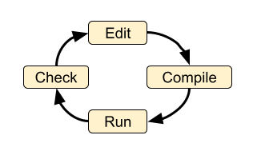
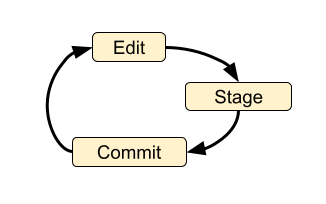
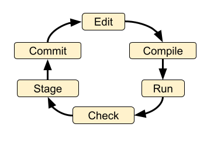

.. # with overline, for parts
   * with overline, for chapters
   =, for sections
   -, for subsections
   ^, for subsubsections
   ", for para

##########
Prelude
##########

All the stuff you should know for the rest of the documentation to make sense.

When possible point towards official sources rather than re-writing
documentation!

**********************
General Programming
**********************

General Workflow Loops
==========================

According to the IEEE, Software Engineering is the systematic, disciplined,
quantifiable approach to the design, development and maintenance of software
systems. As such software engineers are frequently obsessed with processes -
understanding the processes at play and figuring out how to make them consistent
is one key to achieving the systematic, disciplined, and quantifiable approach
that is called for. 

Below we cover several core processes before assembling them to a full workflow.

Core Development Process Loop
-------------------------------

The core development process loop is shown in the diagram.

   
These four steps are at the heart of any software work. In different
environments, some of the steps might be automated or hidden, but the steps must
be carried out in order for software to be created. With a single person this is
straightforward. The individual may elect to add additional steps such as
“backup work” or “publish finished code”. 

Loop with individual version control
---------------------------------------

The most basic version control process loop is simply: edit, stage, commit.

By itself this loop is not particularly useful - it doesn’t even involve running
the code, let alone checking it! But if we add the compile, run and check steps
we are getting closer to a robust development process:

There are a number of other steps that might be added:

 * checkout branch,
 * stash changes not ready to be committed
 * merge branch(es)
 * pull from another repo,
 * push to another repo,
 * rebase changes

Also note that the loop doesn’t not strictly need to happen in the above order.
Sometimes you might want to commit code before it runs or you might want to
cycle through the edit → compile → run → check loop many times before
committing.

Incorporating more people
---------------------------

When multiple people are involved their efforts must be synchronized so that
their changes to the system are compatible and so the people do not interfere
with each other. Git does not specify exactly how this should be done and leaves
many of the details up to the end users. Git provides the general tools to
accomplish collaborative (or individual) work in a wide variety of ways. When
you are interacting with other people you will need to be pushing your changes
to a remote repository and pulling changes from remote repositories. When things
are working smoothly, there are rarely changes that need to be reconciled (merge
conflicts). This leads to a clean and readable history.

There are many complexities and possible scenarios that can come up as this
process is carried out amongst multiple people. It is hard to describe the
scenarios and the implications of different choices without the folks involved
having a pretty solid handle on the basic core developer workflow as well as the
mechanics of the following Git fundamentals:
 
 * Making a commit.
 * Checking out branches.
 * A clone vs a fork.
 * Git vs Github.
 * Viewing git log information (either via command line or GUI app like gitk).
 * Interacting with remote repositories.
 * Browsing a repository on Github

Software Development Patterns
=================================
At the highest level, the process of software development is simply “write 
some code (instructions) and get a machine to carry out the instructions”. 
At the end of the day, this is all we are trying to accomplish. However the 
situation is never simple and there are an infinite number of ways to 
accomplish such a seemingly simple task. When a computer programmer talks 
about toolchains and environment they are talking about the setup for the 
process of “write code and make a machine run it”. There is no single best 
way to set up your environment, and each person has their own needs and 
preferences. Sometimes there are constraints due to hardware (i.e. working 
on a High Performance Computing system or a tiny embedded microprocessor), 
sometimes the constraints come from available software tools or the skills 
of the people writing the code. You will encounter a variety of patterns for 
the environments and toolchains used in this project. Understanding these 
patterns will help you select the best way to perform your work and have 
it mesh with the existing project.

Usually when you start writing some code you are in a purely exploratory 
and experimental mode and you reach for whatever environment and toolchain 
is comfortable and close at hand. Once your code has matured and you want to 
make it available to someone else, you need to put some thought into the 
environment and toolchain for working with the code. Also as your code 
grows in complexity, different environments make certain operations 
easier or harder.

The majority of the dvmdostem code is designed to be run via command line 
interface (CLI), meaning it is expected that you have a terminal (presumably 
bash or something similar) on an Ubuntu-like operating system. You are 
expected to interact with the programs by running the scripts or compiled 
binaries from the command line (REPL).

Following is a brief overview of a variety of different programming 
environments and toolchain patterns.

* Read Eval Print Loop (REPL, shell, terminal)
  REPL stands for "**R**\ ead **E**\ val **P**\ rint **L**\ oop". The REPL can 
  be written in nearly any language and can be designed to interpret nearly 
  any language. Users may be familiar with a number of REPL implementations 
  including the basic Python interpreterprompt (``>>>``), the IPython 
  interpreter prompt (``[In 0]:``), and R prompt (``>``) orsimply the 
  terminal prompt in their shell of choice (commonly bash). A REPL typically 
  ingests one line of text, follows the instructions, and returns the user 
  to the prompt. This is handy for prototyping, but quickly becomes tedious 
  to type if you have multi-line instructions (code). For this reason there 
  is the concept of a script which provides a means for submitting multiple 
  lines of code to a REPL

* GUI Application
  Common, intuitive for exploration. User uses a mouse and keyboard to click 
  buttons and interact with the software. May be written in a wide variety 
  of languages, but typically requires a “framework” of existing code that 
  helps with common patterns. Frameworks you might hear of are: Tcl/Tkinter, 
  QT, Cocoa, Swing, SWT, Delphi.

* Interpreted Program (script)
  An interpreted programming language is translated from human-written 
  code (instructions) into computer instructions (machine language) 
  on-the-fly. Python is an interpreted language meaning that there is not 
  an explicit compile step required to run the program. You simply submit 
  the script (your Python code) to the Python interpreter and it is 
  translated into machine code on the fly.

* Compiled Program (binary) A compiled programming language required a dedicated
  “build step” to translate the human-written code (instructions) into machine
  code. The result of the build step is an object file or a “compiled binary”.
  The main dvmdostem binary is a compiled C++ program. When the source code is
  modified, you must run make to re-compile the project and create a new binary
  object file before running it.

* Integrated Development Environment (IDE)
  Typically this is a GUI application that bundles together a bunch of handing 
  tools into one package. In general the tools are:

    * Text editor
    * REPL
    * Debugger
    * Build tools
    * File browser

  There are many different IDEs each with their own advantages and disadvantages. 
  Often IDEs are particularly suited to a certain language (i.e. PyCharm for 
  Python, Eclipse for C/C++, etc).

* IPython
  IPython is simply an enhanced REPL for Python. It comes with heaps of extra 
  features that make life easier, including support for multi-line statements, 
  built-in help, auto-complete features, and much more.

* Basic IDE
  All you really need for writing compiled or interpreted programs are a text 
  editor and a terminal that will let you compile the program (if necessary) 
  and execute it.

* Jupyter Notebook
  This is a novel addition to the traditional programming toolset. Jupyter 
  Notebooks combine features of:

    * an advanced (enhanced) REPL, 
    * an IDE,
    * formatted writing/documentation system and,
    * run-time for the program.

  This is accomplished using a client server architecture. In order to execute 
  the code in a Jupyter Notebook, you must also run (or connect to) a 
  “Notebook Server” which is a python environment and run-time. One advantage 
  of this is that the client portion can be an interactive web page that is 
  viewable for anyone with a standard web browser - provided they can make 
  requests to a functioning backend server which provides the Python run-time.

  The server can actually run a variety of languages, so it is possible to 
  use R or Julia or a number of other languages as the notebook code cell 
  language.

  Notebooks are great for:

    * Intermingling code and documentation or explanations (formatted text)
    * Experimenting with small code snippets
    * Presenting interactive plots from remote servers without needing an XWindow or other ``DISPLAY`` forwarding system
    * Developing and prototyping code

  Notebooks are challenging for:

    * Version control
    * Writing code that is easy to run in a non-notebook environment (library code)
    * Groups that do not have the bandwidth or abilities for running individual notebook servers or to run and maintain a central notebook server
    * Debugging certain types of process

* Virtual Machine

  In order to wrap up an environment such that you can preserve it or pass it to
  someone else, people have devised the concept of a Virtual Machine (VM). In
  2022, there are innumerable ways to run a VM (VMware, Parallels, Multipass,
  Docker, etc), each with its own tradeoffs. The important thing to remember is
  that a Virtual Machine attempts to encapsulate an environment. Each of the
  items in the above list (Notebook, IPython, IDE, etc) might be able to run
  inside a virtual machine. If you are not provided with a perfectly functioning
  environment it is often up to you to understand what you need for an execution
  context and set it up for yourself; a VM of some variety frequently provides
  some way to achieve this.

********************
Version Control
********************

Why use version control?
=============================

As mentioned in the :ref:`Version Management <software_development_info:Version
Management>` section, using version control in a project really serves several
purposes: 

   #. Provenance - being able to understand (and trust) where the code came
      from. 
   #. Facilitating contributions from multiple people.
   #. Backup - being able to
      revert the code to a previous state in case of an error or other need.

These needs can of course be met without a full fledged version control system
and as you struggle to learn Git you will almost certainly be tempted to just go
back to periodically emailing yourself backups or printing out the code and
locking it in your gun safe. However I would encourage you to persevere as once
you have the basics of Git under your belt, it will fundamentally change the way
you think about programming and will enable you to interact with a wide variety
of software projects as well as having great control over your own projects.

As you work with Git it is valuable to keep in mind the reasons you are using
version control: backup, collaboration, and provenance. Cultivating a clean,
readable, traceable history frequently requires extra steps and care that will
seem extraneous in the moment. However with a multi-person project this care is
essential to making the project history useful. When you are stuck and wondering
what to do, it is often helpful to think in terms of how you want the code
history (commit graph) to look when you are finished. With the idea of the
history you want to achieve in mind, you can then find a path forward. 

Getting Help
==============

General Git help is beyond the scope of this the `dvmdostem` documentation. Here
a few key concepts that the documentation assumes you are familiar with:

 * What is a commit.
 * What is a SHA id.
 * Difference between a fork and a clone.
 * Difference between git push, pull, fetch, and pull request (PR).
 * Difference between git branch, merge and rebase.

Here are several recommendations for general Git help:

 * https://git-scm.com/book/en/v2
 * https://www.atlassian.com/git
 * http://sethrobertson.github.io/GitBestPractices

.. note::
   It is important to make commits that are concise, organized, and readable, 
   thus fulfilling the goals of using a version control system. This comes 
   down to using git on a day-to-day basis and learning:
  
   * what is a commit,
   * how to write a good commit message,
   * how to separate different concerns into different commits,
   * how to fine tune a commit (interactive rebase, amend and when 
     to use it),
   * understanding what types of files or information should not be kept 
   * under version control,
   * how to use branches,
   * how to merge branches, and
   * the implications of making merges in an environment with multiple 
     developers.

Tools
=========

It is possible to use ``git`` purely from the command line, and in many 
cases this is the easiest way to go. However for some people and some 
situations a Graphical User Interface (GUI) is really helpful. Find a solution 
that works for you and your computing platform! There are generally two major 
functions of the Git GUIs, sometimes bundled in one application, and 
sometimes not:

 * Viewing the project history.
 * Adding to the project history (making commits, pushing, pulling, 
   merging, rebasing).

In 2022 there are many many graphical front ends to Git, and many text 
editors and IDEs have built in support for at least some Git features. You 
will need to find a tool that works for you. Although the interfaces look 
antiquated, you might find that the programs Gitk (history viewer) and 
Git Gui (for making commits) are perfectly sufficient, and these are 
readily available on most systems. At the end of the day you are likely to 
use a combination of the command line interface and a graphical frontend tool.

Setup
============

Your Git remote repositories should be appropriately named. This document 
assumes that you are using the following convention:

* The remote named origin should generally point to your fork of the 
  codebase, so the URL will look something like: 
  ``https://github.com/<your user name>/dvm-dos-tem``.
* The remote named ``upstream`` should generally point to
  ``https://github.com/uaf-arctic-eco-modeling/dvm-dos-tem`` or
  ``git@github.com:uaf-arctic-eco-modeling/dvm-dos-tem.git`` if you will be contributing.

It is **strongly encouraged** that you go to the effort of making sure your
current git branch is displayed in your terminal shell prompt. There are many
examples floating around online of how to achieve this for all major operating
systems and shells; one example `here
<https://stackoverflow.com/questions/15883416/adding-git-branch-on-the-bash-command-prompt>`_ 

*********************
Documentation Types
*********************

WRITE THIS....

**********************
Docker
**********************

.. raw:: html

   <!-- shared from Tobey Carmans's Docker Diagram google drawing -->
   <iframe src="https://docs.google.com/presentation/d/e/2PACX-1vSX3m0NGfLrNlOz_RccNyhRh11qwW1Lf0v5bQ1E5nA3RwCl_YHrWOx-S1cVA0AX6e3zZwBKnpyjD5kQ/embed?start=true&loop=true&delayms=3000" frameborder="0" width="480" height="299" allowfullscreen="true" mozallowfullscreen="true" webkitallowfullscreen="true"></iframe>

*********************************
Plotting and Graphical Outputs
*********************************

Plotting is a natural and essential step in the modelling process. The use-cases
and limitations are numerous and there is not a single silver bullet plotting
solution that is sure to work for you.

When working on or with plotting code, it is helpful to remember that problems
can arise in two overlapping spheres: *capability* and *environment*.

*Capability* refers to whether or not the analysis and visualisation you seek
are implemented in the code you are working with.

*Environment* referes to whether the computing environment(s) you work with have
the appropriate hardware, software, tools, etc to carry out the capabilities of
the code you are working with.

These concerns are sometimes totally distinct and sometimes arise in conflict
with each other. Ideally code is written to work with a wide variety of
environments as this makes it easier for other people to use the code in their
circumstances.

There are several paradigms that can be used for working with plots and
graphical output formats. The paradigms are surveyed below.

Interactive Window
==========================================
The interactive window paradigm assumes that you have a "windowing" system
available to you, i.e. something like XWindows or Quartz. In this paradigm, the
plotting library and tools work with the windowing system to display your plot
and (sometimes) allow you to interact with the plot. Frequently you can update
the plot by either using interactive tools, or re-running all or part of the
code. The ability to interact with the plot(s) is very helpful for exploring
data as you don't need to know a-priori the best settings for axis tick marks,
limits, etc.

Matplotlib has popularized this approach, but it is available in many other
systems and baked into some IDEs.

.. image:: images/prelude/example_interactive_plot.png
  :width: 300
  :alt: Example of matplotlib interactive window

Static Plot 
==========================
The static plot paradigm is the simplest. In this mode, code generates and
outputs a ``.png`` or ``.jpg`` file (or similar). Because there is no way to
interact with the image after it has been built, this method can be difficult
when you are first exploring the data and you haven't found the best settings
for axis bounds, ticks, etc.

When using a static image, you generally need a way to control where the
resulting files are saved. 

Many libraries are able to generate static images.

Interactive Browser Plots
==============================
The interactive browser plot paradigm provides the same capabilites as an
Interactive Window plot, but instead of using a special (and often platform
specific) windowing system, a web browser is used to display the plots. This
offers a number of distinct advantages:

  - web browsers are omni-present,

  - the ecosystem of available tools for display and interaction in a web
    browser is very rich,

  - de-coupling of the genearation and display aspects of plotting.

In addition to de-coupling the generation and display conerns, this approach
allows for networking and enables plotting using and Docker container run-time
or any other network-accessible run-time!

There are many tools that leverage this functionality, notably Jupyter
Notebooks, Bokeh, and RStudio.

