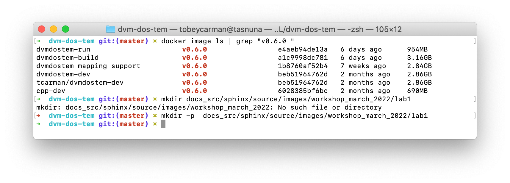

.. # with overline, for parts
   * with overline, for chapters
   =, for sections
   -, for subsections
   ^, for subsubsections
   ", for paragraphs

##########################
March 2022 Workshop Lab 1
##########################

This lab exercise (tutorial) walks through the process of making a basic model
simulation. With this exercise you will get to interact with the code and a
bunch of the supporting tools, including Docker, Git, and some visualization
tools.

.. note::

  This lab is more or less a duplicate of an existing wiki page:
  https://github.com/ua-snap/dvm-dos-tem/wiki/How-To:-Run-dvmdostem-and-plot-output-via-Docker.

  We are in the process of migrating all content from the wiki and assorted
  Google Documents to this Sphinx based documentation system, therefore this
  document should be the most up-to-date.

This tutorial will walk you through the process of:
 
 - getting the dvmdostem code, 
 - building your Docker images, 
 - starting your Docker containers,
 - running dvmdostem in your Docker container (in a trivial and silly fashion), and
 - making a similarly trivial and silly plot.

This tutorial will walk you through most of the above steps with varying levels
of hand-holding.

*************
Install tools
*************

Get started by installing all the software you will need.

Version control
===============

We are using version control software called `Git`_ to manage our code base. Git
is a distributed version control system. The software works well for managing
contributions to the code base from a lot of people, although this is not “free”
- it still takes quite a bit of learning, practice and work to make this happen
smoothly. Git allows you to track changes to files, to make branches for
isolating groups of changes and to manage merging changes from different lines
of development.

In addition to Git, we are using the code hosting service `Github`_. Git is a
stand alone version control system, whereas Github is a hosting service that
integrates with Git. Github is a cloud based code hosting service that
facilitates collaboration between developers without the need to host and manage
a server. In addition to basic code hosting Github provides a heap of additional
features including issue tracking, access control, and various continuous
integration, testing and publishing tools.

There are more details about version control in the
:ref:`software_development_info:Version Management` section of the Dev Info
document.

Git terms you should familiarize yourself with before continuing: commit,
branch, merge, tag, repository, remote.

Github terms you should familiarize yourself with before continuing: clone,
fork, release, wiki, issue tracker, pull request.

Run time environment and virtualization with Docker
====================================================

Any software, ``dvmdostem`` included, requires a specific set of hardware and
supporting software in order to run. This is referred to as the “runtime
environment”. There may be additional tools needed for compiling the software
(translating the software from source code to machine instructions) and for
working with the code to improve it (developing the code). We are currently
using a containerization tool called `Docker`_ to simplify and standardize the
creation of these environments. Docker helps to create stand alone, self
sufficient containers in which an application can run. The idea is that a Docker
container should be portable and able to run on a wide variety of host systems.
The dependencies for a piece of software are isolated inside the container. This
isolation allows software with conflicting dependencies to run on the host
system.

There are other ways you can get the environment necessary for running,
compiling and developing ``dvmdostem``, such as a native installation, or using
a virtual machine (e.g. with Vagrant and Virtual Box or VMWare). Each path to a
functioning runtime environment has its tradeoffs and can be useful in different
situations. We have successfully used native installs, a VirtualBox VM with
Vagrant, and Docker to achieve a valid runtime for ``dvmdostem``. This tutorial
is based on Docker, but the directions for building a VM using Vagrant are still
included in the ``virtualmachines/`` directory of the repository. You may notice
that both the Docker approach and the Vagrant/VirtualBox VM approach basically
build off of a generic Ubuntu base system and then simply install a variety of
packages, adjust some settings and manage sharing data between the host and
guest system.

Our recent switch to using Docker does not preclude you from pursuing a native
install or a virtual machine, but Docker provides several advantages, namely
that the containers are smaller and lighter weight than a full virtual machine
and that the internal layout of the container is the same for everyone, so paths
and other settings can be shared between developers.

Docker also represents a paradigm shift that can take some getting used to - in
fact we are still working on how ``dvmdostem`` should best fit within the
paradigm. With Docker the concept is to isolate a single process and its
dependencies into a container. The container is then run as a service; ideally
there is one process per container and the process offers a single service. Not
all work naturally fits into this paradigm and we expect to modify the
``dvmdostem`` Docker stack in the near future as we improve how things are
structured. See this :ref:`Note <one way to think about Docker>` for more
information.

.. _one way to think about Docker:
.. note::

  One way to think of Docker is to imagine that you have an office with several
  old computers laying around. And you have a system you want to build that
  requires a few different computers, each with slightly different software
  installed and running. And for your system, these different computers will
  need to talk to each other and share certain data. To assemble and configure
  each computer, you have a CD with the basic operating system you need, i.e. a
  Windows install CD, one for Linux, and another for a different flavor of Linux
  with some special packages installed. Once you install the operating system on
  each of your computers, you can start the computer and leave it running so it
  can talk to the other computers once you get them setup. In a notebook, you
  write down the steps for each installation and other settings to get the
  computer running and connected with the shared drives for communication. With
  this analogy, the Docker images are analogous to the CDs you have. Docker
  containers are analogous to the running instances of the computers. And
  docker-compose is analogous to the instructions you wrote in the paper
  notebook for starting the whole system. 

Docker terms you should familiarize yourself with before continuing: build,
image, container, volume, docker-compose.

Text editors and terminal emulator
===================================

You will also need a text editor that you will use to view and modify files and
some kind of terminal emulator (shell or console program) on your computer. As
of 2022 popular text editors are Sublime, VSCode, and Atom. MacOS and Linux
generally have an easily accessible terminal program. For Windows, look into
MobaXTerm.

So to get going, do the following:

 #. Install Git on your computer. Directions for this vary based on your
    operating system; you should be able to get started here https://git-scm.com.
 #. Install Docker. Again directions for this vary for your operating system but
    you should be able to get started here https://docs.docker.com. When
    you are done, you should be able to open a terminal and run ``$ docker
    info`` and ``$ docker --version`` and get something like this:

    .. code:: bash

        $ docker info
        Client:
        Context:    default
        Debug Mode: false
        Plugins:
          buildx: Docker Buildx (Docker Inc., v0.7.1)
          compose: Docker Compose (Docker Inc., v2.2.1)
          scan: Docker Scan (Docker Inc., v0.14.0)
        Server:
        Containers: 4
        ...much more info below...

        $ docker --version
        Docker version 20.10.11, build dea9396

************
Get the code
************

With your tools setup, it is time to get started. Navigate to
https://github.com/ua-snap/dvm-dos-tem and find the link to clone the
repository. On your computer, open a terminal and navigate to a place where you
would like your copy of ``dvmdostem`` to be stored. Copy the clone address and
use it to run the ``$ git clone`` command in your terminal. You might notice
that the clone address is simply the URL for the repo with ``.git`` at the end.
This will fetch a copy of the repository from Github to your local machine. You
should see some messages in your terminal to that extent. Notice that on your
machine you now have a new directory entitled ``dvm-dos-tem`` with an exact copy
of the code that is on Github. In addition, due to the power of Git, you also
have the entire history of the project on your computer as well. This works
because inside your dvm-dos-tem directory is another (hidden) folder named
``.git`` - this hidden folder contains the history of the project and all the
other information that Git needs to perform its magic. You rarely, if ever, need
to look at the contents of the ``.git`` directory. Take a few minutes to explore
the files in the dvm-dos-tem directory.

.. _Names:
.. note::

  Sometimes we write ``dvmdostem``, sometimes we write ``dvm-dos-tem`` and
  sometimes we write DVM-DOS-TEM. These are all the same thing. The order is
  always the same, but sometimes we use capitals and sometimes lower case,
  sometimes with hyphens and sometimes without. This is a fluke of history. In
  some cases it looks better capitalized, sometimes it looks better lower case.
  The repository ended up with hyphens in the name, but the compiled binary
  executable does not have hyphens.

.. _git remotes:
.. note::

  Notice that when you run ``$ git remote -v`` you are presented with some text
  indicating that your remote is named ‘origin’ and points to the Github ua-snap
  repository. To be consistent with this tutorial and the rest of our
  documentation, you should rename this remote to ‘upstream’ and point ‘origin’
  to your personal fork of the code (if you have one). To do this use the ``$
  git remote rename <old> <new>`` command.

.. _git branch:
.. note::

  Notice that after cloning the repository and running the ``$ git branch``
  command you are on the master branch of the code. It is highly recommended
  that you set up your terminal so that the git branch is displayed in your
  prompt. The directions for this are terminal/shell specific and widely
  available with a little web searching. A decent example for Ubuntu/bash can be
  found here:
  https://askubuntu.com/questions/730754/how-do-i-show-the-git-branch-with-colours-in-bash-prompt.

*********************
Build Docker images
*********************
Now that you have the code on your machine, you need a way to interact with it.
You can browse the files using standard tools on your computer, but to execute
(run) the code you will need a special environment with all the dependencies
installed. This is where Docker comes into play.

With Docker there are two steps to using the software: building the images and
starting the running containers based on the images.  As of ``dvmdostem v0.6.0``,
there are 5 images that we are using for this project: 

 #. ``cpp-dev`` - general C++ development tooling. 
 #. ``dvmdostem-dev`` - all tools necessary for developing and working with
    ``dvmdostem``; this will be the image that most users will use most of the
    time. Relies on mounted volumes for access to the source code.
 #. ``dvmdostem-build`` - a stripped down image only used for compiling the C++
    portion of the code. Includes the source code inside the image instead of 
    relying on mounted volumes.
 #. ``dvmdostem-run`` - a very small production image with only the necessary
    run-time libraries, no development or compiling tooling.
 #. ``dvmdostem-mapping-support`` - an image with GDAL tools installed and
    Python.

.. _hosted images:
.. note::

  In the (hopefully near) future it should not be necessary to build your own 
  images unless you have very specific development needs. The images will be
  automatically built and published (to Github, maybe elsewhere) by Github 
  Actions with each release of the code.

With the existing layout, images 1-4 are successively built on top of each other
(layered) which allows for faster builds when you only need to re-build because
of a change in something in one of the upper layers. The
``dvmdostem-mapping-support image`` is totally separate from the others and
allows installing GDAL which is difficult to do in conjunction with some of the
libraries that ``dvmdostem`` depends on.

To build your images, you can use the ``docker-build-wrapper.sh`` script. You
should examine the commands and comments in this script as well as the
Dockerfile in order to understand what is going on. If the wrapper script fails,
you can try running each step individually.

Building the base image, especially cpp-dev, requires quite a bit of downloading
and can take 15 minutes or more depending on your internet connection.

When you have built all the images, you should be able to see them in Docker
Desktop or with the command line as shown in the screenshot.

.. links (explicit targets)
.. _Git: https://git-scm.com
.. _Github: https://github.com
.. _Docker: https://docker.com
.. _Docker Docs: https://docs.docker.com