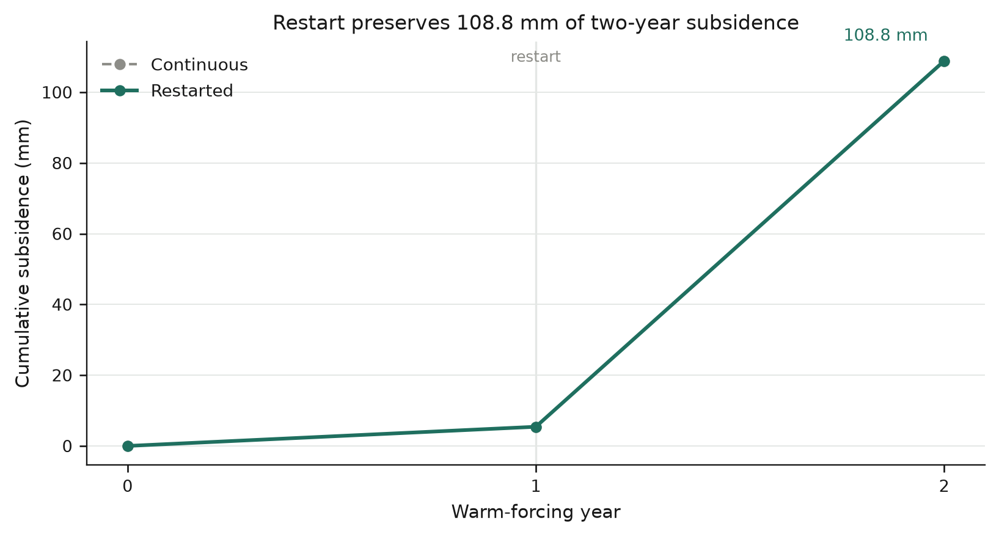
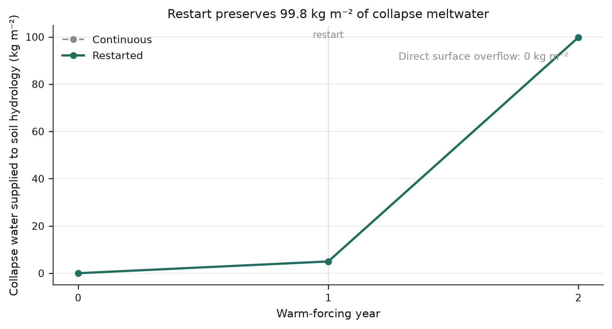
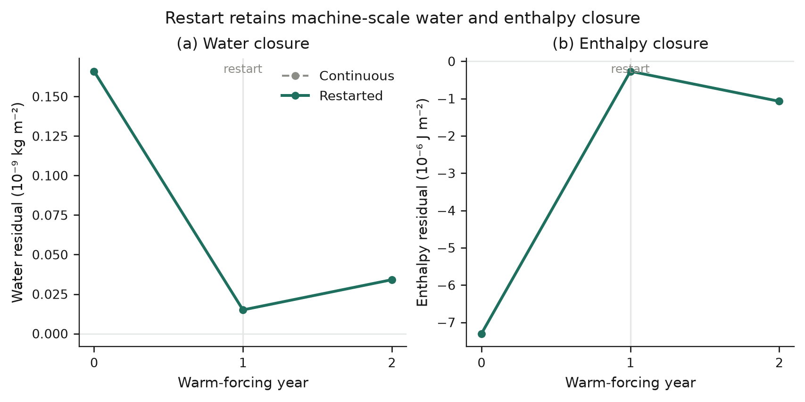
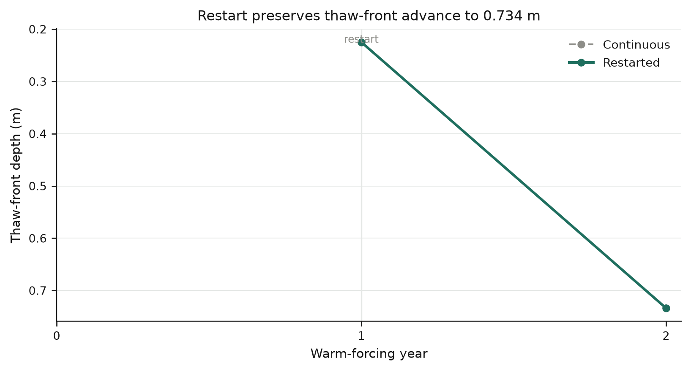
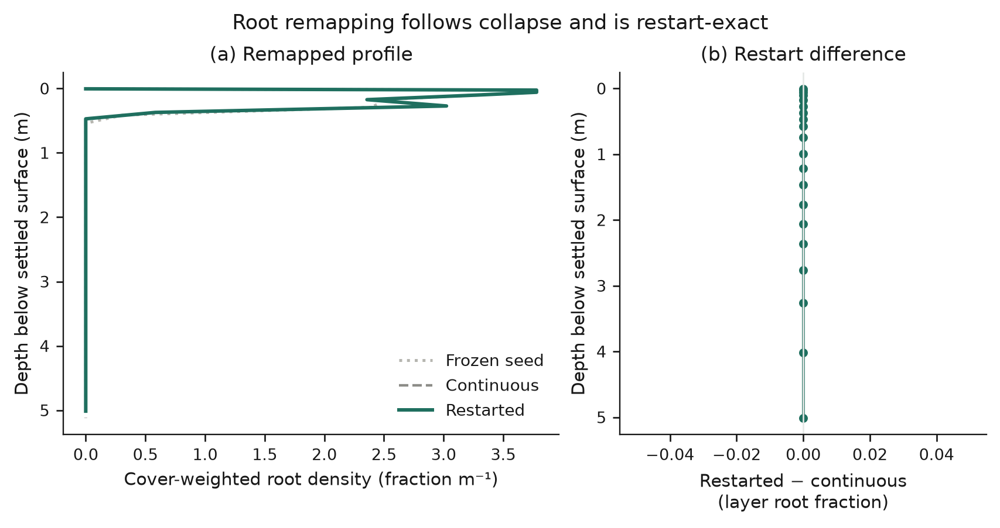
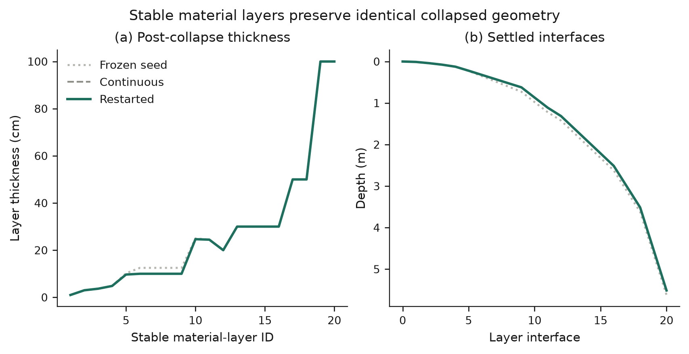

# Active-thaw production restart validation

**Date:** 2026-09-16

**Repository:** `/Users/EJafarov/projects/TEM_abrupt_thaw_dev`

**Starting revision:** `a706c303aa16c6dea926fb566b38b30018fe37b6`

## Executive summary

The active-thaw restart milestone passed all **14 of 14** production gates. The test placed a restart after the first warm-forcing year, when excess-ice loss and subsidence had started but most of the initial excess ice remained. The resumed second year reproduced the continuous two-year calculation exactly.

- Initial excess ice: **183.400 kg m⁻²**.
- Midpoint excess ice: **178.425 kg m⁻²**.
- Midpoint subsidence: **5.425 mm**.
- Final excess ice: **83.592 kg m⁻²**.
- Final subsidence: **108.842 mm**.
- Collapse meltwater generated by excess-ice loss: **99.808 kg m⁻²**.
- Final thaw-front depth: **0.733659 m**.
- Final water residual: **3.41×10⁻¹¹ kg m⁻²**.
- Final enthalpy residual: **−1.07×10⁻⁶ J m⁻²**.
- Maximum continuous-versus-resumed root-fraction difference: **0**.
- Maximum continuous-versus-resumed layer-thickness difference: **0 m**.
- Continuous and resumed restart NetCDF files: **byte-for-byte identical**.
- SHA-256 of both final restart files: `100114896135c535b710b2c956978e4782333db0ff0d76bb6ac3094455d46985`.

This validates the serialized thermokarst state, phase state, fronts, roots derived from settled geometry, and post-collapse geometry across a restart during active excess-ice thaw.

## Production defect found and corrected

The first warm-restart trial failed before loading the supplied restart. `Cohort::initialize_state_parameters()` constructed a fresh thermokarst profile using the new run's first warm climate value, which triggered the guard requiring excess ice to be initialized in frozen soil. The restart state was scheduled to load later, so cold-forcing restart tests had hidden the ordering defect.

The production initialization now constructs a new thermokarst profile only when `restart_from` is empty:

```cpp
if (md->thermokarst_enabled && md->restart_from.empty()) {
  tem_thermokarst::initialize(...);
}
```

Versioned and legacy restarts still initialize or restore thermokarst state in `set_state_from_restartdata()`. This lets a warm continuation load the persisted frozen/partially thawed state before any new forcing is applied.

## Experimental design

### Shared configuration

- Full production `dvmdostem` executable.
- One active Toolik demonstration grid cell at `(Y=0, X=0)`.
- Environmental processes enabled.
- Biogeochemistry, nitrogen feedback, dynamic soil biogeochemistry, dynamic soil layers, and dynamic LAI disabled to isolate thermal, hydrological, geometric, and restart behavior.
- Thermokarst excess fraction: **0.20** from **0.2 to 1.0 m**.
- Production completion criterion: grid-cell `run_status=100`.

### Frozen seed

The test first runs one pre-run year under a constant −20 °C atmosphere with zero precipitation and zero net incoming radiation. This creates a fully frozen column containing 183.4 kg m⁻² of excess ice.

### Periodic warm forcing

The thaw calculation uses a constant +5 °C atmosphere, zero precipitation, zero net incoming radiation, and vapor pressure of 1 Pa. Every month and every climate year contains the same values, so the forcing has a one-year period. TEM's stage-relative climate index can therefore reset on restart without selecting a different forcing year.

The +5 °C value was selected because it creates partial excess-ice loss in year one and continued loss in year two. This places the checkpoint inside active collapse:

| State | Excess ice (kg m⁻²) | Cumulative subsidence (mm) |
|---|---:|---:|
| Frozen seed | 183.400 | 0.000 |
| Restart midpoint | 178.425 | 5.425 |
| Final | 83.592 | 108.842 |

### Compared paths

1. **Continuous path:** two warm transition-stage years in one invocation.
2. **Restarted path:** one warm transition-stage year, write NetCDF restart, then one warm transition-stage year resumed from that restart.

The midpoint restart is used by both trajectories at year one. Final equality is evaluated at the value level for every active-pixel restart field and at the byte level for the complete NetCDF files.

## Results

### Subsidence magnitude and timing

The first warm year caused 5.425 mm of settlement. Collapse accelerated during the second year as the thaw front moved through more of the excess-ice interval, reaching 108.842 mm. The continuous and resumed endpoints are identical.



### Collapse meltwater and hydrological routing

Excess-ice mass loss is converted one-for-one to liquid water. The identity

\[
M_{melt}=M_{x,0}-M_x=\rho_i S
\]

holds to **8.53×10⁻¹⁴ kg m⁻²**, where \(M_x\) is excess-ice mass, \(\rho_i=917\ \mathrm{kg\,m^{-3}}\), and \(S\) is cumulative subsidence.

The column generated 4.975 kg m⁻² of collapse water before the checkpoint and 99.808 kg m⁻² by the final checkpoint. This water enters the production soil liquid state and is then handled by the existing ponding, infiltration, Richards drainage, and runoff calculations. The thermokarst column's direct surface-overflow accumulator remained zero because available pore storage accepted the released liquid before hydrology operated.

The present restart fields do not retain a source-specific tracer after collapse water mixes with ordinary soil liquid. The figure therefore shows cumulative collapse water supplied to soil hydrology, calculated exactly from excess-ice inventory loss, and reports direct thermal overflow separately.



### Water and enthalpy closure

The final water residual was 3.41×10⁻¹¹ kg m⁻², below the 1×10⁻⁷ kg m⁻² gate. The final enthalpy residual was −1.07×10⁻⁶ J m⁻², below the 1×10⁻³ J m⁻² gate. Continuous and resumed values overlap exactly at the final checkpoint.

The plotted residuals are the end-of-day local conservation residuals stored in `TKstate`; they are not cumulative errors. Cumulative boundary energy reached 2.974×10⁸ J m⁻² by the end of the warm calculation.



### Front positions

The frozen seed has no internal thaw front. A thawing front appeared at 0.224792 m after the first warm year and advanced to 0.733659 m after the second year. Front depth and front type are exactly equal in the continuous and resumed restart files.



### Root remapping

TEM's persisted vegetation root profile uses ten 0.1 m rooting bands. The validation reproduces `Cohort::getSoilFineRootFrac_Monthly()` using those persisted bands, vegetation cover, soil material type, and settled layer geometry. It calculates a vegetation-cover-weighted root fraction for each current soil layer.

Collapse shifted the cover-weighted mean root depth from 0.174320 m to 0.170345 m below the settled surface. The largest seed-to-final layer root-fraction change was 0.02009. The final continuous-versus-resumed difference was exactly zero for every layer, and the remapped fractions sum to one within floating-point precision.



### Post-collapse layer geometry

Total soil-column thickness decreased from 5.621700 m to 5.512858 m, matching 0.108842 m of subsidence. Stable material-layer IDs were retained; only layers intersecting the initialized excess-ice interval contracted. The final geometry obeys

\[
\Delta z_i=\Delta z_{m,i}+\frac{M_{x,i}}{\rho_i}
\]

with a maximum error of **6.94×10⁻¹⁸ m**. Continuous and resumed final layer thicknesses are exactly equal.



## Acceptance results

| Test | Observed | Criterion | Result |
|---|---:|---:|:---:|
| Production runs complete | 100/100/100/100 | all 100 | PASS |
| Midpoint has active thaw | 5.425 mm with 178.425 kg m⁻² remaining | subsidence > 0 and excess remains | PASS |
| Collapse continues after midpoint | 108.842 mm final | final > midpoint | PASS |
| Melt mass–subsidence identity | 8.53×10⁻¹⁴ kg m⁻² error | ≤1×10⁻⁹ | PASS |
| Final restart NetCDF files | byte-identical | exact | PASS |
| Active-pixel restart fields | identical | exact | PASS |
| Final subsidence difference | 0 m | ≤1×10⁻¹² m | PASS |
| Final collapse-water difference | 0 kg m⁻² | ≤1×10⁻⁹ kg m⁻² | PASS |
| Water residual | 3.41×10⁻¹¹ kg m⁻² | ≤1×10⁻⁷ kg m⁻² | PASS |
| Enthalpy residual | 1.07×10⁻⁶ J m⁻² | ≤1×10⁻³ J m⁻² | PASS |
| Front positions and types | identical | exact | PASS |
| Remapped root fractions | maximum difference 0 | ≤1×10⁻¹⁴ | PASS |
| Layer geometry | maximum difference 0 m | ≤1×10⁻¹² m | PASS |
| Geometry identity | 6.94×10⁻¹⁸ m | ≤1×10⁻¹² m | PASS |

## Regression and visual verification

- Core thermokarst process tests: **26/26 passed**.
- NetCDF thermokarst restart round trip: **passed**.
- Legacy-restart compatibility: **passed**.
- Previous zero-excess/frozen-column production suite: **17/17 passed** after the initialization-order correction.
- New active-thaw production suite: **14/14 passed**.
- All six SVG files passed programmatic vector preflight.
- All six PNG files were inspected at final size and as a grayscale family. Labels, units, comparison order, and values match the CSV/JSON evidence.
- No uncertainty interval is shown because this is one deterministic integration test, not an ensemble or parameter estimate.

## Reproduction

From `/Users/EJafarov/projects/TEM_abrupt_thaw_dev`:

```console
make thermokarst-test
make thermokarst-production-validation
make thermokarst-active-thaw-validation
```

The active-thaw target writes ignored run products to:

```text
experiments/thermokarst/active_thaw_validation_results/
```

That directory contains the four run configurations and logs, seed/midpoint/final NetCDF restart files, `summary.json`, `checks.csv`, `trajectory.csv`, a visual specification, and PNG/SVG figures.

## Interpretation and limitations

The test demonstrates deterministic restart continuation through active excess-ice melt for the current one-column production mechanism. It verifies the serialized quantities needed to continue thermal phase change and reconstruct derived geometry, fronts, and roots.

The experiment remains an integration test rather than a site simulation. The forcing is constant and idealized, the comparison has annual checkpoints, only one grid cell is used, and biogeochemistry is disabled. Collapse water is not tagged after it enters the ordinary soil liquid pool, so source-specific runoff and drainage cannot be separated from other soil water in restart diagnostics. Pond thermal feedback, lateral thermokarst drainage, and dynamic organic-layer topology remain outside the current prototype.

The next useful increment is a daily or monthly production diagnostic for thermokarst-generated liquid, its partitioning among storage, runoff, and drainage, and the moving front/subsidence trajectory. That diagnostic should be persisted or reconstructible without changing restart continuation and should be tested under a seasonal periodic forcing with freeze–thaw reversal.
