# Barrow CRREL subsidence validation report

**Reference:** Streletskiy et al. (2016), CRREL plots 34, 37, 40, 44

**Harness:** `experiments/thermokarst/barrow_validation.py`

**Bundled climate:** `experiments/thermokarst/barrow_validation/nws-barrow-climate-full.nc`

## Summary

| Phase | Status | Command |
|---|---|---|
| 0 — pipeline | not run | `make thermokarst-barrow-validation-phase0` |
| A — ALT calibration | **PARTIAL** (3/6 gates) | `make thermokarst-barrow-alt-calibration` |
| 1 — Streletskiy 2003–2015 | **PARTIAL** (9/11 gates) | `make thermokarst-barrow-validation-phase1` |
| 2 — full record 1962–2015 | **PARTIAL** (4/10 gates) | `make thermokarst-barrow-validation-phase2` |

Resume long runs with `--reuse` to skip completed stages and reuse the bundled climate:

```sh
.venv-thermokarst/bin/python experiments/thermokarst/barrow_validation.py \
  --binary ./dvmdostem --phase 1 --reuse
```

## Comparison figures (2003–2015)

Observed subsidence uses **absolute elevation change** from Streletskiy dGPS
(includes frost heave; not pure thaw collapse). Model subsidence is cumulative
`TKSUBSIDENCE`. Corrected ALT adds modeled subsidence to September max thaw depth;
observed ALT is mechanical probing at five points per plot. DDT is thawing
degree-days (Σ max(T, 0) × days): observed from Streletskiy Table 1;
modeled from NWS-bias-corrected monthly forcing.

### Active-layer thickness: observed vs modeled

September max `TKFRONT` thaw depth vs Streletskiy mechanical probing (2003–2015).

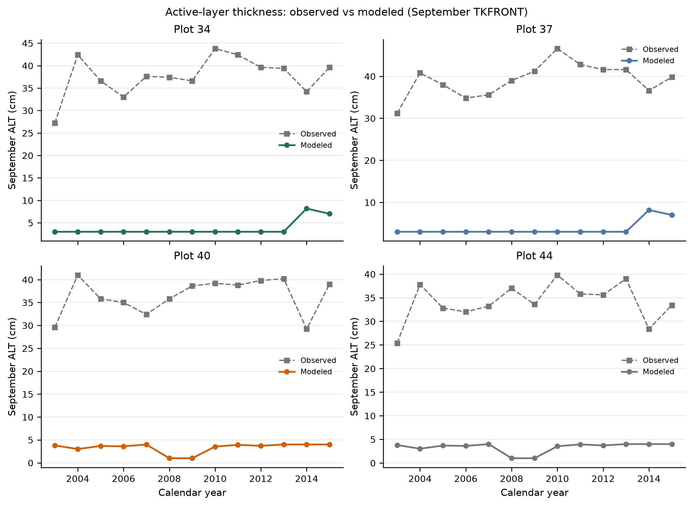

### Subsidence time series

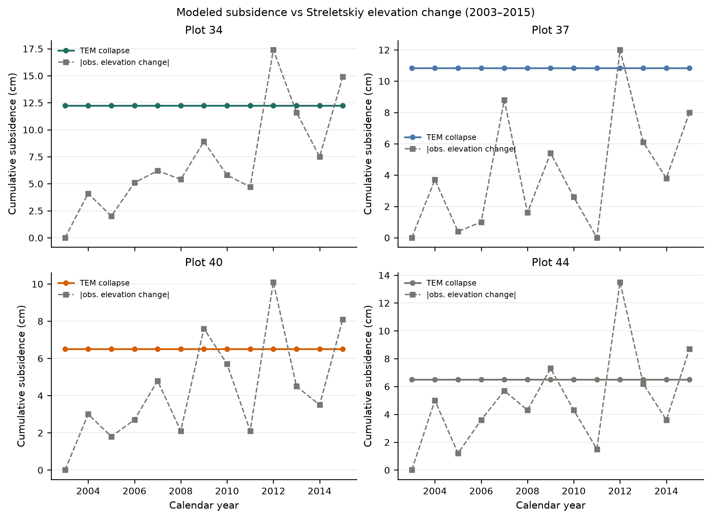

### Cumulative subsidence at 2015

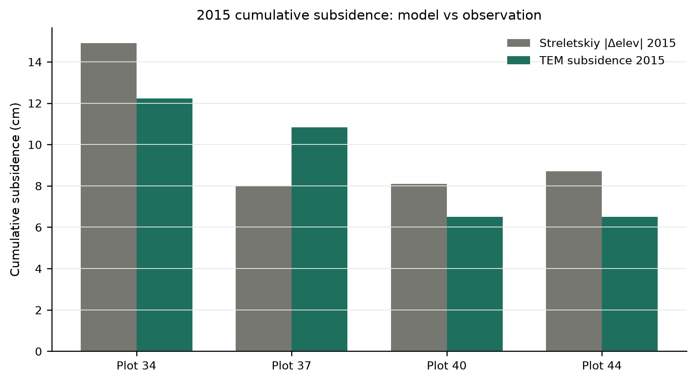

### Active-layer thickness vs thawing degree-days

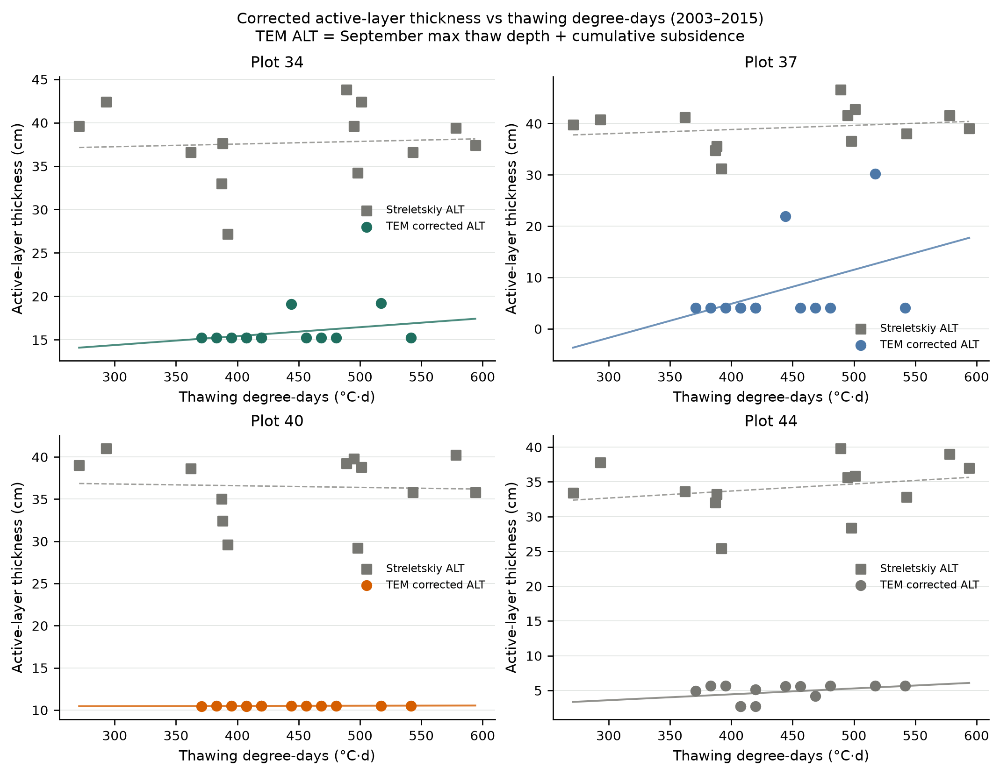

## Climate inputs

NWS-bias-corrected historic forcing: full spin-up record (left) and 2003–2015
transient window (right). Precipitation scaled ×0.55 from Toolik template.

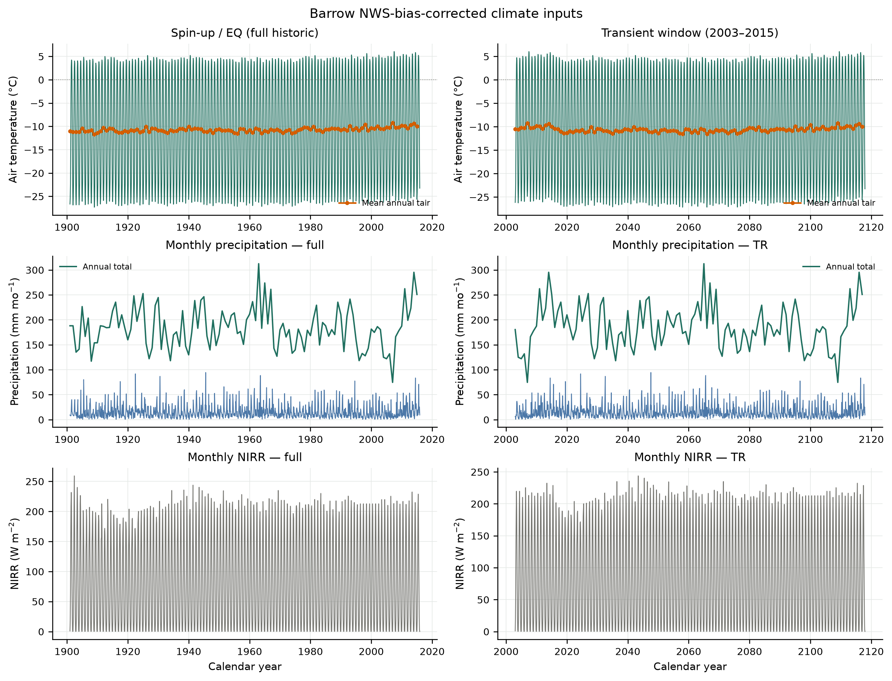

### Active-layer thickness from soil temperature (0 °C isotherm)

September ALT from monthly `TLAYER` (deepest 0 °C isotherm) vs Streletskiy probing.

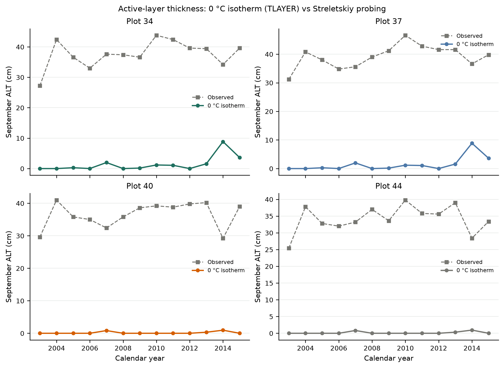

### Soil temperature, snow, and subsidence by plot

Depth–time soil temperature (`TLAYER`, blue–white–red color scale), monthly snow
depth, cumulative subsidence, and 0 °C isotherm ALT overlay.

#### Plot 34


#### Plot 37

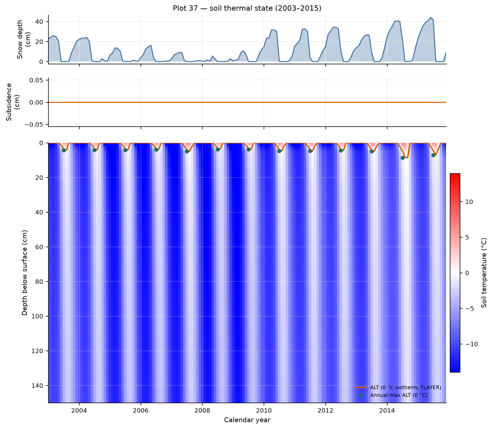

#### Plot 40

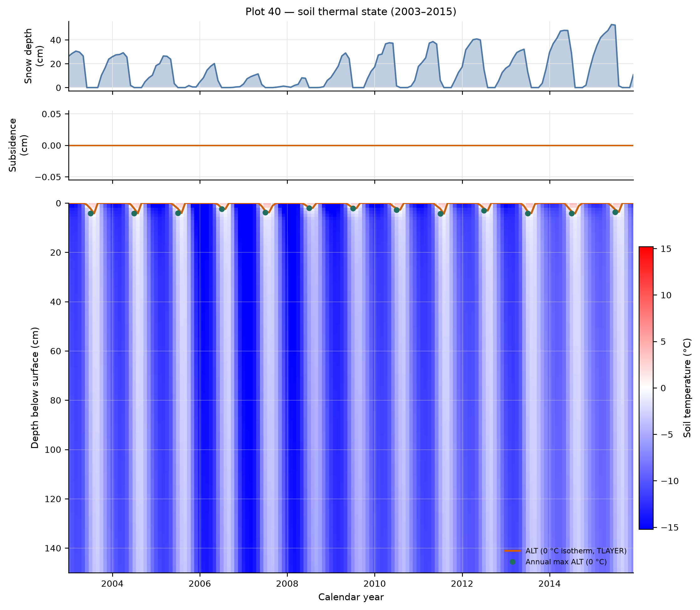

#### Plot 44

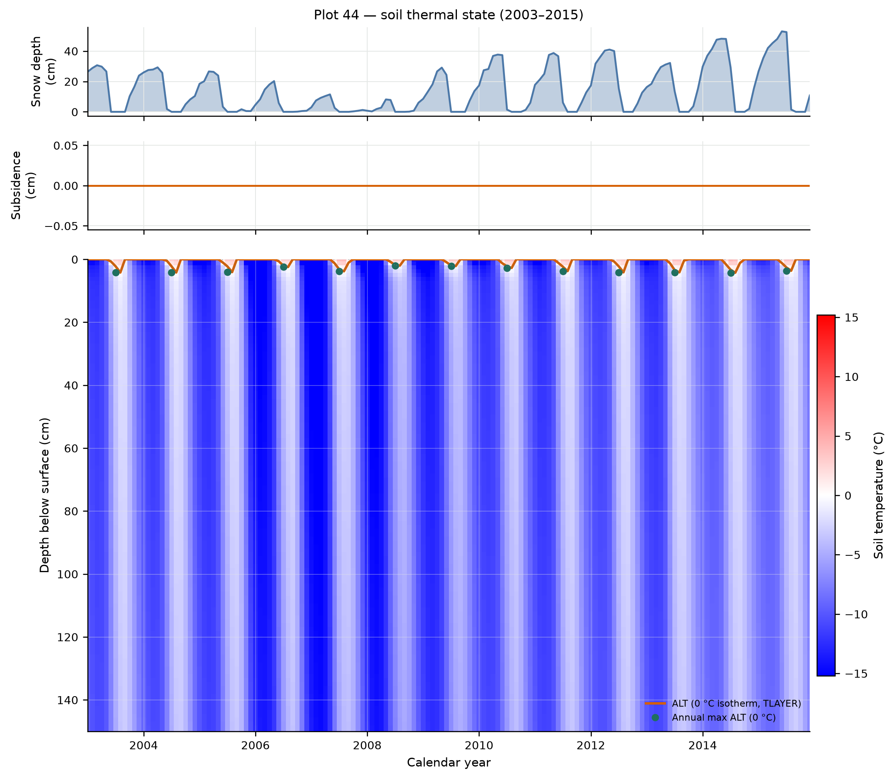

## Phase A — ALT calibration (n-factor)

### Configuration

- Spin-up: 1 PR + 30 EQ years
- Transient: 13 TR years (2003–2015)
- Thermokarst: **on** (TKFRONT output); no excess ice injected
- Parameters: `/Users/EJafarov/projects/TEM_abrupt_thaw_dev/experiments/thermokarst/barrow_validation/parameters`
- n-factors: {'cmt05': {'s': 1.0456, 'w': 1.121}, 'cmt06': {'s': 1.5, 'w': 1.0}}

### Gates

- Hard: 2/2 passed
- Soft: 1/4 passed

- Mean model ALT: **3.5 cm** (obs ~36.9 cm)
- RMSE vs Streletskiy: **33.7 cm**

### Phase A figures

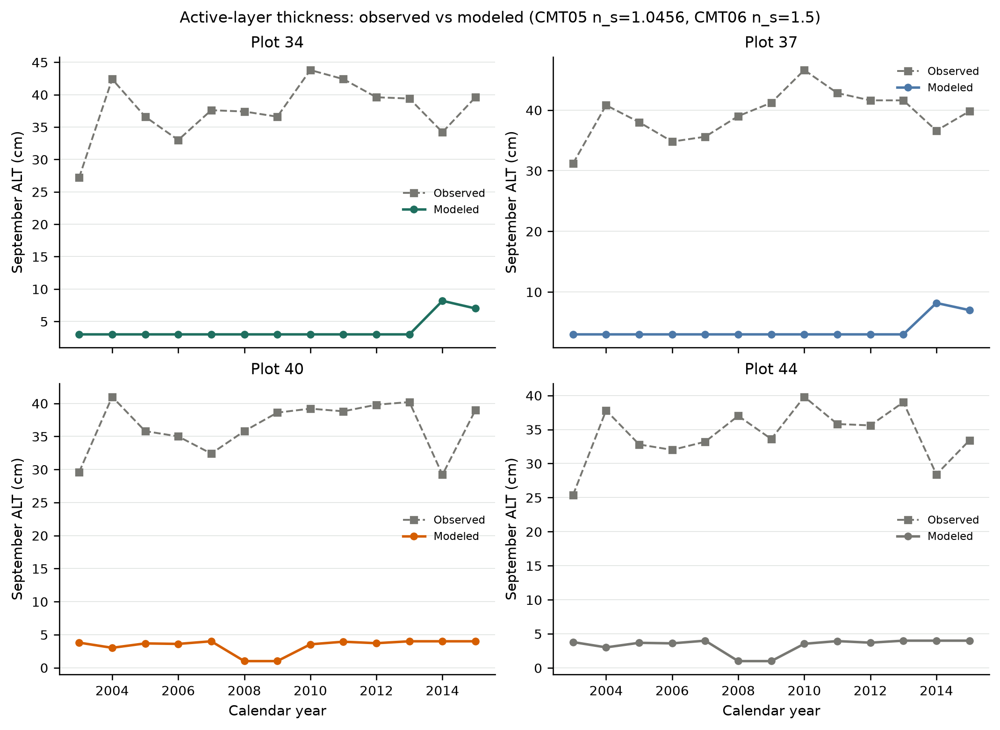

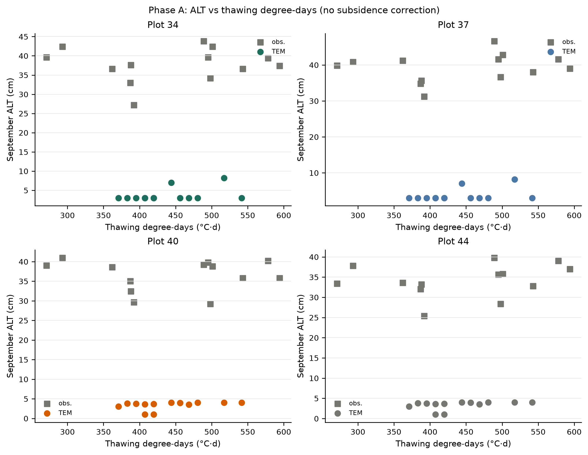

Artifacts: `experiments/thermokarst/barrow_validation_phaseA_results/`

Calibrated n-factors (when using `--calibrate`) are written to `experiments/thermokarst/barrow_validation/barrow-alt-calibration.json`.

## Phase 1 — Streletskiy window 2003–2015

### Configuration

- Spin-up: 1 PR + 30 EQ years
- Transient: 13 TR years (2003–2015)
- Forcing: NWS Barrow monthly (Toolik bias-corrected; precip ×0.55)
- Ice: band 0.02–0.12 m, fractions {'34': 0.55, '37': 0.52, '40': 0.46, '44': 0.46}

### Gates

- Hard: 2/2 passed
- Soft: 7/9 passed

| Gate | Status |
|---|---|
| production completion | PASS (hard) |
| reference subsidence | PASS (hard) |
| NWS climate window | PASS |
| calibrated ice band | PASS |
| all plots subside | PASS |
| mean subsidence bracket | PASS |
| plot 34 fastest | PASS |
| trend bracket | FAIL |
| plot 34 trend highest | PASS |
| warm-year concentration | FAIL |
| monotonic subsidence | PASS |

### Model vs observation (2015 cumulative collapse)

| Plot | TEM (cm) | |obs. Δelev| (cm) |
|---|---:|---:|
| 34 | 12.2 | 14.9 |
| 37 | 10.8 | 8.0 |
| 40 | 6.5 | 8.1 |
| 44 | 6.5 | 8.7 |

Artifacts: `experiments/thermokarst/barrow_validation_phase1_results/`

## Phase 2 — full Streletskiy record 1962–2015

### Configuration

- Spin-up: 1 PR + 50 EQ years
- Transient: 54 TR years (1962–2015)
- Forcing: same NWS Barrow climate as Phase 1
- Ice: Phase 1 calibrated band injection (reused fractions)

### Gates

- Hard: 2/2 passed
- Soft: 2/8 passed

| Gate | Status |
|---|---|
| production completion | PASS (hard) |
| reference subsidence | PASS (hard) |
| full record window | PASS |
| 1962–2003 stability | FAIL |
| 2003–2015 subsidence bracket | FAIL |
| 2003–2015 mean subsidence | FAIL |
| plot 34 fastest post-2003 | FAIL |
| 2012 largest increment | FAIL |
| ALT trend 2003–2015 | FAIL |
| monotonic subsidence | PASS |

### 1962–2003 stability assessment

Streletskiy observed net elevation change over 1962–2003 is within interannual
variability (roughly ±5 cm; plot 44 shows +4.9 cm heave from snow redistribution).
TEM `TKSUBSIDENCE` tracks irreversible collapse only — no frost heave.

| Plot | Model subsidence to 2003 (cm) | |obs. net Δelev| 1962→2003 (cm) | Gate (<5 cm) |
|---|---:|---:|---|
| 34 | 12.2 | 3.4 | FAIL |
| 37 | 1.1 | 4.3 | PASS |
| 40 | 6.5 | 3.9 | FAIL |
| 44 | 1.7 | 4.9 | PASS |

Most plots collapse in **1962** (first transient year) when shallow-band ice
thaws. Only plot 37 shows incremental subsidence after 2003 (~9.7 cm in 2003–2015).

### 2003–2015 window (repeat of Phase 1 targets)

| Plot | Model 2003–2015 (cm) | |obs. Δelev| 2015 (cm) |
|---|---:|---:|
| 34 | 0.0 | 14.9 |
| 37 | 9.7 | 8.0 |
| 40 | 0.0 | 8.1 |
| 44 | 0.0 | 8.7 |

Artifacts: `experiments/thermokarst/barrow_validation_phase2_results/`

Phase 2 run figures: `barrow-phase2-subsidence-full-record`, `barrow-phase2-subsidence-windows`, `barrow-phase2-alt-corrected` (in results directory).

## Process limitations

1. **No frost heave** — cannot match ±8–13 cm interannual elevation swings or
   1962–2003 stability without heave.
2. **Shallow-band collapse** — ice at 0.02–0.12 m collapses when thaw reaches it;
   deeper paper transient layer (0.34 m) yields zero subsidence under NWS Barrow forcing.
3. **Net elevation ≠ collapse** — compare cumulative subsidence trends, not raw dGPS series.

