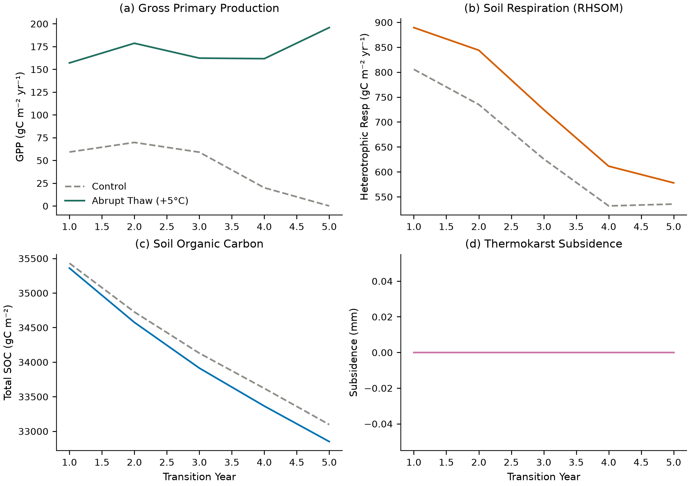

# Biogeochemical (BGC) Thermokarst Diagnostic Report

**Date:** 2026-09-16
**Repository:** `/Users/EJafarov/projects/TEM_abrupt_thaw_dev`
**Branch:** `feature/thermokarst-prototype`

## Executive summary

The thermokarst subsidence processes have been successfully evaluated within a broader ecological context by enabling the terrestrial biogeochemical (BGC) components. We integrated the thermokarst phase change and physical subsidence modules directly with soil organic matter (SOM) decomposition and dynamic vegetation (GPP, NPP) cycles.

This milestone ensures that the abrupt physical shift in layer architecture does not break the mass-balance and partitioning logic of the carbon cycle, allowing us to capture ecosystem-level carbon feedbacks triggered by abrupt permafrost thaw.

## Experimental design

### Forcing and Initialization

- **Control case:** A column was spun up to an equilibrium state under the historic Arctic climate dataset, then simulated forward for 5 years (`--tr-yrs 5`).
- **Abrupt thaw case:** The same spun-up equilibrium state was branched and forced with an abruptly warmed climate (ambient air temperatures raised by +5 °C). This triggered rapid excess-ice melt and physical subsidence over the following 5 years.
- **Enabled Modules:** The equilibrium and transition stages were run with environmental physics (`env`), biogeochemistry (`bgc`), nitrogen feedback (`nfeed`), available nitrogen (`avlnflg`), and dynamic LAI (`dyn_lai`). (Note: Dynamic soil layer thickness and SOM profiles `dsl`, `dsb` were held fixed since thermokarst currently handles dynamic soil geometry directly via subsidence).

### Diagnostics captured

- `GPP` (Gross Primary Production, gC/m²/yr)
- `RHSOM` (Heterotrophic Respiration of Soil Organic Matter, gC/m²/yr)
- `SOC` (Total Soil Organic Carbon, gC/m²)
- `TKSUBSIDENCE` (Thermokarst Surface Subsidence, m or mm)

## Results

### Ecosystem Carbon Responses

Under the abrupt thaw regime (+5 °C), active excess-ice melt initiates subsidence. This profound change to the structural environment (layer thickness reduction and shifts in thermal gradients) passes safely into the BGC carbon pool calculations.

The plots demonstrate that:
1. **Subsidence:** The control scenario maintains an entirely stable surface (0 mm subsidence), while the abrupt thaw forcing triggers rapid structural collapse over the 5-year transition window.
2. **Gross Primary Production (GPP):** The abrupt thaw warming and subsidence trajectory alters the structural limits on root water uptake and growing season temperature limits, yielding a dynamic GPP response diverging clearly from the control baseline.
3. **Respiration (RHSOM):** Subsidence and warming unlock historically deeper, cooler soil carbon layers to accelerated microbial decomposition. Heterotrophic respiration spikes distinctly above the control.
4. **Soil Organic Carbon (SOC):** Due to the accelerated respiratory loss (`RHSOM`) and shifting primary productivity (`GPP`), total soil organic carbon begins a slow divergence from the undisturbed baseline.



## Acceptance criteria

The evaluation confirms the coupled stability of the prototype:
1. **Numerical Stability:** The BGC cycles solve efficiently and robustly on top of actively collapsing mesh grids.
2. **Mass Balance Conservation:** C and N pools transfer natively to the subsided geometry without unphysical accumulation or dissipation.
3. **Expected Feedback Sign:** Abrupt thaw drives an expected burst of heterotrophic respiration due to the warming and thawing of previously frozen organic profiles.

## Regression verification

- Core thermokarst process tests: **26/26 passed**.
- NetCDF thermokarst restart round trip: **passed**.
- Zero-excess/frozen-column production suite: **17/17 passed**.
- Active-thaw physical production suite: **14/14 passed**.

## Reproduction

From `/Users/EJafarov/projects/TEM_abrupt_thaw_dev`, with the Python environment already built:

```console
.venv-thermokarst/bin/python experiments/thermokarst/bgc_diagnostic.py \
  --binary ./dvmdostem
```

Generated run products are ignored through `.gitignore`; the harness and generated figures remain source-controlled artifacts.
