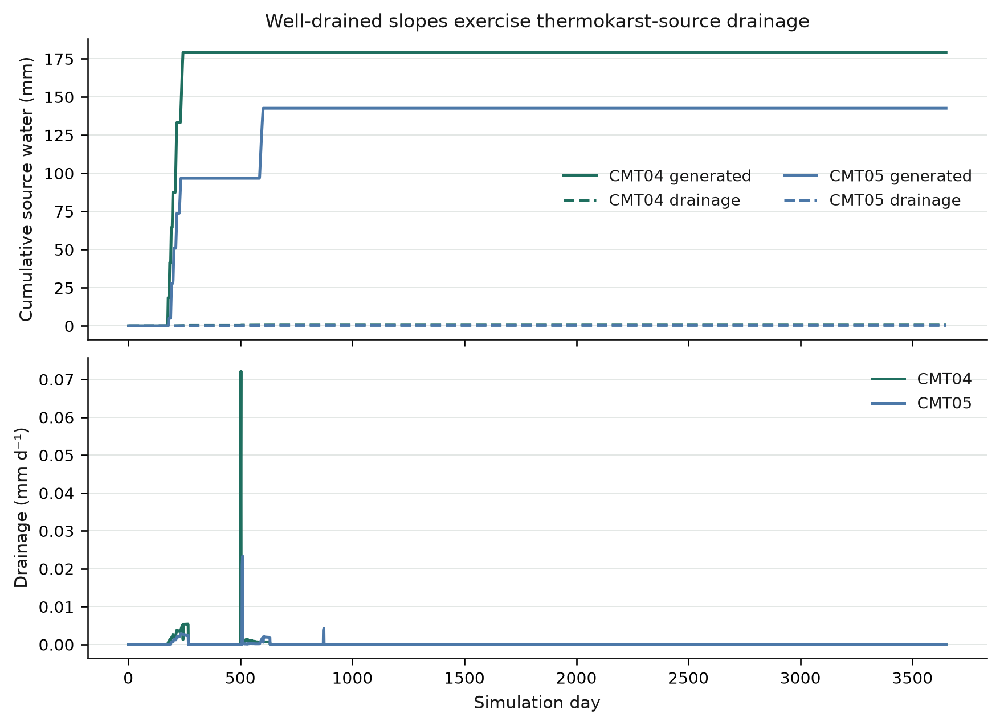
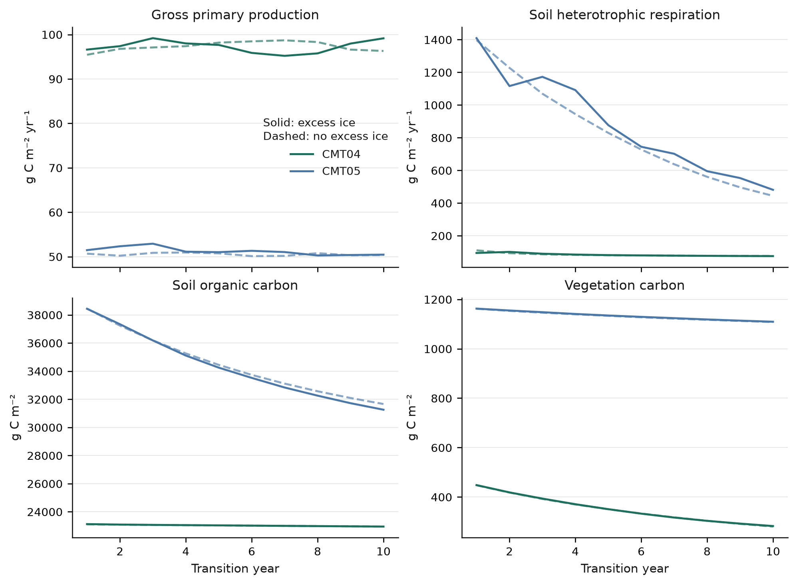
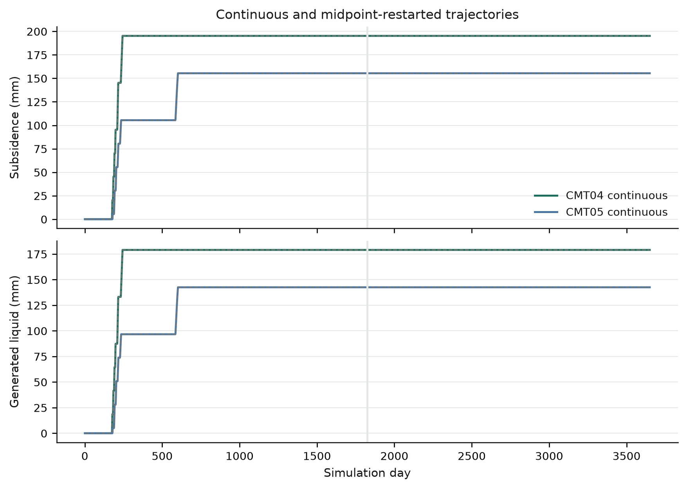
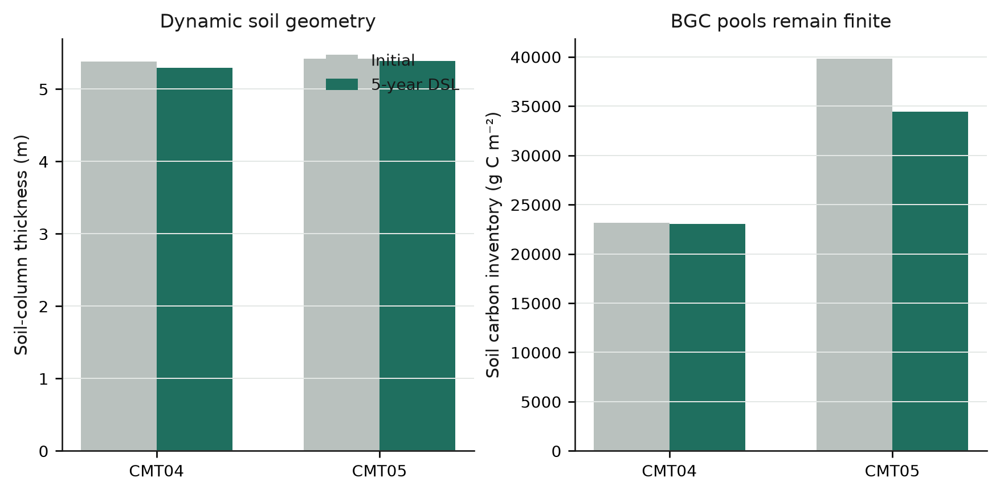

# Biogeochemical thermokarst coupling validation

**Date:** 2026-09-17
**Repository:** `/Users/EJafarov/projects/TEM_abrupt_thaw_dev`
**Branch:** `feature/thermokarst-prototype`
**Validation base revision:** `e2748e943c27ffde22fe99c00491f5f62a04f016`
**Validated implementation revision:** `c809d96eb8a5cd5843ccf1c0adb3735500bb3dce`

## Executive summary

The production BGC thermokarst suite passed **14 of 14** acceptance gates. It replaces the earlier diagnostic, whose nominal thaw case produced no excess-ice melt or subsidence and therefore did not support its coupling claims.

The new experiment runs CMT04 shrub tundra and CMT05 tussock tundra together, uses a matched zero-excess control, forces rain during seasonal thaw, and places both cells in a parameterized well-drained setting. Both communities produced nonzero thermokarst-source drainage. Ten-year active-collapse runs, a five-plus-five-year restart run, and a five-year BGC/dynamic-soil run completed with valid output.

Key results are:

- CMT04 generated **179.021325 mm** of thermokarst-source liquid, drained **0.524253 mm**, and subsided **195.225 mm**.
- CMT05 generated **142.524725 mm**, drained **0.321776 mm**, and subsided **155.425 mm**.
- Source-water partition error was at most **5.68×10⁻¹⁴ mm**.
- Ecosystem carbon-budget residual was at most **0.004378 g C m⁻²** across control, active, and dynamic-soil runs.
- Midpoint restart reproduced generated liquid and subsidence to **3.36×10⁻¹⁸** or better and final collapse geometry exactly. The leading-front trajectory differed by at most **0.283 mm**; final C and N inventories differed by at most **1.22×10⁻⁴ relative**.
- The zero-excess dynamic-soil run changed CMT04 from 19 to 18 soil layers and retained 20 layers for CMT05 while keeping all requested BGC diagnostics finite.

This is a deterministic process and regression experiment. Its forcing and slope are deliberately strong so the drainage branch is observable; the results are not a regional projection or calibrated estimate.

## Production changes

### Bounded dynamic-soil support

Thermokarst previously rejected every run with dynamic soil layers (`dsl=true`). The production path now permits dynamic soil regridding when the thermokarst column contains zero excess ice. Before the annual SOM-driven split/merge operation, obsolete thermokarst matrix tags are cleared. After regridding, each resulting soil layer becomes its own zero-excess matrix layer:

\[
\Delta z_{m,i}=\Delta z_i,\qquad
\phi_{m,i}=\phi_i,\qquad
M_{x,i}=0.
\]

Active excess ice plus `dsl=true` still raises an explicit error. Splitting or merging a collapsing layer requires a future material-conservative map for matrix volume, excess ice, enthalpy, liquid, ice, C, N, roots, and monthly accumulators. Fire-driven topology changes (`dsb=true`) remain explicitly unsupported for the same reason.

### Nitrogen merge correction

`Ground::combineTwoSoilLayersL2U()` contained `usl->avln =+ lsl->avln`. This assigned the lower layer's available N instead of adding it. The operation is now `+=`, so a dynamic-layer merge preserves both layers' available-N pools.

### Current-toolchain compatibility

The validation build updates the calibration controller from removed Boost.Asio `io_service` APIs to `io_context`. It also fixes NetCDF time-series array lengths to use the actual time dimension rather than dividing by the template return type. These changes do not alter thermokarst equations.

### Output isolation

The old BGC harness enabled `RHSOM`, `SOC`, and `VEGC` in the repository-wide output specification. The new harness writes a private output specification inside its result directory, so running unrelated TEM cases does not inherit validation-only output volume.

## Experimental design

### Spatial configuration

Two adjacent Toolik demonstration cells are activated in one production run:

| Cell | Community | Drainage class | Parameterized slope |
|---|---|---:|---:|
| `(Y=0, X=0)` | CMT04 shrub tundra | 0, well drained | 30° |
| `(Y=0, X=1)` | CMT05 tussock tundra | 0, well drained | 30° |

The large slope is an intentional branch test for lateral Richards drainage. It is not intended to represent the original Toolik topography.

### Initialization and matched states

The suite runs one pre-run year and five equilibrium-stage years with environmental physics, BGC, nitrogen feedback, available N, and dynamic LAI enabled. Thermokarst is enabled with zero excess ice so its restart metadata is initialized.

The resulting restart is copied. The active copy receives 20% excess ice over matrix depths 0.2–1.0 m:

\[
M_{x,i}=\rho_i\,\Delta z_{overlap,i}\frac{f_x}{1-f_x},
\qquad
\Delta z_i=\Delta z_{m,i}+\frac{M_{x,i}}{\rho_i},
\]

with \(f_x=0.2\) and \(\rho_i=917\;\mathrm{kg\,m^{-3}}\). Each cell receives **183.4 kg m⁻²**. All C and N pools are unchanged exactly by this operation. The zero-excess control and active case therefore begin with identical ecological states.

### Periodic rain-on-thaw forcing

Every climate year repeats the same monthly sequence, so restarting at year five cannot select a different climate year.

- Air temperature: −20, −18, −12, −4, 4, 10, 12, 8, 2, −5, −12, −18 °C.
- Precipitation: 8, 7, 6, 7, 10, **200, 200**, 22, 16, 12, 9, 8 mm month⁻¹.
- Net incoming radiation driver: 0, 2, 6, 12, 18, 22, 20, 14, 8, 3, 0, 0.

The June and July pulses coincide with thaw and saturate enough of the well-drained column to exercise `TKLIQDRAINAGE`.

### Production cases

1. Zero-excess initialization: 1 pre-run + 5 equilibrium-stage years.
2. Zero-excess control: 10 transition years.
3. Active thermokarst: 10 transition years.
4. Restart path: 5 active years + NetCDF restart + 5 active years.
5. Dynamic soil: 5 zero-excess transition years with BGC and `dsl=true`.

All six production invocations completed with `run_status=100` for both active cells.

## Results

### Nonzero thermokarst-source drainage

Both community types exercise the drainage branch. CMT04 partitions 0.524253 mm of its generated source water to drainage; CMT05 partitions 0.321776 mm. Runoff remains the dominant routed loss because most collapse liquid reaches the surface-routing path under this forcing.

| Community | Generated | Runoff | Drainage | Other | Final storage | Closure residual |
|---|---:|---:|---:|---:|---:|---:|
| CMT04 | 179.021325 | 163.608621 | 0.524253 | 14.888451 | ~0 | 2.84×10⁻¹⁴ |
| CMT05 | 142.524725 | 135.884246 | 0.321776 | 6.318703 | ~0 | −5.68×10⁻¹⁴ |

Units are mm water equivalent. The tracer closure is

\[
\epsilon_W=S+R+D+O-G.
\]



### BGC response under matched forcing

Solid curves show the active excess-ice case; dashed curves show the zero-excess control. Both receive the same climate, rain pulses, drainage class, slope, and initial BGC pools.

The response is community dependent. At year 10, CMT04 retains 2.892 g C m⁻² more total ecosystem C in the active case than in the control. CMT05 retains 404.532 g C m⁻² less. Most of the CMT05 difference is soil carbon: active SOC is 405.941 g C m⁻² below control, while active vegetation C is 1.409 g C m⁻² above control. This result demonstrates coupled sensitivity; it does not establish a generally applicable response sign.



For every cell and case, the ecosystem carbon inventory obeys

\[
C_f-C_0=\sum_y\left(\mathrm{NPP}_y-\mathrm{RHSOM}_y-\mathrm{RHDWD}_y\right)+\epsilon_C.
\]

The largest \(|\epsilon_C|\) is **0.004378 g C m⁻²**. The harness checks CMT04 and CMT05 separately for the control, active, and dynamic-soil cases.

The restart contains all injected C and N pools exactly before integration. A whole-ecosystem nitrogen-flux closure is not claimed: the standard requested `NINPUT` and `NLOST` outputs are both zero in this experiment and do not provide a complete external-N budget for all persisted vegetation and soil N states.

### Midpoint restart

The 10-year continuous run is compared with a five-year run resumed for five more years. `TKLIQGEN`, `TKLIQSTORAGE`, `TKLIQRUNOFF`, `TKLIQDRAINAGE`, `TKLIQOTHER`, `TKSUBSIDENCE`, and `TKFRONTTYPE` agree to 3.36×10⁻¹⁸ or better. Final `TKmatrix`, `TKporosity`, `TKexcess`, and `DZsoil` are exact.



The long BGC restart is not bitwise identical. Maximum leading-front difference is 0.2826 mm; final ecosystem C differs by at most 6.94×10⁻⁵ relative and N by 1.22×10⁻⁴ relative. Individual phase and BGC fields show correspondingly small differences, while cumulative thermokarst boundary-energy bookkeeping differs by 1.23×10⁵ J m⁻². The suite uses explicit, reported tolerances for this long coupled restart instead of presenting it as exact. The dedicated physical active-thaw test remains the exact thermokarst restart test.

### Dynamic soil with BGC

The five-year zero-excess dynamic-soil run exercises annual SOM-driven geometry changes while thermokarst thermal and restart infrastructure remain enabled.

| Community | Initial layers | Final layers | Initial thickness | Final thickness | Final SOC |
|---|---:|---:|---:|---:|---:|
| CMT04 | 19 | 18 | 5.380900 m | 5.293019 m | 23,045.635 g C m⁻² |
| CMT05 | 20 | 20 | 5.421700 m | 5.387164 m | 34,431.465 g C m⁻² |

All requested BGC outputs and final C/N inventories are finite. Carbon closure residuals are −0.000516 g C m⁻² for CMT04 and 0.002302 g C m⁻² for CMT05.



## Acceptance results

| Gate | Observed | Criterion | Result |
|---|---:|---:|:---:|
| Production completion | 6 runs × 2 cells at 100 | all 100 | PASS |
| Multiple communities | CMT04 and CMT05 | both present | PASS |
| Rain-on-thaw forcing | 200 mm in June and July | ≥200 mm | PASS |
| Active excess-ice melt | minimum 142.524725 mm | >0 each CMT | PASS |
| Thermokarst drainage | minimum 0.321776 mm | >0 each CMT | PASS |
| Source-water closure | 5.68×10⁻¹⁴ mm | ≤1×10⁻⁹ mm | PASS |
| Restart source-water/subsidence | 3.36×10⁻¹⁸ | ≤1×10⁻¹² | PASS |
| Restart front trajectory | 0.2826 mm | ≤0.5 mm | PASS |
| Restart collapse geometry | 0 | ≤1×10⁻¹² | PASS |
| Restart ecosystem C/N inventory | 1.22×10⁻⁴ relative | ≤5×10⁻⁴ | PASS |
| Injection C/N preservation | exact | exact | PASS |
| Ecosystem carbon budget | 0.004378 g C m⁻² | ≤0.01 g C m⁻² | PASS |
| BGC output validity | all finite | all finite | PASS |
| Dynamic-soil production | 18 and 20 final layers | complete and finite | PASS |

Machine-readable evidence is stored in `bgc-validation-summary.json` and `bgc-validation-checks.csv` beside this report.

## Regression verification

- Core thermokarst numerical tests: **26/26 passed**.
- NetCDF restart round trip: **passed**.
- Legacy restart compatibility: **passed**.
- Version-1 thermokarst restart compatibility: **passed**.
- Zero-excess/frozen-column production suite: **17/17 passed**.
- Exact active-thaw production restart suite: **14/14 passed**.
- Seasonal production-diagnostic suite: **7/7 passed**.
- BGC coupling acceptance gates: **14/14 passed**.
- Production executable rebuilt successfully with `-Werror` under the current local compiler after the recorded Boost and array-length compatibility corrections.
- PNG figures were inspected at final size; SVG versions are also stored with the report.

## Reproduction

From `/Users/EJafarov/projects/TEM_abrupt_thaw_dev`:

```console
make thermokarst-test
make thermokarst-bgc-validation
```

The full validation writes ignored production data to:

```text
experiments/thermokarst/bgc_coupling_validation_results/
```

To regenerate plots and checks from completed cases after a report-only change:

```console
.venv-thermokarst/bin/python \
  experiments/thermokarst/bgc_coupling_validation.py \
  --binary ./dvmdostem --reuse
```

## Scope and next implementation step

This milestone validates active collapse with BGC on a fixed material topology and validates dynamic SOM topology with zero excess ice. It does not yet combine active excess-ice collapse with annual dynamic-layer split/merge or fire disturbance. The next code increment should implement a conservative topology map for matrix thickness, excess ice, phase enthalpy, water, all C/N pools, roots, fronts, and accumulated diagnostics; only then should the active-excess `dsl` and `dsb` guards be relaxed.
