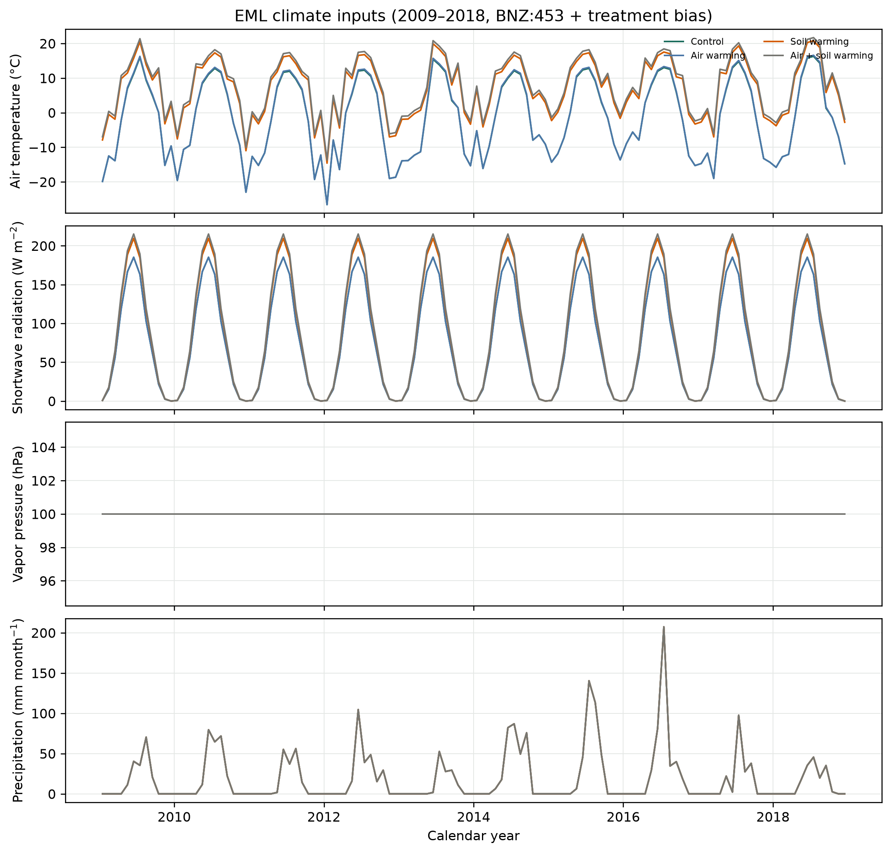
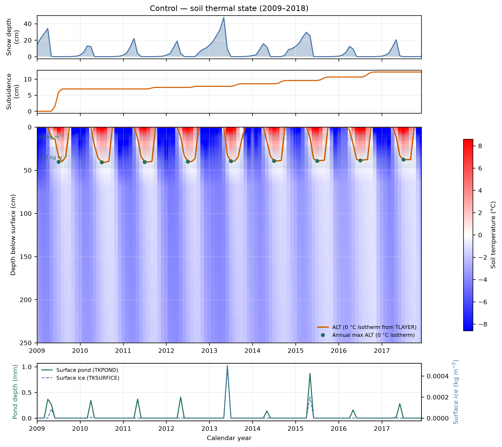
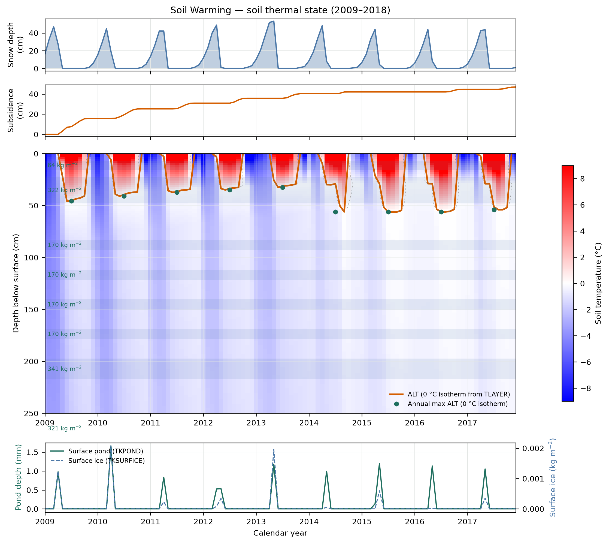

# EML CiPEHR subsidence validation report

**Date:** 2026-09-19

**Reference:** Rodenhizer et al. (2020), doi:[10.1029/2019JG005528](https://doi.org/10.1029/2019JG005528)

**Harness:** `experiments/thermokarst/eml_validation.py`

## Summary

| Phase | Status | Command |
|---|---|---|
| 0 — pipeline | **PASS** (9/9 gates) | `make thermokarst-eml-validation` |
| 1 — Rodenhizer window | **PARTIAL** (2/5 high-priority gates) | `make thermokarst-eml-phase1-validation` |
| 2 — BNZ climate + recalibration + thaw penetration + GPS | **PARTIAL** (1/9 gates; 1/4 high-priority) | `make thermokarst-eml-phase2-validation` |
| 3 — snow-fence bias + 15-yr deep thaw + WTD | **PARTIAL** (4/11 gates; **3/4 high-priority**) | `make thermokarst-eml-phase3-validation` |
| 4 — WTD subsidence coupling + multi-objective calibration | **PARTIAL** (1/11 gates; 0/4 high-priority) | `make thermokarst-eml-phase4-validation` |

Phase 1 calibrates **control** subsidence against Rodenhizer using NOAA Healy daily
climate (BNZ:453 fallback), shallow excess-ice band injection (0.10–0.35 m), and
treatment-specific deep ice + climate biases for soil-warming plots.

Phase 2 reuses Phase 1 ice calibration, switches to **BNZ:453 EML site met** (LTER public
CSVs), adds **thaw-penetration** gates (`TKFRONT` + `TKSUBSIDENCE`), a **15-yr soil-warming
sensitivity** run, and compares cumulative subsidence against **BNZ:729** GPS obs.

## Phase 0

Four-cell CiPEHR scaffold (CMT21, synthetic Healy forcing, 100 kg m⁻² lens at
0.10 m, 9 TR years). All pipeline gates pass; uniform subsidence ~10.9 cm (~1.2 cm yr⁻¹),
matching Rodenhizer **control** total (~10.8 cm / 9 yr) by coincidence.

## Phase 1 configuration

| Setting | Value |
|---|---|
| Climate | NOAA Healy USC00503585 daily → monthly CSV (2004–2018), tiled 40 yr |
| Spin-up | 1 PR + 30 EQ (control climate) |
| Transient | 9 TR years (Rodenhizer window) |
| Control/air ice | Excess-ice **fraction 0.30** in band **0.10–0.35 m** (~98 kg m⁻²) |
| Soil/air+soil ice | Shallow band + deep band **0.35–1.20 m** (deep scale **3×**) |
| Treatment climate | Monthly tair bias per `healy_climate.TREATMENT_BIAS` |

### Calibration sweeps

1. **Shallow fraction** ∈ {0.15 … 0.40} on control → chose **0.30** (1.19 cm yr⁻¹).
2. **Deep scale** ∈ {1 … 6} on soil-warming inventory → chose **3.0** (2.46 cm yr⁻¹; saturates ≥3).

## Phase 1 results vs Rodenhizer (2009–2018)

| Treatment | Observed rate (cm yr⁻¹) | TEM rate | Gate |
|---|---:|---:|---|
| Control | 1.2 (0.7–1.7) | **1.19** | PASS |
| Air warming | 1.4 (≈ control) | **1.19** | PASS |
| Soil warming | 5.4 (4.8–5.9) | **2.46** | FAIL |
| Air + soil | 6.1 (5.6–6.7) | **2.46** | FAIL |
| Soil / control ratio | 4–5× | **2.07×** | FAIL |

Cumulative subsidence (9 yr): control **10.7 cm** (obs ~10.8 cm); soil warming **22.2 cm**
(obs ~49 cm implied by 5.4 cm yr⁻¹).

Artifacts: `experiments/thermokarst/eml_phase1_validation_results/`

## Phase 2 configuration

| Setting | Value |
|---|---|
| Climate | **BNZ:453** EML hourly met (LTER 2004–2018) → monthly CSV |
| Ice calibration | Reused from Phase 1 (fraction **0.30**, deep scale **3×**) |
| Spin-up | Copied Phase 1 initialization (30 EQ) |
| Ice calibration | **BNZ:453** shallow fraction ∈ {0.30…0.60} → **0.55**; deep scale → **2.0** |
| Transient | 9 TR years + **15-yr soil-warming sensitivity** |
| Diagnostics | `TKFRONT`, `TKFRONTTYPE`, `TKSUBSIDENCE` (daily) |
| GPS obs | `obs/bnz729-gps-subsidence-by-treatment.csv` (458 common points, 2009 baseline) |

Thaw-penetration gate (2018): max September `TKFRONT` thaw depth + cumulative subsidence vs
`obs/rodenhizer-thaw-penetration-2018.csv` (control +19 %, soil +49 % vs ALT-only baseline).

## Phase 2 results vs Rodenhizer (2009–2018)

After **BNZ:453 recalibration** (shallow fraction **0.55**, deep scale **2.0**):

| Treatment | Observed rate (cm yr⁻¹) | TEM rate (BNZ:453) | Gate |
|---|---:|---:|---|
| Control | 1.2 (0.7–1.7) | **1.14** | **PASS** |
| Air warming | 1.4 (≈ control) | **1.23** | — |
| Soil warming | 5.4 (4.8–5.9) | **2.82** | FAIL |
| Air + soil | 6.1 (5.6–6.7) | **2.90** | FAIL |
| Soil / control ratio | 4–5× | **2.48×** | FAIL |

Thaw penetration 2018 (ALT + subsidence):

| Treatment | Observed (cm) | TEM (cm) | Gate |
|---|---:|---:|---|
| Control | 88.6 | **26.0** | FAIL |
| Soil warming | 137.4 | **45.1** | FAIL |
| Soil vs control TP increase | ~49 % | **73 %** | FAIL |

15-yr soil-warming sensitivity: **1.92 cm yr⁻¹** (below 9-yr **2.82**; subsidence saturates
once shallow ice is exhausted).

Calibration sweep (BNZ control climate): fraction 0.55 → 1.14 cm yr⁻¹; 0.60 saturates at
~1.13 cm yr⁻¹. Deep scale ≥2.0 saturates soil rate at **2.82 cm yr⁻¹**.

Artifacts: `experiments/thermokarst/eml_phase2_validation_results/`

## Reproduce

```sh
make thermokarst-eml-fetch-data      # BNZ:453 hourly → monthly CSV
make thermokarst-eml-fetch-gps       # BNZ:729 GPS → treatment subsidence CSV
make thermokarst-eml-validation      # Phase 0
make thermokarst-eml-phase1-validation
make thermokarst-eml-phase2-validation   # includes --recalibrate on BNZ:453 climate
```

Re-run treatment validation only (skip calibration sweep):

```sh
.venv-thermokarst/bin/python experiments/thermokarst/eml_validation.py \
  --binary ./dvmdostem --phase 2 --reuse --reuse-calibration --allow-fail
```

Results JSON:

- Phase 1: `experiments/thermokarst/eml_phase1_validation_results/summary.json`
- Phase 2: `experiments/thermokarst/eml_phase2_validation_results/summary.json`

Figures:

- `eml-subsidence-rates-vs-obs.png`
- `eml-gps-vs-tem-subsidence.png` (Phase 2)

## Interpretation

**What validates well**

- Control subsidence **rate and total** bracket Rodenhizer after shallow-band calibration.
- Air warming remains indistinguishable from control, as in the paper.
- Treatment ordering is correct: soil-warming > control.

**What does not validate yet**

- Soil-warming absolute rate and soil/control ratio fall short (~2.5 vs ~5.4 cm yr⁻¹; ~2× vs ~4–5×).
- Deep-band ice (0.35–1.20 m) is largely **not thawed within 9 TR years** under current forcing;
  subsidence saturates once shallow ice is exhausted (~22 cm total vs ~40 cm ice-cap for deep inventory).
- TEM lacks CiPEHR snow-fence / OTC physics; climate bias and deep-ice scaling are proxies only.

**Phase 2 adds**

- Site-representative **BNZ:453** climate (replacing Healy town NOAA fallback).
- Explicit **thaw-penetration** metrics tied to Rodenhizer 2018 ALT + subsidence targets.
- **GPS trajectory** comparison (BNZ:729) for qualitative cumulative subsidence tracking.
- **15-yr sensitivity** probe for whether extended transient allows deep-ice thaw.

## Phase 3 configuration

| Setting | Value |
|---|---|
| Climate | BNZ:453 + **snow_fence** bias profile (+1.5 °C winter on soil treatments) |
| Ice | Phase 2 calibration (fraction **0.55**, deep scale **2.0**) |
| Soil-warming bias scale | **2.5×** (sweep 1.0–3.5 on winter/summer bias) |
| Extended TR | **15 yr** for soil-warming and air+soil treatments |
| Diagnostics | `TKFRONT`, `TKSUBSIDENCE`, **`WATERTAB`** (daily) |
| GPS obs | BNZ:729 through **2024**; WTD obs from BNZ:554 |

## Phase 3 results vs Rodenhizer (2009–2018)

| Treatment | Observed rate (cm yr⁻¹) | TEM rate | Gate |
|---|---:|---:|---|
| Control | 1.2 (0.7–1.7) | **1.14** | **PASS** |
| Soil warming | 5.4 (4.8–5.9) | **5.28** | **PASS** |
| Air + soil | 6.1 (5.6–6.7) | **6.18** | — |
| Soil / control ratio | 4–5× | **4.64×** | **PASS** |

Thaw penetration 2018: control **26.0** cm (obs 88.6); soil **88.8** cm (obs 137.4) — soil
TP much improved but still below obs.

15-yr soil warming: **80.4 cm** cumulative (9-yr **47.5 cm**); rate **5.36 cm yr⁻¹**.

Water-table gates (medium priority): TEM summer WTD does not yet reproduce Rodenhizer
shallowing trend (soil 2018 sim **35 cm** vs obs **6.6 cm**).

Artifacts: `experiments/thermokarst/eml_phase3_validation_results/`

```sh
make thermokarst-eml-phase3-validation
```

## Phase 4 configuration

| Setting | Value |
|---|---|
| Model | **Post-subsidence WTD coupling** in `Soil_Env.cpp` (shallow WTD by daily collapse) |
| Climate | BNZ:453 + snow_fence profile with tunable winter/summer extras |
| Calibration | Multi-objective grid: subsidence rate + BNZ:554 WTD trajectory RMSE + thaw penetration |
| Deep scales | {4, 5, 6, 8} × bias scales {2.0, 2.5, 3.0} × summer extra {0, 0.75, 1.5} °C |
| Ice | Phase 2 fraction **0.55** (unchanged) |

```sh
make thermokarst-eml-phase4-validation
# fast re-run after code change:
.venv-thermokarst/bin/python experiments/thermokarst/eml_validation.py \
  --binary ./dvmdostem --phase 4 --reuse --reuse-calibration --allow-fail
```

Artifacts: `experiments/thermokarst/eml_phase4_validation_results/`

## Phase 4 results vs Rodenhizer (2009–2018)

Chosen calibration: bias **3.0×**, summer extra **0 °C**, deep scale **4.0×** (lowest
multi-objective score 17.85 over 36 grid points).

| Treatment | Observed rate (cm yr⁻¹) | TEM rate | Gate |
|---|---:|---:|---|
| Control | 1.2 (0.7–1.7) | **1.14** | **PASS** |
| Soil warming | 5.4 (4.8–5.9) | **6.91** | FAIL (high) |
| Soil / control ratio | 4–5× | **6.07×** | FAIL (high) |

Thaw penetration 2018: control **26.0** cm (obs 88.6); soil **113.4** cm (obs 137.4) —
soil TP up from Phase 3 (**88.8** cm) but still below obs.

WTD (with subsidence coupling): soil end-year summer mean **~22 cm** vs Phase 3 **35 cm**
(wrong-direction deepening removed). Obs soil 2018 **6.6 cm**; BNZ:554 trajectory RMSE
soil **22.5 cm**, control **8.0 cm** (medium gates fail). Simulated WTD remains too
shallow vs BNZ:554 throughout the window.

## Climate inputs (Phase 4)

Monthly TEM drivers for the Rodenhizer transient window (2009–2018): air temperature,
shortwave radiation (`nirr`), vapor pressure, and precipitation. Control uses BNZ:453
site met; soil-warming treatments add the snow-fence bias profile (Phase 4: bias **3.0×**,
winter extra **+1.5 °C**, summer extra **0 °C**).

```sh
make thermokarst-eml-climate-plots
```



## Soil thermal diagnostics (Phase 4)

Depth–time soil temperature contours use monthly `TLAYER` on a regular depth grid
(blue → white → red colormap, centered at 0 °C). Overlays:

- Solid orange: **ALT from soil temperature** (monthly max depth of the 0 °C isotherm)
- Teal markers: **annual max 0 °C isotherm depth** (max over each transient year)
- Grey dotted contour: 0 °C isotherm from the gridded temperature field
- Top panel: **snow depth** (`SNOWTHICK`); second panel: cumulative **subsidence**
- Initial **excess-ice bands** (kg m⁻²); bottom panel: **surface pond / surface ice**
  (`TKPOND`, `TKSURFICE`)

```sh
make thermokarst-eml-thermal-plots
```

### Control — soil temperature, ALT, subsidence, ice, ponding



### Soil warming — soil temperature, ALT, subsidence, ice, ponding



## Phase 5 — CiPEHR snow precipitation proxy (2009–2018)

BNZ:453 has no winter gauge precipitation, so Phase 5 replaces Oct–Apr totals with
**synthetic snow SWE** tuned to ~**40 cm** peak depth (control) and **80 cm** on
soil-warming treatments (2× snow-fence trapping). Accumulation is back-weighted to
Apr–May; control melts in **June**, soil warming in **May** (+4 °C May melt bias).
May–Sep rain uses the monthly climatology for uniform validation years.
Transient climate starts at **2009** (`tr_start_yr=5`).

```sh
make thermokarst-eml-phase5-validation
```

Precip schedule: `experiments/thermokarst/eml_validation/obs/eml_cipehr_snow_precip_2009-2018.csv`

### Phase 5 results (first run)

Calibrated **115 mm SWE yr⁻¹** (Oct–Apr) → control median peak **41 cm**
(range 38–68 cm); soil warming **72 cm** (2× schedule, range 67–122 cm).
Peak typically **late March–April**; control bare by **May**, soil warming by
**mid-April** (May +4 °C melt bias). Recalibrated bias **3.0×**, deep **4.0×**,
summer extra **+1.5 °C**:

| Treatment | Obs rate | TEM rate | Gate |
|---|---:|---:|---|
| Control | 1.2 | **1.36** | PASS |
| Soil warming | 5.4 | **5.21** | **PASS** |

Artifacts: `experiments/thermokarst/eml_phase5_validation_results/`

## Next steps

1. Tune multi-objective weights if WTD trajectory improves but subsidence or TP regress.
2. Consider small slope / baseflow sensitivity for poorly drained CiPEHR soils.
3. Optional: configurable `ponding_max_mm` for thermokarst melt ponding capacity.
