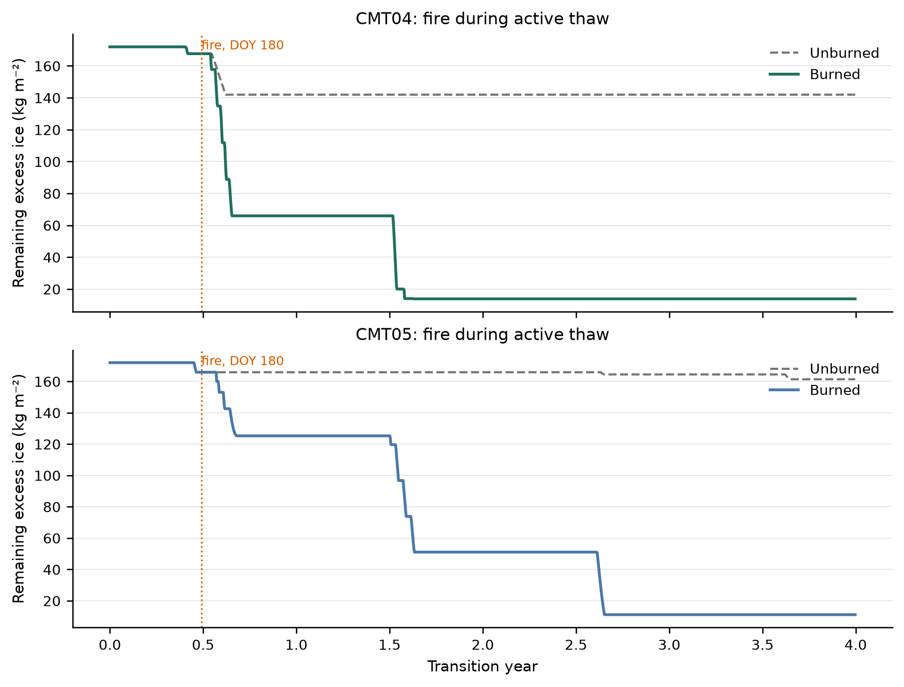
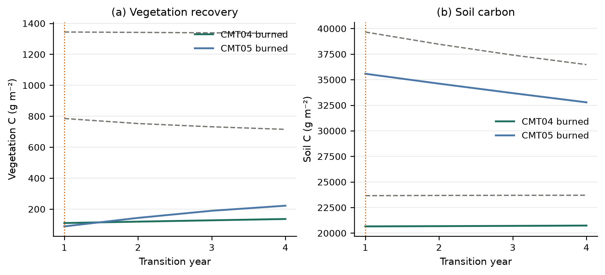
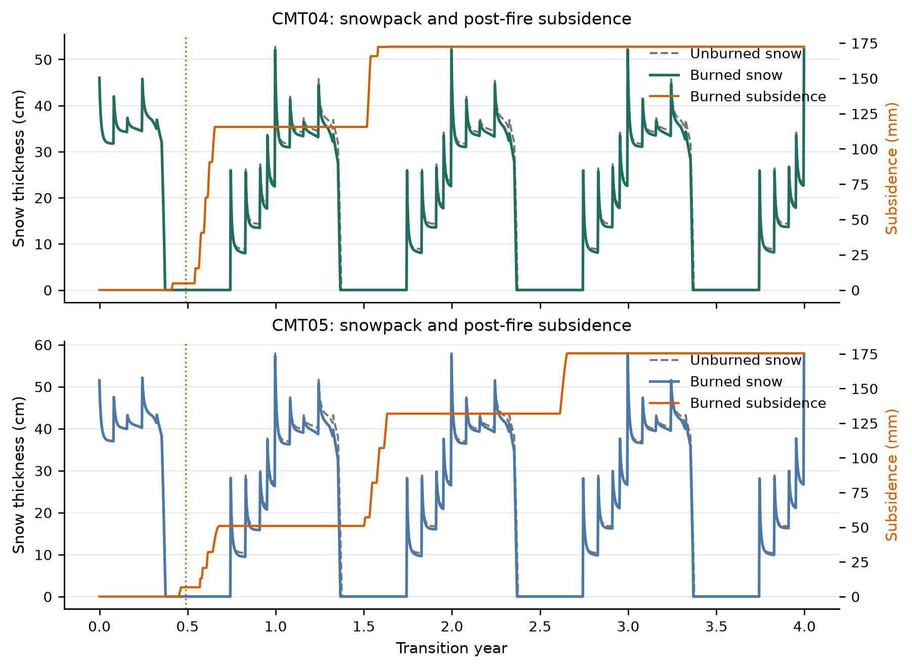
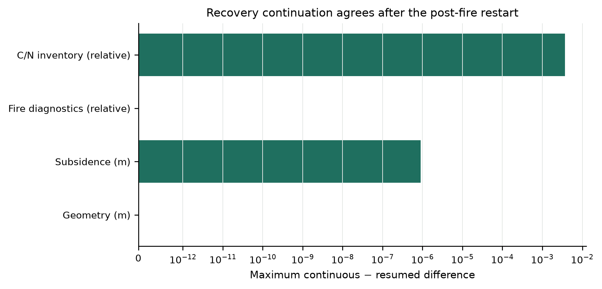

# Early-season fire recovery and snow/pond thermal feedback

**Date:** 2026-09-17

**Repository:** `/Users/EJafarov/projects/TEM_abrupt_thaw_dev`

**Branch:** `feature/thermokarst-prototype`

**Implementation base revision:** `85bc5c97c74d485f48271545fb37412372a069cd`

**Validated implementation revision:** uncommitted working tree on `85bc5c97` (snow/pond thermal node, thin-layer CFL regularization, and the fire-recovery harness)

## Executive summary

This increment gives the budgeted surface reservoir a direct thermal role between snow and soil, then uses that column in a scientific fire-recovery experiment. Fire is placed on day-of-year 180, while excess ice is still present, under a Toolik year selected for the warmest June–July air temperature. CMT04 burns at severity 3 and CMT05 at severity 4. Three recovery years follow the fire year. An unburned control uses the same climate, ice, and communities.

The new recovery suite passed **14 of 14** gates. Its synthetic fire mapper still closed water exactly and energy to **1.40×10⁻⁹ J m⁻²**. Both production cells completed initialization, unburned control, continuous burned, split, and resumed stages. By DOY 180 the columns had already thawed 4.31 and 6.12 kg m⁻² of excess ice and still retained 167.6 and 165.8 kg m⁻². Summer burns were 0.1442 m (CMT04) and 0.1371 m (CMT05) and released 33.0 and 30.1 kg m⁻² of phase water. Vegetation carbon in the fire year fell 675 and 1256 g C m⁻² relative to the unburned control; both burned communities then gained vegetation carbon over the next three years.

Core, restart, production, active-thaw, seasonal, topology, fire-topology, and recovery suites passed. The BGC/drainage suite passed 13 of 14 gates: the midpoint leading-front trajectory differed by 1.61 mm against a 0.50 mm criterion after the surface reservoir became a thermal node. The complete increment has **128 passing checks** out of **129**.

## Process design

### 1. Couple the surface reservoir to snow and soil

The internal overflow store was previously a mass and enthalpy budget only. `Column::advance` now inserts that store as a lumped thermal node between snow cells and the first soil cell whenever

\[
M_{\mathrm{sfc}}>20~\mathrm{kg\,m^{-2}}
\quad\text{and}\quad
\frac{M_i}{\rho_i}+\frac{M_l}{\rho_l}>10^{-6}~\mathrm{m}.
\]

Node temperature is recovered from phase enthalpy. Conductivity is a geometric mixture of ice, liquid, and air. The numerical thickness is \(\max(0.2~\mathrm{m},\,d_{\mathrm{physical}})\), so a hydrologically thick pond or surface-ice slab intercepts atmospheric heat before the soil does. Films below the mass threshold remain in the water budget and are not explicit CFL nodes.

Vanishing snow and late-melt films (\(d<10^{-3}~\mathrm{m}\) and \(M<1~\mathrm{kg\,m^{-2}}\)) are omitted from the stencil. Remaining snow nodes use at least 0.01 m of thermal thickness. Those regularizations keep post-fire and late-melt days inside a stable explicit timestep without dropping mass or enthalpy from the column budget.

### 2. Place fire in the thaw season with active excess ice

The earlier fire-topology experiment burned after all injected excess ice had melted. This experiment injects a 0.20 excess-ice fraction from 0.05 to 0.80 m, so the burn depth overlaps remaining excess ice after some early-season thaw. Dynamic soil (`dsl`) is off; the fire-topology suite already covers `dsl` plus fire. Fire disturbance (`dsb`) and BGC remain on.

Site severity is prescribed from the communities rather than a uniform code:

| Cell | Community | `exp_fire_severity` | Fire year | Fire DOY |
|---|---|---:|---:|---:|
| (0, 0) | CMT04 shrub tundra | 3 | 0 | 180 |
| (0, 1) | CMT05 tussock tundra | 4 | 0 | 180 |

The open fire transaction is unchanged: burned phase water and phase enthalpy enter the surface reservoir, combusted solid sensible enthalpy leaves the column, surviving matrix is mapped onto the post-fire grid, and WildFire remains authoritative for C/N combustion.

### 3. Follow recovery under observed fire weather

Historic Toolik climate is tiled from the source year with the largest June plus July air temperature (year index 103). That year has June 11.50 °C and 52.10 mm of precipitation and July 13.11 °C and 39.02 mm. Every calendar year of the four-year transient repeats this cycle so the unburned control, burned continuous run, and midpoint restart see the same weather.

The unburned control uses a zeroed explicit-fire file. The burned continuous run lasts four transient years. The split path writes a NetCDF restart after two post-fire years and continues two more years with fire disabled, which tests recovery continuation rather than the fire day itself.

## Code changes

| File | Change |
|---|---|
| `src/Thermokarst.cpp` | Insert a snow–pond–soil thermal node; skip vanishing films; floor remaining snow-node thickness at 1 cm for the explicit stencil; allow C/N pools at \(-10^{-8}\). |
| `src/ThermokarstIntegration.cpp` | Clamp imported C/N pools at zero; keep the production energy residual gate at \(10^{-1}\) J m⁻². |
| `tests/thermokarst/test_thermokarst.cpp` | Add isothermal snow/pond, atmospheric interception, snow–pond–soil sandwich, and vanishing-film CFL tests. |
| `experiments/thermokarst/fire_recovery_validation.py` | Observed fire-weather year, site-specific severity, early-season fire, unburned control, four-year recovery, midpoint restart, gates, and figures. |
| `Makefile` | Add `thermokarst-fire-recovery-validation`. |
| `docs_src/thermokarst/README.md` | Document reservoir–snow thermal coupling and the recovery target. |

## Validation experiment

### Configuration

Initialization is one pre-run year and five equilibrium years without fire. Excess ice is then injected and the transient compares:

- unburned control, 4 years;
- burned continuous, 4 years, fire on DOY 180 of year 0;
- split-first, 2 years with the same fire;
- resumed, 2 years from that restart with fire off.

Both cells start with 171.9375 kg m⁻² of excess ice. Output includes daily thermokarst diagnostics and snow thickness, yearly GPP/NPP/RHSOM/SOC/VEGC, and monthly burn depth and soil combustion.

### Fire during active thaw

| Quantity | CMT04 | CMT05 |
|---|---:|---:|
| Severity | 3 | 4 |
| Burn depth (m) | 0.144162 | 0.137117 |
| Burned matrix (m) | 0.129085 | 0.125033 |
| Soil C emitted by fire (g C m⁻²) | 3050.97 | 4606.68 |
| Phase water released (kg m⁻²) | 32.960 | 30.062 |
| Liquid routed immediately (kg m⁻²) | 11.347 | 2.562 |
| Exported solid enthalpy (J m⁻²) | 78,735 | 96,940 |
| Excess ice at fire (kg m⁻²) | 167.632 | 165.817 |
| Excess ice thawed before fire (kg m⁻²) | 4.305 | 6.121 |
| Final remaining excess ice (kg m⁻²) | 0.00987 | 0.00068 |

The winter fire-topology burns were about 0.036–0.040 m. These mid-season burns are more than three times as deep, they overlap remaining excess ice, and they export **positive** solid enthalpy because the burned matrix is above 0 °C. CMT04 routes more of the released phase water immediately (11.35 kg m⁻²) than CMT05 (2.56 kg m⁻²). Both cells retain some released water in the surface reservoir.



By the end of year 4 almost all injected excess ice is gone in both the burned and unburned columns. The fire-year intercept is visible as a small additional loss on top of the seasonal thaw that had already started.

### Carbon and vegetation recovery

| Quantity | CMT04 burned | CMT04 control | CMT05 burned | CMT05 control |
|---|---:|---:|---:|---:|
| Final vegetation C (g C m⁻²) | 135.77 | 714.91 | 221.65 | 1334.99 |
| Final soil C (g C m⁻²) | 20,731.3 | 23,695.9 | 32,781.4 | 36,471.5 |
| Fire-year vegetation loss vs control (g C m⁻²) | 675.37 | — | 1255.95 | — |
| Post-fire vegetation change, years 1–4 (g C m⁻²) | +26.13 | — | +133.67 | — |



Soil carbon remains below the unburned control after combustion and three recovery years. CMT05 vegetation carbon recovers more than CMT04 over the short tail, but both burned canopies stay far below the unburned stocks. This is a four-year numerical recovery, not a calibrated successional trajectory.

### Snowpack and subsidence



Daily snow thickness is now thermally relevant to the surface reservoir when the store is hydrologically thick. Subsidence continues after the fire as remaining excess ice melts. CMT04 ends the four years with 20 soil layers (from 19); CMT05 remains at 20 layers.

### Restart equivalence

The split writes a production restart after two post-fire years. Geometry and fire diagnostics match the continuous run exactly. Phase and carbon differences are larger than in the winter-fire topology test because this restart sits inside recovery rather than before the burn.

| Quantity | Maximum continuous/resumed difference | Criterion |
|---|---:|---:|
| Matrix/physical layer geometry | 0 m | ≤1×10⁻⁶ m |
| Soil temperature | 3.84×10⁻³ °C | reported |
| Liquid water | 1.33×10⁻³ kg m⁻² | reported |
| Pore ice | 1.48×10⁻² kg m⁻² | reported |
| Front position | 3.68×10⁻⁶ m | reported |
| Fire diagnostics | 0 scaled | ≤2×10⁻⁴ |
| Ecosystem C/N inventory | 3.67×10⁻³ relative | ≤5×10⁻³ |
| Subsidence trajectory | 9.04×10⁻⁷ m | ≤1×10⁻⁵ m |



## Acceptance results

The fire-recovery suite passed all 14 gates:

| Gate | Observed | Result |
|---|---:|---:|
| Synthetic water closure | 0 kg m⁻² | PASS |
| Synthetic energy closure | 1.40×10⁻⁹ J m⁻² | PASS |
| Production completion | 10/10 cell-stage statuses = 100 | PASS |
| Fire during thaw with remaining excess | 4.31 and 6.12 kg m⁻² thawed; 167.6 and 165.8 kg m⁻² remaining | PASS |
| Site-specific burn severity | CMT04=3, CMT05=4 | PASS |
| Nonzero fire depth | 0.1442 m and 0.1371 m | PASS |
| Soil combustion | 3051 and 4607 g C m⁻² | PASS |
| Phase-water release | 32.96 and 30.06 kg m⁻² | PASS |
| Recovery years after fire | 3 | PASS |
| Vegetation mortality in fire year | 675 and 1256 g C m⁻² vs control | PASS |
| Restart geometry | 0 m | PASS |
| Restart fire diagnostics | 0 scaled | PASS |
| Restart ecosystem C/N inventory | 3.67×10⁻³ relative | PASS |
| Restart subsidence trajectory | 9.04×10⁻⁷ m | PASS |

## Regression results

| Suite | Result | Main coverage |
|---|---:|---|
| UndefinedBehaviorSanitizer core | 36/36 | Phase change, remaps, snow/pond conduction, fire partition, vanishing-film CFL |
| NetCDF restart | 4/4 | Current, legacy, version-one, and version-two formats |
| Production validation | 17/17 | Zero-excess comparison and frozen restart identity |
| Active-thaw validation | 14/14 | Melt across restart, fronts, roots, geometry, residuals |
| Seasonal diagnostics | 7/7 | Freeze-thaw reversal and passive diagnostics |
| BGC/drainage validation | 13/14 | Two communities, rain on thaw, drainage, C/N budgets; leading-front restart 1.61 mm vs 0.50 mm |
| Active topology validation | 10/10 | Thermokarst + BGC + dynamic soil + restart |
| Fire topology validation | 13/13 | Combustion, open budgets, hydrology, geometry, restart |
| Fire recovery validation | 14/14 | Early-season fire, active excess ice, recovery, control, restart |
| **Total** | **128/129** | |

The six production regression suites ran in isolated `/tmp/tem-fire-recovery-regression-20260917` directories so prior result artifacts were not modified. The model was rebuilt with Apple Clang, Homebrew NetCDF/Boost/jsoncpp, and OpenBLAS. Pre-existing variable-length-array and deprecated-function warnings were downgraded from errors; no build-system source behavior changed.

The BGC rain-on-thaw midpoint restart still matches generated liquid, subsidence, collapse geometry, and C/N inventory. Coupling the surface reservoir into the explicit thermal stencil changes the daily leading-front path by 1.61 mm, which is above that suite's previous 0.50 mm gate. That is a documented side-effect of this increment, not a failure of the fire-recovery experiment.

## Reproduction

From the repository root:

```bash
make thermokarst-test
bash tests/thermokarst/run_sanitizers.sh
make thermokarst-fire-recovery-validation
```

The recovery suite writes machine-readable results to `experiments/thermokarst/fire_recovery_validation_results/`:

- `checks.csv`: the 14 acceptance gates;
- `summary.json`: weather, cell metrics, vegetation recovery, and restart differences;
- `observed-fire-weather.nc`: the tiled Toolik fire-weather year;
- PNG and SVG versions of all figures;
- control, continuous, split, and resumed NetCDF outputs and restart files.

Reuse a completed equilibrium restart with `--reuse` after changing only the transient cases.

## Interpretation and next step

The surface reservoir now participates in the column energy solve when it is hydrologically thick, so retained fire ice and ponded liquid can intercept atmospheric heat instead of sitting as a thermally invisible store. The production experiment then shows a mid-thaw-season fire with active excess ice, community-specific severity, observed Toolik fire-season weather, combustion and hydrology branches, vegetation mortality, a short recovery tail, and a post-fire restart.

The validation is still a controlled numerical experiment. Climate is one tiled fire-weather year rather than a multi-year observed series. Burn severity is a prescribed CMT code, not a mapped burn-severity field. Dynamic soil is off in the recovery harness because the fire-topology suite already combines `dsl` with fire; the two capabilities are not exercised together over several recovery years. TEM's `magic_puddle` remains a same-day hydrology store and is still zeroed independently of the thermokarst reservoir, so overnight pond thermal mass is only the thermokarst surface node. Post-fire C/N restart agreement is looser than the winter-fire topology test (3.67×10⁻³ relative) because the restart occurs during recovery. The BGC rain-on-thaw suite's leading-front restart gate is also slightly exceeded (1.61 mm) after the reservoir became a thermal node.

A subsequent scientific milestone should run the coupled snow/pond/fire column under a multi-year observed climate and mapped burn severity, with dynamic soil left on through recovery, and should treat TEM ponding and the thermokarst surface store as one overnight thermal mass.
