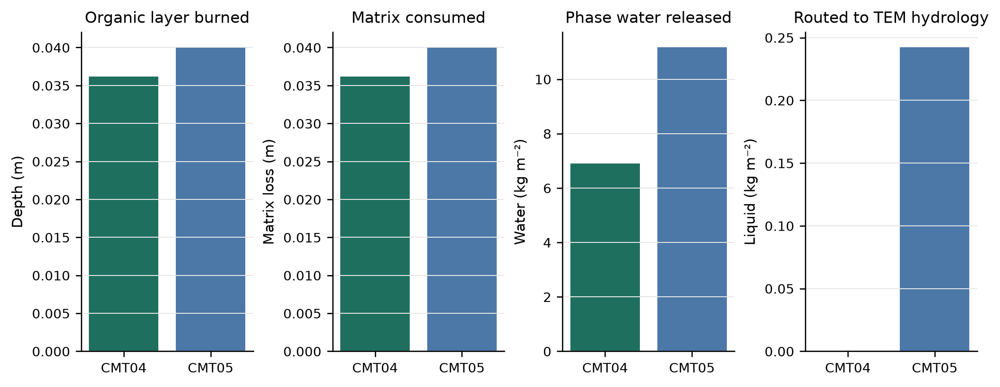
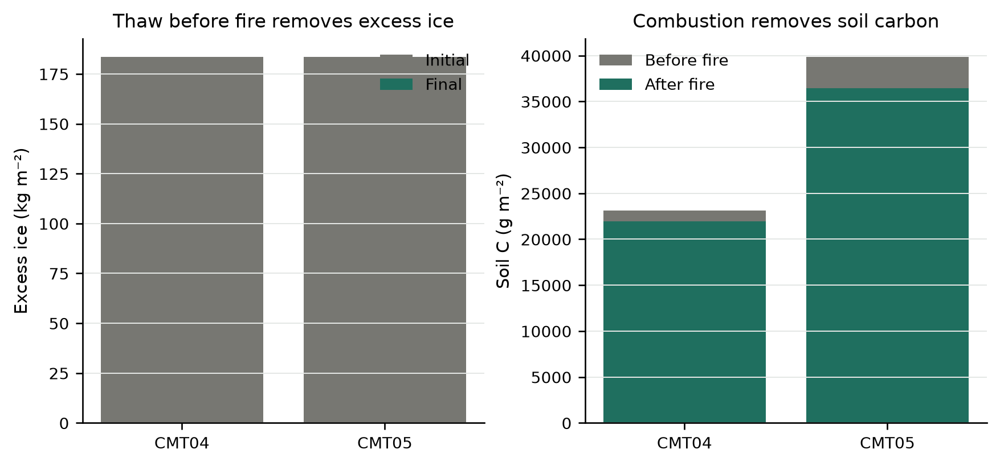
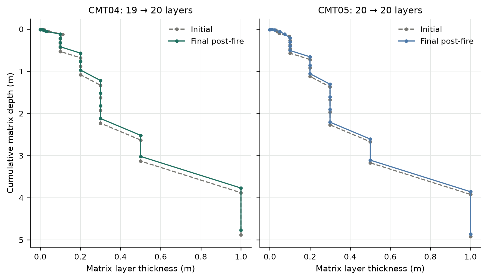
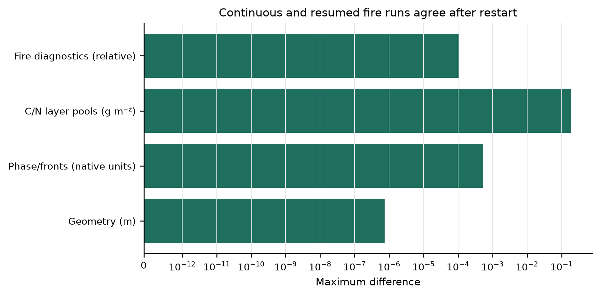

# Fire-driven thermokarst topology validation

**Date:** 2026-09-17

**Repository:** `/Users/EJafarov/projects/TEM_abrupt_thaw_dev`

**Branch:** `feature/thermokarst-prototype`

**Implementation base revision:** `335ef5123272b9d4bc1619cae52eedaf6d455821`

**Validated implementation revision:** `52e271a383e74266b2b0c6a27fcf4d37673f6bfa`

## Executive summary

This increment connects TEM fire disturbance to the thermokarst topology transaction. Fire can now remove part or all of shallow organic horizons while thermokarst, dynamic soil (`dsl`), fire disturbance (`dsb`), and BGC are active together. The transaction treats combustion as an open system: surviving physical state is mapped to the legacy post-fire grid, burned water and phase enthalpy enter the surface reservoir, liquid is passed to TEM hydrology, burned solid sensible enthalpy leaves the modeled column, and WildFire remains authoritative for C/N combustion and retention.

The new fire suite passed **13 of 13** gates. Its synthetic case closed water exactly and energy to **1.40×10⁻⁹ J m⁻²**. Two production communities completed continuous and midpoint-restarted runs. CMT04 burned 0.03618 m and CMT05 burned 0.04000 m of soil; they released 6.906 and 11.165 kg m⁻² of phase water. The cold CMT04 event retained that water as frozen surface storage, while CMT05 routed 0.2421 kg m⁻² of liquid into TEM ponding, infiltration, runoff, and drainage logic.

All regression suites passed. The complete increment has **111 passing checks**: 32 thermokarst core tests, 4 NetCDF restart tests, 17 production checks, 14 active-thaw checks, 7 seasonal diagnostic checks, 14 BGC/drainage checks, 10 dynamic-topology checks, and 13 fire-topology checks.

## Process design

### 1. Capture the pre-fire state

Immediately before `WildFire::burn`, the production BGC arrays are copied into the soil layers and the thermokarst adapter snapshots every soil cell:

\[
\left(\Delta z_m,\phi,M_l,M_i,M_x,H,
C_{raw},C_a,C_{pr},C_{cr},N_{org},N_{avl}\right)_j .
\]

The adapter temporarily exposes matrix-only thickness to the legacy fire routines. `WildFire::burn` computes vegetation and soil combustion, retained C/N, root mortality, and fire fluxes. `Ground::adjustSoilAfterburn` then creates the established post-fire material sequence and layer thicknesses.

### 2. Separate burned and surviving physical state

For a prescribed physical burn depth \(d_b\), donor layer \(j\) has physical thickness

\[
d_j=\Delta z_{m,j}+\frac{M_{x,j}}{\rho_i}.
\]

Starting at the surface, the burned and surviving fractions are

\[
b_j=\operatorname{clip}\left(\frac{d_b-z_j}{d_j},0,1\right),
\qquad s_j=1-b_j.
\]

Here \(z_j\) is the physical depth to the top of donor layer \(j\).

The surviving matrix coordinate is normalized and overlapped with the prescribed post-fire matrix grid. For receiver \(i\), donor weights satisfy

\[
\sum_i f_{ij}=s_j,
\qquad X'_i=\sum_j f_{ij}X_j
\]

for liquid, pore ice, excess ice, enthalpy, and passive pools. This permits horizon deletion, fibric-to-humic conversion, and creation of a new moss layer. Post-fire porosity, solid heat capacity, and conductivity come from the new material rather than from a removed donor.

### 3. Use combustion C/N as the authoritative result

Fire C/N is not a closed remap. The physical map calculates donor transfer, but the final six soil C/N pools are replaced with the post-combustion values produced by the existing WildFire and soil-BGC code. The transaction verifies only that those authoritative post-fire pools transfer into the new layer objects without another gain or loss.

WildFire already reduces fine roots. Root fractions therefore use the normalized surviving transfer

\[
\hat f_{ij}=\begin{cases}
f_{ij}/s_j,&s_j>0,\\
0,&s_j=0,
\end{cases}
\]

which moves the remaining roots without applying burn mortality twice. Environmental layer arrays, annual BGC state, flux accumulators, and litter-history diagnostics use the same topology map. Missing legacy diagnostics contribute zero; intensive values renormalize over finite donors.

### 4. Close fire water and energy as an open transaction

Burned phase water is

\[
M_{rel}=\sum_j b_j(M_{l,j}+M_{i,j}+M_{x,j}).
\]

Its enthalpy enters the surface reservoir:

\[
H_{phase,rel}=\sum_j b_j
\left(\left[M_{l,j}c_l+(M_{i,j}+M_{x,j})c_i\right]T_j
+L_fM_{l,j}\right).
\]

The sensible enthalpy attached to combusted solid matrix leaves the column:

\[
H_{solid,export}=\sum_j b_j\Delta z_{m,j}(1-\phi_j)c_{s,j}T_j.
\]

The checked budgets are

\[
\epsilon_M=M_{after}-M_{before}=0,
\]

\[
\epsilon_H=H_{after}+H_{solid,export}-H_{before}=0.
\]

`H_{solid,export}` is signed sensible enthalpy. It is negative for the frozen validation columns because removing cold solid removes negative enthalpy relative to the model's 0 °C reference.

Phase reconciliation runs once after remapping. Liquid above the zero-capacity internal surface reservoir becomes `pending_runoff` and is consumed once by TEM's existing hydrology. Exactly that liquid is also tagged as newly generated thermokarst source water. Colder released water remains as surface ice until a later thermal solve melts it.

### 5. Rebuild fronts and persist diagnostics

The transaction exports phase state and geometry, refreshes soil horizons and drainage, and reconstructs freeze/thaw fronts. Regridding can expose more transitions than the fixed ten-front restart representation. The adapter now applies the same rule as TEM's Stefan solver: repeatedly remove the closest alternating front pair until the profile fits, preserving alternation and the phase at depth.

Restart version 3 persists four cumulative fire fields:

- released phase water;
- exported solid sensible enthalpy;
- burned matrix thickness;
- liquid routed immediately to TEM hydrology.

Version-zero files still initialize from configuration. Version-one and version-two files load their shorter state vectors and initialize later diagnostics to zero.

## Code changes

| File | Change |
|---|---|
| `include/Thermokarst.h`, `src/Thermokarst.cpp` | Add `FireTopologyMap`, physical-depth clipping, survivor mapping, and separate burned water, phase-energy, solid-energy, and matrix accounting. |
| `include/ThermokarstIntegration.h`, `src/ThermokarstIntegration.cpp` | Add the production fire transaction, post-combustion pool transfer, phase reconciliation, open mass/energy checks, hydrology handoff, diagnostic accumulation, and bounded front reconstruction. |
| `src/Cohort.cpp` | Remove the thermokarst + `dsb` guard; synchronize C/N, roots, environmental arrays, BGC accumulators, and post-fire topology. |
| `include/ThermokarstState.h`, `src/Cohort.cpp` | Extend and version the persisted fire diagnostics. |
| `tests/thermokarst/test_thermokarst.cpp` | Add fire partition, horizon deletion/humification, and excessive-burn rejection tests. |
| `tests/thermokarst/test_restart_netcdf.cpp` | Test current, legacy, version-one, and version-two NetCDF restart compatibility. |
| `experiments/thermokarst/fire_topology_probe.cpp` | Provide a deterministic open-budget fire mapping case. |
| `experiments/thermokarst/fire_topology_validation.py` | Run two production communities, midpoint restart equivalence, acceptance gates, and figures. |
| `Makefile` | Add `thermokarst-fire-validation`. |

## Validation experiment

### Configuration

The experiment uses CMT04 shrub tundra and CMT05 tussock tundra. It initializes one pre-run year and five equilibrium years, injects a 0.20 excess-ice fraction from 0 to 0.8 m, and enables BGC, dynamic soil, fire disturbance, and thermokarst. Both cells begin with 183.4 kg m⁻² of excess ice.

The forcing is explicitly one-year periodic. The continuous case runs two transient years and schedules a severity-four fire on day 350 of year 2. The split case runs one no-fire year, writes a NetCDF restart, then schedules the same fire on day 350 of the resumed year. This aligns the event with the same forcing year on both paths, so calendar selection cannot confound restart equivalence.

The deliberately short post-fire tail avoids turning this numerical topology test into a long recovery experiment. All injected excess ice melts before the winter fire; the synthetic probe therefore supplies direct coverage of burned excess-ice partitioning, while the production case tests the full WildFire/BGC/topology/hydrology integration.

### Fire partition and hydrology

| Quantity | CMT04 | CMT05 |
|---|---:|---:|
| Burn depth / burned matrix (m) | 0.036183 | 0.040000 |
| Soil C emitted by fire (g C m⁻²) | 1161.08 | 1344.06 |
| Phase water released (kg m⁻²) | 6.9058 | 11.1650 |
| Liquid routed immediately (kg m⁻²) | 0 | 0.24211 |
| Exported solid enthalpy (J m⁻²) | -19,359.5 | -34,342.1 |



CMT04's released phase water remains frozen in the thermokarst surface reservoir. CMT05 produces nonzero liquid and exercises the handoff to TEM's post-fire hydrology. The remaining phase water is retained and budgeted rather than silently discarded.

### Carbon and excess ice

Soil C falls from 23,145.1 to 21,972.1 g C m⁻² in CMT04 and from 39,825.5 to 36,417.5 g C m⁻² in CMT05. Those final changes include the explicit combustion flux and subsequent BGC over the validation period. Both cells lose all injected excess ice during the thaw season before the fire.



### Layer geometry

CMT04 changes from 19 to 20 soil layers; CMT05 retains 20 layers while its thickness profile changes. The figure compares the injected initial grid with the final post-fire grid, so it includes the preceding thaw and annual dynamic-soil operation as well as fire regridding.



### Restart equivalence

| Quantity | Maximum continuous/resumed difference | Criterion |
|---|---:|---:|
| Matrix/physical layer geometry | 7.36×10⁻⁷ m | ≤1×10⁻⁶ m |
| Soil temperature | 8.83×10⁻⁶ °C | phase/front gate |
| Liquid water | 5.32×10⁻⁴ kg m⁻² | phase/front gate ≤1×10⁻³ |
| Pore ice | 5.26×10⁻⁴ kg m⁻² | phase/front gate ≤1×10⁻³ |
| Front position | 1.63×10⁻⁶ m | phase/front gate ≤1×10⁻³ |
| Fire diagnostics | 1.04×10⁻⁴ scaled | ≤2×10⁻⁴ |
| Ecosystem C/N inventory | 1.69×10⁻⁵ relative | ≤5×10⁻⁴ |

The post-restart path serializes the full production state after year 1; small differences then propagate through 350 days before the fire. The tolerances are inherited from the coupled BGC/topology validations and are several orders smaller than the fire signal.



## Acceptance results

The fire-specific suite passed all 13 gates:

| Gate | Observed | Result |
|---|---:|---:|
| Synthetic water closure | 0 kg m⁻² | PASS |
| Synthetic energy closure | 1.40×10⁻⁹ J m⁻² | PASS |
| Production completion | 8/8 cell-stage statuses = 100 | PASS |
| Nonzero fire depth | both communities | PASS |
| Soil combustion | both communities | PASS |
| Phase-water release | both communities | PASS |
| Liquid hydrology branch | 0.24211 kg m⁻² in CMT05 | PASS |
| Matrix loss | both communities | PASS |
| Finite signed energy export | both communities | PASS |
| Restart geometry | 7.36×10⁻⁷ m | PASS |
| Restart phase/front state | 5.32×10⁻⁴ maximum | PASS |
| Restart fire diagnostics | 1.04×10⁻⁴ scaled | PASS |
| Restart C/N inventory | 1.69×10⁻⁵ relative | PASS |

## Regression results

| Suite | Result | Main coverage |
|---|---:|---|
| UndefinedBehaviorSanitizer core | 32/32 | Phase change, remaps, budgets, restart, fire partition |
| NetCDF restart | 4/4 | Current, legacy, version-one, and version-two formats |
| Production validation | 17/17 | Zero-excess comparison and frozen restart identity |
| Active-thaw validation | 14/14 | Melt across restart, fronts, roots, geometry, residuals |
| Seasonal diagnostics | 7/7 | Freeze-thaw reversal and passive diagnostics |
| BGC/drainage validation | 14/14 | Two communities, rain on thaw, drainage, C/N budgets |
| Active topology validation | 10/10 | Thermokarst + BGC + dynamic soil + restart |
| Fire topology validation | 13/13 | Combustion, open budgets, hydrology, geometry, restart |
| **Total** | **111/111** | |

The five production regression suites ran in isolated `/tmp/tem-fire-regression-20260917` directories so prior result artifacts were not modified. The model was rebuilt with Apple Clang, Homebrew NetCDF/Boost/jsoncpp, and OpenBLAS. Pre-existing variable-length-array and deprecated-function warnings were downgraded from errors; no build-system source behavior changed.

All four SVG figures passed programmatic integrity, vector, size, and font preflight. The only preflight warning was a 5.95 pt mathematical superscript in the restart figure. The figures were also inspected at final size and in grayscale; line style, labels, and direct category positions retain the comparisons without color.

## Reproduction

From the repository root:

```bash
make thermokarst-test
bash tests/thermokarst/run_sanitizers.sh
make thermokarst-fire-validation
```

The fire suite writes machine-readable results to `experiments/thermokarst/fire_topology_validation_results/`:

- `checks.csv`: the 13 acceptance gates;
- `summary.json`: budgets, production metrics, and restart differences;
- `fire-topology-probe.csv`: deterministic donor, loss, and survivor totals;
- PNG and SVG versions of all figures;
- continuous, split, and resumed NetCDF outputs and restart files.

## Interpretation and limits

This milestone verifies that fire-driven layer deletion and material conversion no longer violate thermokarst water, enthalpy, C/N, root, front, or restart state. The production case includes a nonzero routed-liquid branch and shows that cold released water can remain frozen without being counted as runoff.

The validation is a controlled numerical experiment rather than a calibrated fire-recovery simulation. The fire occurs after the injected excess ice has melted, so active excess ice within the burned horizon is covered only by the synthetic mapper. The run ends shortly after the event and does not test multi-year post-fire insulation, vegetation recovery, talik development, erosion, or lateral thermokarst drainage. The internal frozen surface reservoir still lacks direct snow/pond thermal feedback. A subsequent scientific milestone should place fire earlier in the thaw season with active excess ice and follow several recovery years under observed fire weather and site-specific burn severity.
