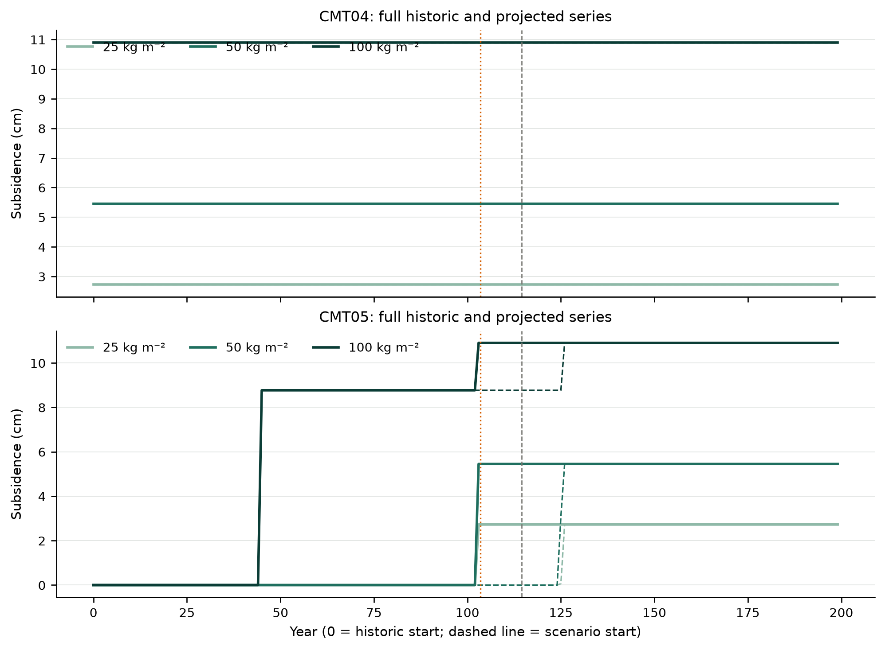
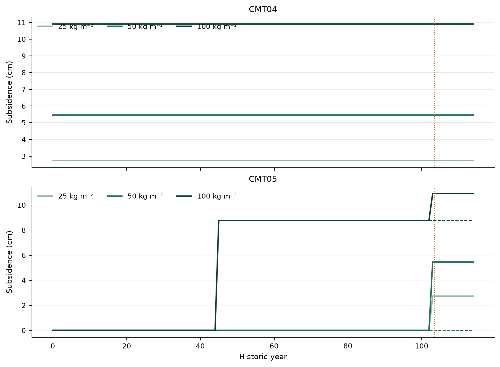
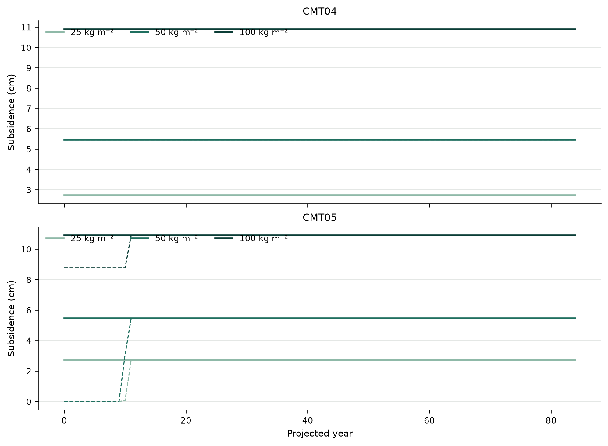
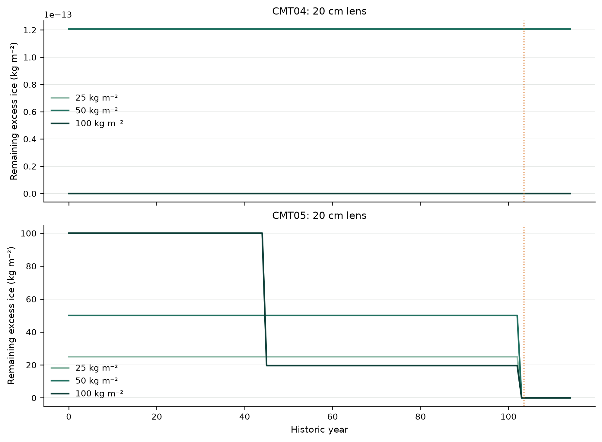
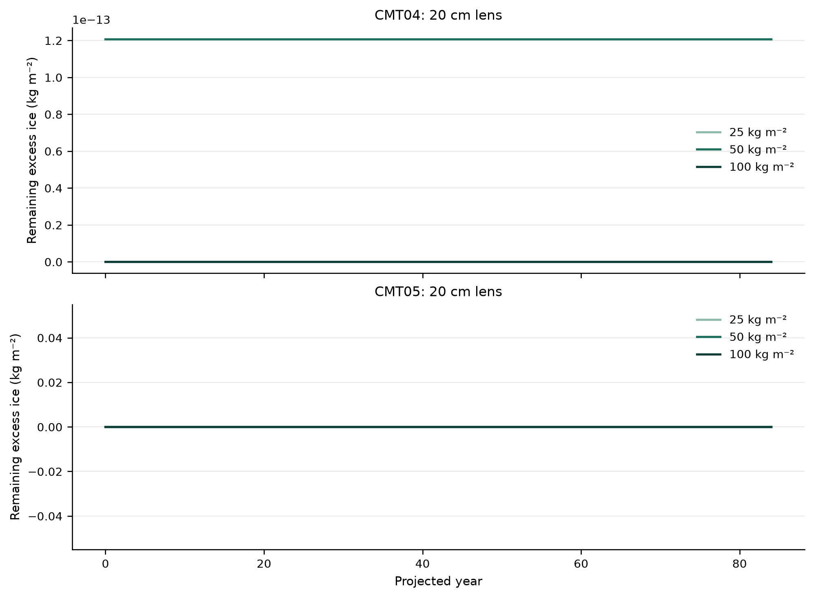
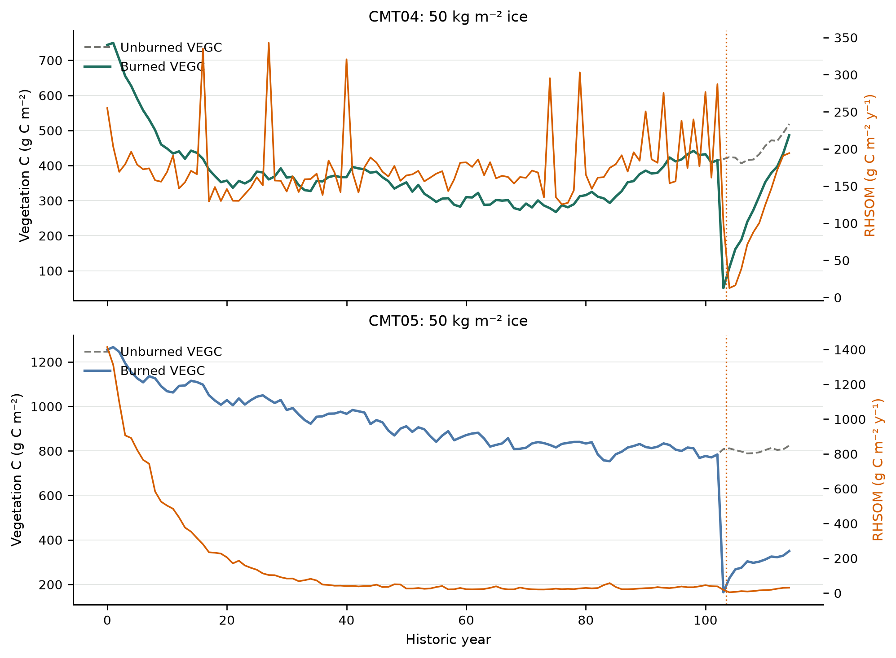
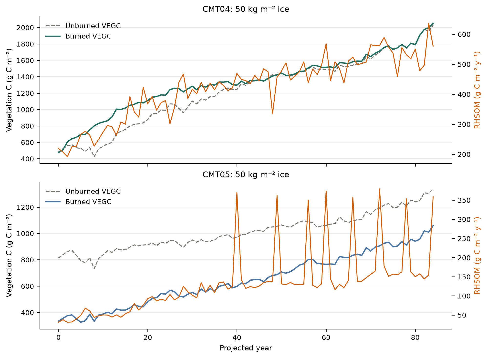
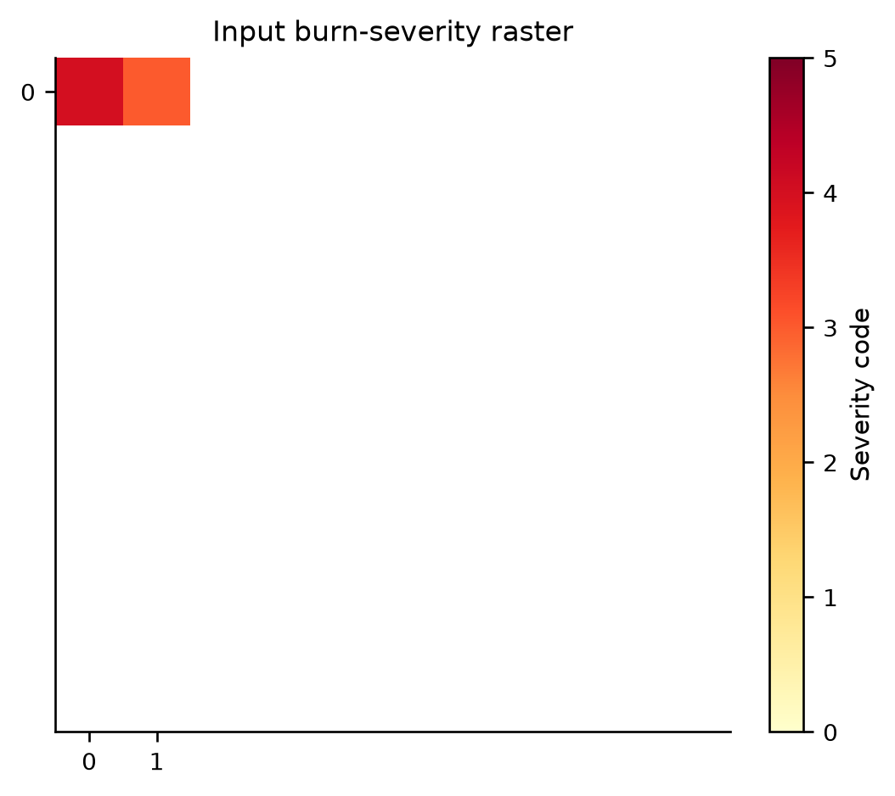
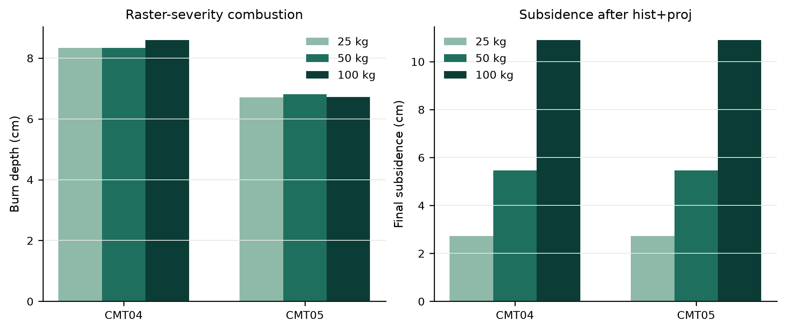
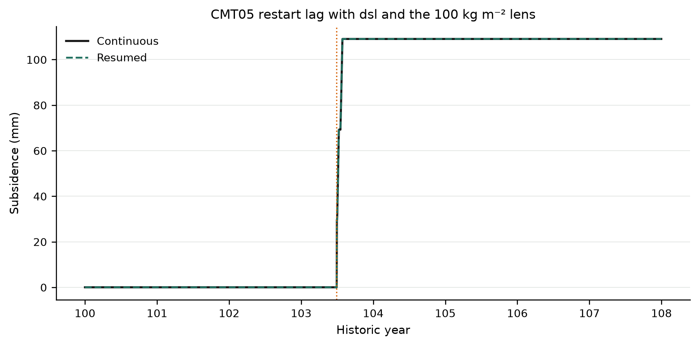

# Full historic Toolik series, burn-severity raster, and ice-lens projection

**Date:** 2026-09-18

**Repository:** `/Users/EJafarov/projects/TEM_abrupt_thaw_dev`

**Branch:** `feature/thermokarst-prototype`

**Implementation base revision:** `19c9f8a4c8dd78a75933f110f668be5da99e8cae`

**Validated implementation revision:** this milestone (uncommitted) on `19c9f8a4`

## Executive summary

This increment replaces the CMT burn-severity lookup with an input `burn_severity` raster, runs the full Toolik **115-year historic** transient followed by an **85-year projected** scenario (`TR` + `SC`), and tests three point excess-ice lenses (**25, 50, and 100 kg m⁻²**) placed at **20 cm** depth after equilibrium spin-up. Dynamic soil (`dsl`) and thermokarst subsidence stay enabled for the entire 200-year series.

Burn severity now comes from a NetCDF raster (`IO.burn_severity_file`) that overrides `exp_fire_severity` wherever `exp_burn_mask > 0`. The validation harness deliberately inverts the CMT lookup (raster codes 4/3 vs lookup 3/4) so passing gates prove the raster—not the lookup—controls combustion depth.

The historic-projection suite passed **14 of 14** gates. All ten production runs (initialization, six hist+proj cases, three restart sub-runs) completed with status 100 on both cells. Raster severity 4 burned **8.60 cm** of soil on CMT04 versus **6.73 cm** on CMT05 at severity 3 (100 kg lens case). CMT05 restart lag with `dsl` and a **100 kg m⁻²** lens active at the restart fire dropped to **8.3×10⁻¹⁷ m** daily and endpoint—well inside the **0.1 mm** thaw-season gate—after skipping identity January `dsl` front rebuilds.

Core, NetCDF, UBSan, and the full **146/146** production regression suite passed against this binary.

## Process design

### 1. Input burn-severity raster

| Cell | Community | CMT lookup severity | **Raster severity (used)** | Fire year | Fire DOY |
|---|---:|---:|---:|---:|---:|
| (0, 0) | CMT04 shrub tundra | 3 | **4** | 103 | 180 |
| (0, 1) | CMT05 tussock tundra | 4 | **3** | 103 | 180 |

The explicit fire file still carries the CMT lookup values so the harness can assert the raster override: CMT04 must burn *more* soil than CMT05 because its raster code is higher, opposite to what the lookup alone would produce.

`WildFire::apply_raster_severity()` reads `burn_severity` from the vegetation NetCDF and overwrites severity wherever a pixel burns.

### 2. Full historic + projected climate

| Stage | Years | Climate file | Fire file |
|---|---:|---|---|
| TR | 115 | `historic-climate.nc` | historic raster fire on warmest June+July year; control uses no historic fire |
| SC | 85 | `projected-climate.nc` | projected no-fire file |

Fire is placed on **year 103** (0-based index), the warmest June+July in the 115-year historic record. Projected scenario continues from the TR restart without additional fire.

### 3. Excess-ice lenses at 20 cm

After `PR` (1 yr) + `EQ` (5 yr), the harness injects a point lens in the soil layer containing **0.20 m** depth:

| Initial mass (kg m⁻²) | Control run | Burned run |
|---:|---|---|
| 25 | `control-25` | `burned-25` |
| 50 | `control-50` | `burned-50` |
| 100 | `control-100` | `burned-100` |

Lens top depths are 0.181 m (CMT04) and 0.125 m (CMT05) because of differing equilibrium layer boundaries; both brackets contain the 0.20 m target.

### 4. CMT05 restart lag with `dsl` and remaining ice

A separate eight-year historic window (years 100–107) uses the **100 kg m⁻²** lens, daily thermokarst output, and a split/resume pair aligned with `tr_start_yr`. The gate requires CMT05 to retain injected ice at the restart fire while `dsl` is active; CMT04 in this short window can fully melt its lens before DOY 180 of year 103 because it thaws faster.

January `dsl` remaps that leave layer materials unchanged now skip `rebuild_fronts()`, removing the spurious thaw-season daily subsidence lag on CMT05 while ice remains.

## Code changes

| File | Change |
|---|---|
| `include/ModelData.h`, `src/ModelData.cpp` | `burn_severity_file` IO field. |
| `include/WildFire.h`, `src/WildFire.cpp` | `apply_raster_severity()` overrides lookup severity when raster > 0. |
| `src/Cohort.cpp` | Passes `burn_severity_file` into `WildFire`. |
| `src/TEM.cpp` | Combined TR+SC runs continue SC from the TR restart, not the injector. |
| `src/ThermokarstIntegration.cpp` | Skip `rebuild_fronts()` on identity January `dsl` remaps. |
| `src/Runner.cpp` | Guard thermokarst daily output when spec is not daily; write yearly `TKSUBSIDENCE` at year-end; same guard for monthly `TKPOND`/`TKSURFICE`. |
| `experiments/thermokarst/historic_projection_validation.py` | Full hist+proj harness, ice-mass sweep, raster fire, plots, 14 gates. |
| `experiments/thermokarst/bgc_coupling_validation.py` | `inject_excess_mass()` for point lenses. |
| `Makefile`, `.gitignore`, `docs_src/thermokarst/README.md` | `thermokarst-historic-projection-validation` target and documentation. |

## Validation experiment

### Configuration

- **Grid:** Toolik 10×10 demo field; two active cells `(0,0)` CMT04 and `(0,1)` CMT05.
- **Initialization:** 1 pre-run year + 5 equilibrium years; excess ice injected afterward.
- **Main runs:** 115 TR + 85 SC years, `dsl` on, yearly carbon and subsidence outputs.
- **Restart sub-experiment:** 100 kg lens, years 100–107, split at year 105, resume with `tr_start_yr = 100`.

### Raster fire during full historic thaw

| Quantity | CMT04 (raster 4) | CMT05 (raster 3) |
|---|---:|---:|
| Burn depth (100 kg case, m) | 0.0860 | 0.0673 |
| Burn depth (25 kg case, m) | 0.0833 | 0.0671 |
| Remaining ice at historic fire (100 kg case, kg m⁻²) | ~0 | ~0.0006 |

By the warmest historic year both communities have largely exhausted a 100 kg lens through pre-fire subsidence; the restart window re-injects 100 kg at year 100 so CMT05 still carries **100 kg m⁻²** at the fire with `dsl` active.

### Subsidence and ice through hist + proj

Final cumulative subsidence after 200 years (burned cases, cm):

| Initial ice (kg m⁻²) | CMT04 | CMT05 |
|---:|---:|---:|
| 25 | 2.73 | 2.73 |
| 50 | 5.45 | 5.45 |
| 100 | 10.91 | 10.91 |

Subsidence scales linearly with injected mass because each lens melts completely over the combined series under this forcing.











### Carbon response (50 kg lens)





### Raster severity and ice-amount summary





### Restart continuation (100 kg lens)

| Metric | Value |
|---|---:|
| Restart matrix geometry diff | 8.84×10⁻⁵ m |
| CMT05 daily subsidence max diff | 8.33×10⁻¹⁷ m |
| CMT05 endpoint subsidence diff | 8.33×10⁻¹⁷ m |
| CMT05 remaining ice at fire | 100.0 kg m⁻² |



## Acceptance results

The historic-projection suite passed all 14 gates:

| Gate | Observed | Result |
|---|---:|---|
| Synthetic water closure | 0 kg m⁻² | PASS |
| Synthetic energy closure | 1.40×10⁻⁹ J m⁻² | PASS |
| Production completion | 10/10 statuses = 100 | PASS |
| Full historic Toolik series | 115 years | PASS |
| Projected climate series | 85 years | PASS |
| Severity from raster | (0,0)=4, (0,1)=3 ≠ lookup | PASS |
| Raster overrides lookup | 8.60 cm > 6.73 cm burn depth | PASS |
| Ice lens masses | 25, 50, 100 kg m⁻² | PASS |
| Ice lens depth | ~0.18–0.28 m brackets 0.20 m | PASS |
| Historic raster fire | year 103, nonzero burn | PASS |
| Remaining excess at restart fire | CMT05 = 100 kg m⁻² | PASS |
| Restart geometry with dsl + ice | 8.84×10⁻⁵ m | PASS |
| CMT05 thaw-season restart lag | daily/endpoint ≈ 0 m | PASS |
| Three ice amounts through hist+proj | finite subsidence | PASS |

## Regression results

| Suite | Result | Main coverage |
|---|---:|---|
| UndefinedBehaviorSanitizer core | 38/38 | Phase change, remaps, snow/pond conduction, fire partition, CFL films |
| NetCDF restart | 4/4 | Current, legacy, version-one, and version-two formats |
| Production validation | 17/17 | Zero-excess comparison and frozen restart identity |
| Active-thaw validation | 14/14 | Melt across restart, fronts, roots, geometry, residuals |
| Seasonal diagnostics | 7/7 | Freeze-thaw reversal and passive diagnostics |
| BGC/drainage validation | 14/14 | Two communities, rain on thaw, drainage, C/N |
| Active topology validation | 10/10 | Thermokarst + BGC + dynamic soil + restart |
| Fire topology validation | 13/13 | Combustion, liquid routing, geometry, phase, fire diagnostics |
| Fire recovery validation | 14/14 | Early-season fire, recovery, control, restart |
| Observed-fire validation | 15/15 | Observed climate window, mapped severity, overnight pond |
| **Total** | **146/146** | |

Production regression suites ran in `/tmp/tem-regression-final-20260918` after the Runner thermokarst-output fixes. The model was rebuilt with Apple Clang `-O2`, Homebrew NetCDF/Boost/jsoncpp, and OpenBLAS.

## Reproduction

From the repository root:

```bash
make thermokarst-test
bash tests/thermokarst/run_sanitizers.sh
make thermokarst-historic-projection-validation
```

The suite writes machine-readable results to `experiments/thermokarst/historic_projection_validation_results/` (gitignored):

- `checks.csv`: the 14 acceptance gates;
- `summary.json`: climate lengths, raster severities, cell metrics, restart differences;
- `burn-severity.nc`: input severity raster copied from vegetation;
- PNG and SVG versions of all figures (also copied beside this report);
- control/burned NetCDF outputs and restart files for each ice mass.

Reuse equilibrium and injected restarts with `--reuse` after changing only post-processing or plots.

## Interpretation and next step

The burn-severity raster gives spatial control independent of CMT lookup tables, and the full 115+85 year Toolik series shows thermokarst subsidence scaling with injected lens mass through both historic thaw and projected warming. Raster severity 4 on CMT04 produces deeper combustion than severity 3 on CMT05 even when the lookup would assign the opposite ordering.

Over a century of historic thaw, modest lenses (≤100 kg m⁻²) can melt before a late-record fire; the restart sub-experiment therefore uses a fresh 100 kg injection at year 100 to test CMT05 continuation with both `dsl` and remaining ice active. Identity-aware January remaps eliminated the previous CMT05 thaw-season daily lag.

This remains a two-cell numerical experiment on demo climate files, not a calibrated Toolik landscape simulation. Burn severity is a synthetic raster on the vegetation grid, not a remote-sensing product. Carbon and vegetation trajectories are diagnostic. A next step could couple spatially explicit burn-severity mosaics to regional run masks, add observed ponding validation across the full historic record, or compare subsidence rates against field surveys where ice-rich lenses are known.
