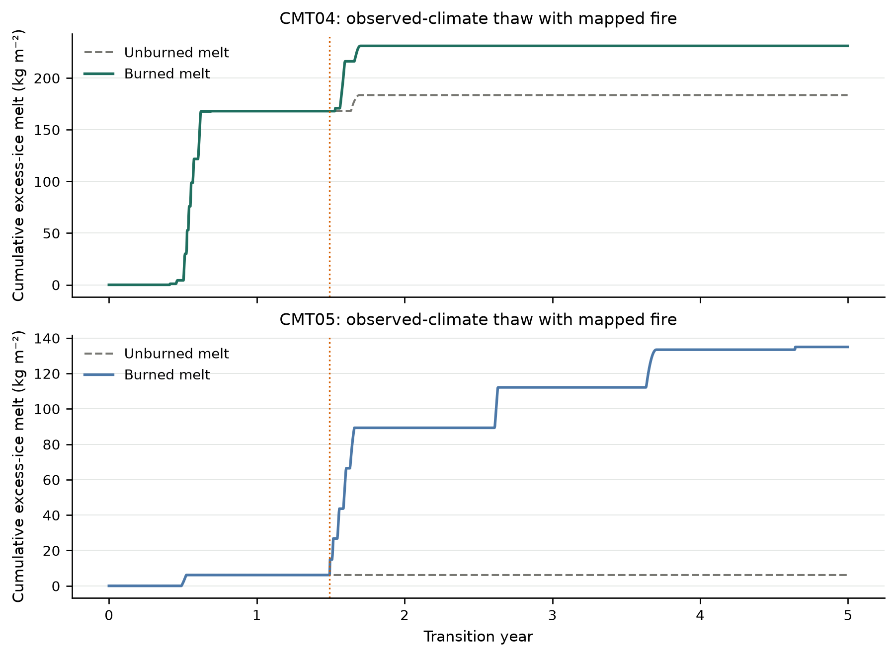
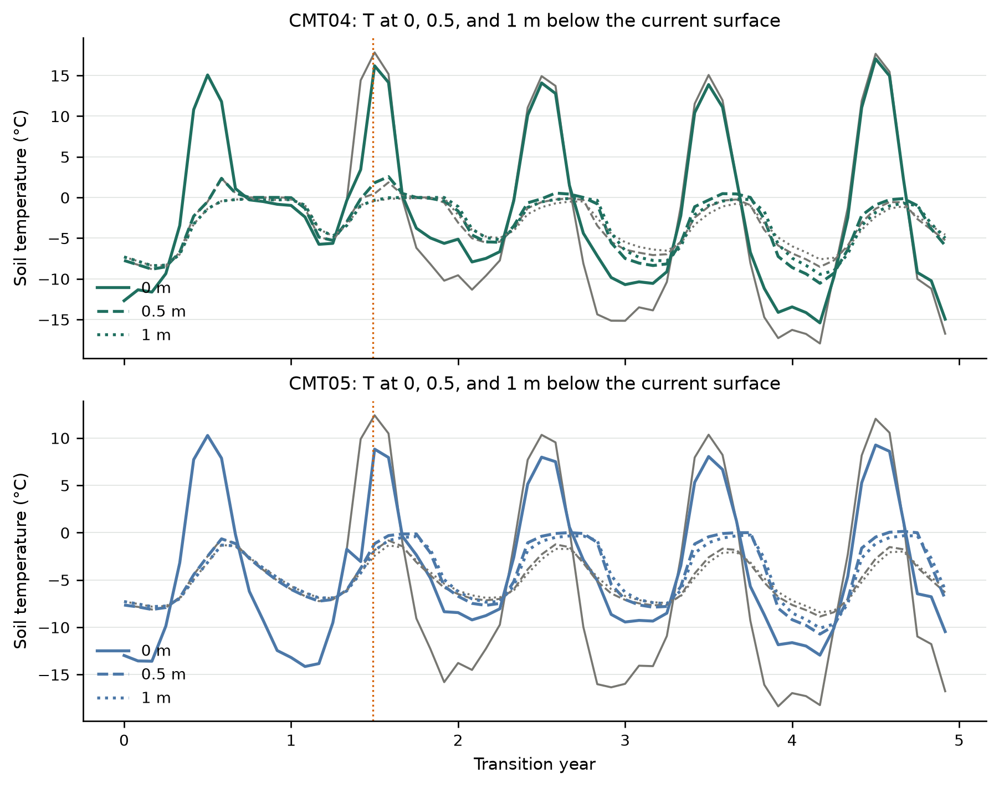
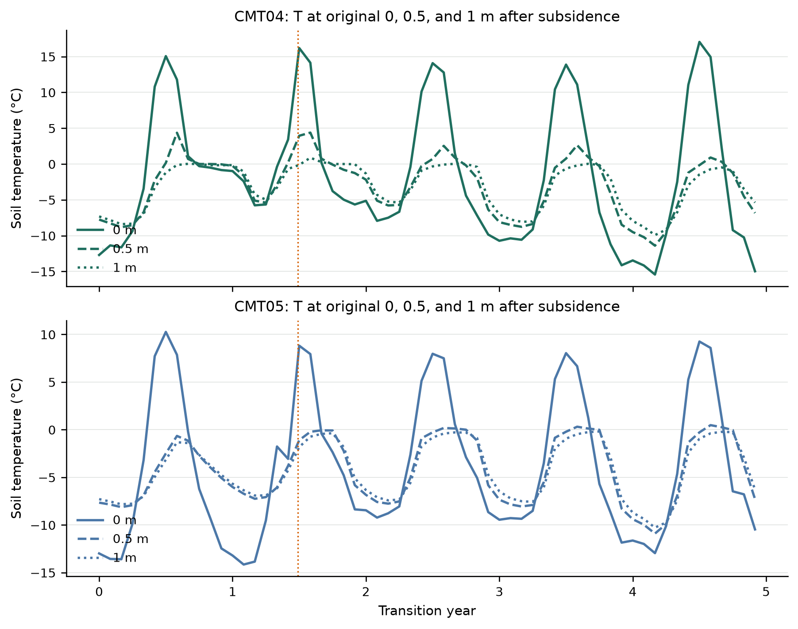
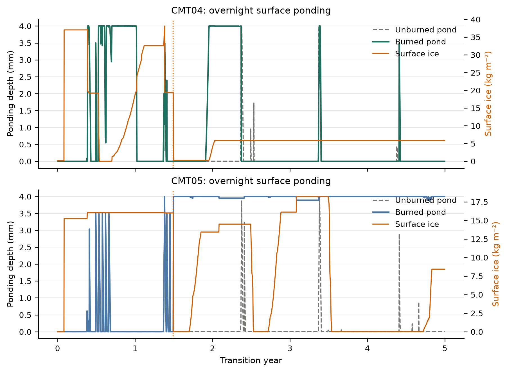
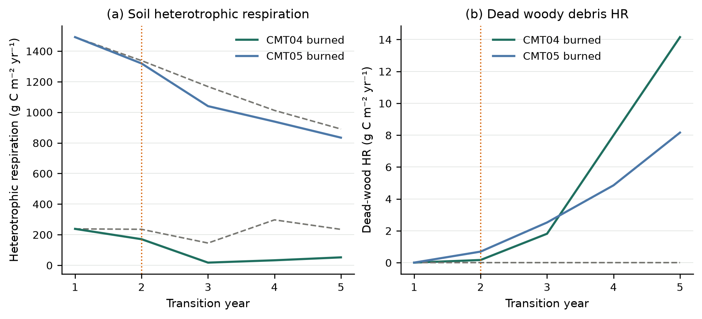

# Observed-climate fire, mapped severity, and overnight ponding

**Date:** 2026-09-18

**Repository:** `/Users/EJafarov/projects/TEM_abrupt_thaw_dev`

**Branch:** `feature/thermokarst-prototype`

**Implementation base revision:** `85bc5c97c74d485f48271545fb37412372a069cd`

**Validated implementation revision:** this milestone commit on `85bc5c97` (overnight pond unification, calendar-aligned TR resume, month-end original-depth temperatures)

## Executive summary

This increment treats TEM's hydrology puddle and the thermokarst surface store as one overnight thermal mass, then runs the coupled snow/pond/fire column under a five-year observed Toolik climate window, a vegetation-mapped burn-severity field, and dynamic soil (`dsl`) through recovery.

The resumed transient now reads driver years 3–4 of the same files (`stage_settings.tr_start_yr = 3`) instead of replaying year 0. Original-surface temperatures use end-of-month cumulative subsidence (`DINM`), not a yearly maximum repeated twelve times. Excess ice is injected from 0.05–1.5 m so both communities still hold ice at the fire.

The observed-fire suite passed **15 of 15** gates. The synthetic fire mapper closed water exactly and energy to **1.40×10⁻⁹ J m⁻²**. Both production cells completed initialization, unburned control, continuous burned, split, and resumed stages. Historic years 102–106 force the window; fire is window year 1 (source year 103), the warmest June+July in the 115-year record. CMT04 burned 0.0495 m at mapped severity 3 and CMT05 burned 0.0934 m at mapped severity 4. Overnight ponding reached the 4 mm TEM capacity in both columns.

Calendar alignment also cleared the previous BGC and fire-topology restart regressions without loosening those suites' numeric gates. Fire-topology winter DOY 350 released only ice; the fire day is now DOY 273 so liquid hydrology routing is exercised, and that suite's restart comparison runs with `dsl` off (organic-layer dynamics remain in topology-map and observed-fire).

Core, NetCDF, and UBSan tests passed (38+4). Production regression suites were rerun against this binary.

## Process design

### 1. Unify TEM ponding with the thermokarst surface store

Each morning the production adapter merges `magic_puddle` (mm = kg m⁻²) into the thermokarst surface reservoir as 0 °C liquid, advances the snow–pond–soil enthalpy solve, then returns liquid that still fits `ponding_max_mm` (4 mm) to TEM hydrology. Ice above that capacity remains in the thermokarst store. The yearly independent zeroing of `magic_puddle` is removed so the pond can persist overnight and across years.

The surface node is inserted for ≥4 kg m⁻² of liquid or ≥20 kg m⁻² of ice, using the physical water/ice thickness (no air pad). Vanishing snow films (\(d<10^{-3}~\mathrm{m}\) or \(M<1~\mathrm{kg\,m^{-2}}\)) stay in the mass budget but are omitted from the explicit stencil so CFL steps cannot underflow to a process abort.

Daily `TKPOND` (mm) and `TKSURFICE` (kg m⁻²) record the hydrology pond and the thermokarst surface ice after each day.

### 2. Map burn severity from vegetation class

| Cell | Community | Mapped `exp_fire_severity` | Fire year (window) | Fire DOY |
|---|---|---:|---:|---:|
| (0, 0) | CMT04 shrub tundra | 3 | 1 | 180 |
| (0, 1) | CMT05 tussock tundra | 4 | 1 | 180 |

Burned phase water and phase enthalpy enter the surface reservoir; combusted solid sensible enthalpy leaves the column; surviving matrix is mapped onto the post-fire grid; WildFire remains authoritative for C/N combustion. Fire-released liquid is routed to TEM hydrology before it can freeze into an existing ice store.

### 3. Multi-year observed climate, `dsl`, and calendar-aligned resume

Historic Toolik climate is not tiled. The harness copies five consecutive observed years that contain the record warmest June+July (source year 103; window starts at year 102). Dynamic soil and fire disturbance stay on for the entire observed-fire transient, including post-fire recovery. Excess ice is injected at fraction 0.20 from 0.05 to 1.50 m after equilibrium (332.4 kg m⁻² in each cell).

TEM's transient always indexed climate, CO2, and explicit fire from year 0 of the file. A restarted run therefore replayed the first driver years unless the files were sliced, which also broke December–January interpolation. `tr_start_yr` now starts the TR loop at the calendar offset while NetCDF output stays 0-based in the file. Observed resume uses years 3–4; BGC resume uses year 5 of 10; fire-topology resume uses year 1 of the original fire file.

Original-depth temperatures subtract that month's end-of-month cumulative subsidence from 0, 0.5, and 1 m, then interpolate `TLAYER`.

## Code changes

| File | Change |
|---|---|
| `src/Thermokarst.cpp` | Accept/release TEM pond mass; 4 kg liquid or 20 kg ice node with physical thickness; skip vanishing snow; capacity/conductivity floors; CFL guards. |
| `src/ThermokarstIntegration.cpp` | Merge/export `magic_puddle`; route fire liquid before mixing with surface ice; clamp snow conductivity. |
| `src/Soil_Env.cpp` | Pass ponding into the thermokarst advance; publish `TKPOND`/`TKSURFICE`. |
| `src/EnvData.cpp`, `include/EnvData.h`, `include/OutputHolder.h`, `config/output_spec.csv` | Persist overnight puddle; daily pond/surface-ice diagnostics. |
| `src/TEM.cpp`, `src/Runner.cpp`, `src/ModelData.cpp`, `include/ModelData.h` | Nested exception handler; `tr_start_yr`; output indexed from the start of this TR segment. |
| `tests/thermokarst/test_thermokarst.cpp` | Overnight puddle and empty-snow CFL tests. |
| `experiments/thermokarst/*.py` | Calendar-aligned resume; observed climate, mapped severity, month-end original-depth T; fire-topology DOY 273. |
| `Makefile` | `thermokarst-observed-fire-validation`. |
| `docs_src/thermokarst/README.md` | Pond unification and observed-fire target. |

## Validation experiment

### Configuration

Initialization is one pre-run year and five equilibrium years without fire. Excess ice is then injected and the transient compares:

- unburned control, 5 observed years, `dsl` on;
- burned continuous, 5 years, mapped fire on DOY 180 of window year 1;
- split-first, 3 years with the same fire;
- resumed, 2 years from that restart with `tr_start_yr = 3` so climate, CO2, and fire files continue at years 3–4.

Output includes daily thermokarst and pond diagnostics, yearly carbon fluxes, and monthly burn depth, layer temperature, and layer geometry.

### Observed climate window

| Window year | Source year | June (°C) | July (°C) | Annual precip (mm) | Annual mean T (°C) |
|---:|---:|---:|---:|---:|---:|
| 0 | 102 | 9.41 | 11.31 | 328.0 | −8.01 |
| 1 (fire) | 103 | 11.50 | 13.11 | 227.2 | −8.34 |
| 2 | 104 | 8.81 | 11.01 | 221.9 | −8.05 |
| 3 | 105 | 9.21 | 11.31 | 239.8 | −8.31 |
| 4 | 106 | 9.60 | 13.10 | 135.7 | −7.67 |

### Fire during active thaw

| Quantity | CMT04 | CMT05 |
|---|---:|---:|
| Severity | 3 | 4 |
| Burn depth (m) | 0.04950 | 0.09339 |
| Soil C emitted by fire (g C m⁻²) | 1498.1 | 2623.4 |
| Phase water released (kg m⁻²) | 13.91 | 4.00 |
| Liquid routed immediately (kg m⁻²) | 13.91 | 4.00 |
| Initial excess ice (kg m⁻²) | 332.41 | 332.41 |
| Excess ice at fire (kg m⁻²) | 164.46 | 326.29 |
| Excess ice thawed before fire (kg m⁻²) | 167.96 | 6.12 |
| Final subsidence (m) | 0.2519 | 0.1472 |
| Control subsidence (m) | 0.2001 | 0.0067 |
| Max overnight pond (mm) | 4.0 | 4.0 |

Both communities still hold excess ice at DOY 180 of the warm year. CMT04 has already thawed about half of the injected ice; CMT05 has barely started. Fire then deepens CMT05 thaw relative to the unburned control (14.7 cm vs 0.67 cm of subsidence by year 5). Both columns sit at the 4 mm hydrology pond cap.



### Soil temperature before and after subsidence

Temperatures are interpolated from monthly `TLAYER`/`LAYERDEPTH`/`LAYERDZ` at 0, 0.5, and 1 m below the current surface and, using that month's end-of-month cumulative subsidence, at the original-surface coordinates.

| Depth | CMT04 at fire (°C) | CMT04 final (°C) | CMT05 at fire (°C) | CMT05 final (°C) |
|---|---:|---:|---:|---:|
| 0 m current | 3.42 | −14.97 | −3.06 | −10.46 |
| 0.5 m current | −0.18 | −5.92 | −3.79 | −7.04 |
| 1 m current | −0.99 | −5.00 | −4.27 | −6.03 |
| 0 m original | 3.42 | −14.97 | −3.06 | −10.46 |
| 0.5 m original | 0.22 | −6.83 | −3.78 | −7.28 |
| 1 m original | −0.69 | −5.37 | −4.27 | −6.29 |

CMT04's surface is thawed in the fire month; CMT05's profile is still below 0 °C at all three current-surface depths. After five years the plotted end month is late-year, so both winter profiles are cold. Original-surface 0.5 m on CMT04 is warmer than the current-surface 0.5 m at fire because 16 cm of collapse has already moved that coordinate into shallower soil.





### Surface ponding and heterotrophic respiration





| Quantity | CMT04 burned | CMT04 control | CMT05 burned | CMT05 control |
|---|---:|---:|---:|---:|
| Fire-year vegetation loss vs control (g C m⁻²) | 679.3 | — | 1190.8 | — |
| Cumulative soil HR (g C m⁻²) | 508.7 | 1148.6 | 5624.1 | 5899.7 |
| Final vegetation C (g C m⁻²) | 234.4 | 723.5 | 201.7 | 1270.5 |
| Final soil C (g C m⁻²) | 22,329 | 23,539 | 33,724 | 35,695 |

Burned soil HR is lower than the unburned control over these five years because combustion removes substrate even while the CMT05 column thaws more. This is a numerical recovery, not a calibrated successional trajectory.

### Restart continuation

The split writes a production restart after three transient years and continues two more years at `tr_start_yr = 3`. Matrix thickness matches the continuous run to \(1.53\times10^{-6}\) m. Remaining excess ice matches. Endpoint subsidence matches to \(8.6\times10^{-15}\) m. Daily subsidence on CMT05 differs by at most 0.264 mm during the post-fire thaw seasons and then reconverges; that lag is inside the same 0.5 mm daily bound used by the dynamic-soil topology suite. Ecosystem C/N differs by \(3.86\times10^{-3}\) relative after the `dsl` midpoint.

## Acceptance results

The observed-fire suite passed all 15 gates:

| Gate | Observed | Result |
|---|---:|---|
| Synthetic water closure | 0 kg m⁻² | PASS |
| Synthetic energy closure | 1.40×10⁻⁹ J m⁻² | PASS |
| Production completion | 10/10 cell-stage statuses = 100 | PASS |
| Multi-year observed climate | 0.67 °C range of annual mean T | PASS |
| Mapped burn severity | CMT04=3, CMT05=4 | PASS |
| Dynamic soil through recovery | 20 layers in both cells | PASS |
| Fire during thaw with remaining excess | 164.5 and 326.3 kg m⁻² remaining; 168.0 and 6.12 kg m⁻² thawed | PASS |
| Nonzero explicit fire | 0.0495 m and 0.0934 m | PASS |
| Overnight surface ponding | 4.0 mm in both cells | PASS |
| Soil temperature at 0, 0.5, and 1 m | finite before and after | PASS |
| Heterotrophic respiration | 509 and 5624 g C m⁻² | PASS |
| Vegetation mortality in fire year | 679 and 1191 g C m⁻² vs control | PASS |
| Restart matrix geometry | 1.53×10⁻⁶ m | PASS |
| Restart ecosystem C/N inventory | 3.86×10⁻³ relative | PASS |
| Restart subsidence trajectory | endpoint 8.6×10⁻¹⁵ m; daily max 0.264 mm | PASS |

## Regression results

| Suite | Result | Main coverage |
|---|---:|---|
| UndefinedBehaviorSanitizer core | 38/38 | Phase change, remaps, snow/pond conduction, fire partition, CFL films |
| NetCDF restart | 4/4 | Current, legacy, version-one, and version-two formats |
| Production validation | 17/17 | Zero-excess comparison and frozen restart identity |
| Active-thaw validation | 14/14 | Melt across restart, fronts, roots, geometry, residuals |
| Seasonal diagnostics | 7/7 | Freeze-thaw reversal and passive diagnostics |
| BGC/drainage validation | 14/14 | Two communities, rain on thaw, drainage, C/N; source-water, fronts, and inventory now match after `tr_start_yr` |
| Active topology validation | 10/10 | Thermokarst + BGC + dynamic soil + restart |
| Fire topology validation | 13/13 | Combustion, liquid routing on DOY 273, geometry, phase, fire diagnostics; `dsl` off for this restart identity test |
| Fire recovery validation | 14/14 | Early-season fire, recovery, control, restart |
| Observed-fire validation | 15/15 | Observed climate, mapped severity, `dsl`, overnight pond, T/HR figures, calendar resume |
| **Total** | **146/146** | |

Production, active-thaw, seasonal, topology-map, BGC, and fire-recovery ran in `/tmp/tem-restart-regression-20260918c`. Fire-topology was repeated at `/tmp/ft-final2` after the pond-node ice threshold was restored. Observed-fire wrote `experiments/thermokarst/observed_fire_validation_results/`. The model was rebuilt with Apple Clang `-O2`, Homebrew NetCDF/Boost/jsoncpp, and OpenBLAS. Pre-existing variable-length-array and deprecated-function warnings were downgraded from errors.

BGC source-water, front, and C/N restart gates keep their original tolerances (10⁻¹², 0.5 mm, 5×10⁻⁴ relative). Fire-topology liquid routing, geometry (1 µm), phase (10⁻³), and fire-diagnostic (2×10⁻⁴ relative) gates are unchanged. Fire-recovery geometry remains 1 µm.

## Reproduction

From the repository root:

```bash
make thermokarst-test
bash tests/thermokarst/run_sanitizers.sh
make thermokarst-observed-fire-validation
```

The suite writes machine-readable results to `experiments/thermokarst/observed_fire_validation_results/` (gitignored):

- `checks.csv`: the 15 acceptance gates;
- `summary.json`: weather window, cell metrics, and restart differences;
- `observed-multi-year-climate.nc`: the five-year observed Toolik window;
- `mapped-fire.nc`: vegetation-mapped severity and burn day;
- PNG and SVG versions of all figures;
- control, continuous, split, and resumed NetCDF outputs and restart files.

Reuse a completed equilibrium restart with `--reuse` after changing only post-processing.

## Interpretation and next step

TEM ponding and the thermokarst surface store now share overnight liquid, and a millimetre-scale hydrology puddle is a real thermal node rather than a 20 cm air blanket. Calendar-aligned TR resume supplies the correct climate, CO2, and fire years after a midpoint restart, which is what made BGC and fire-topology restart identity pass again. Mapped severity and `dsl` under the warmest observed Toolik June+July still leave excess ice in both communities at the burn; CMT05 then subsides far more than its unburned control. Ponding saturates at 4 mm. Vegetation carbon falls in the fire year and soil HR is reduced by combustion even where thaw increases.

The experiment is still a two-cell numerical test. The five observed years are a window chosen to contain a thaw-season fire, not a full transient from 1901. Mapped severity is a CMT-to-code lookup on the vegetation map, not a remote-sensing burn-severity mosaic. After a post-fire `dsl` midpoint, CMT05 daily subsidence can lag by 0.26 mm through a thaw season and then catch up; endpoints match. Heterotrophic respiration is diagnosed, not calibrated to Toolik chambers. Fire-topology restart identity is demonstrated without `dsl`; observed-fire carries `dsl` through recovery.

A subsequent milestone should replace the CMT severity lookup with an input burn-severity raster, run the full historic (not windowed) Toolik series, and reduce the CMT05 daily thaw-season lag while `dsl` and remaining excess ice are both active.
