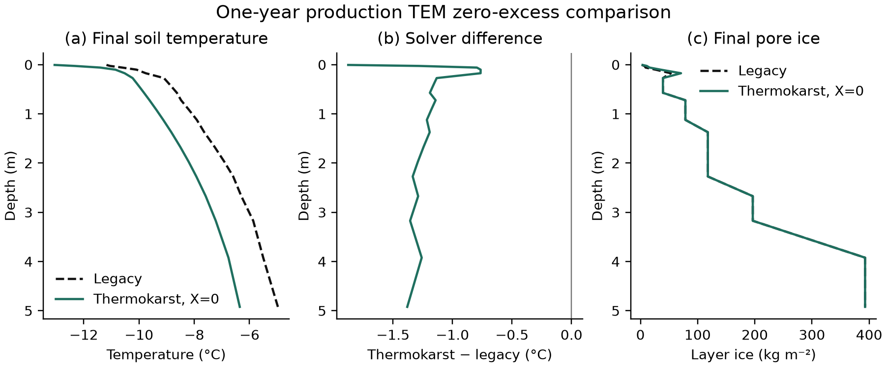
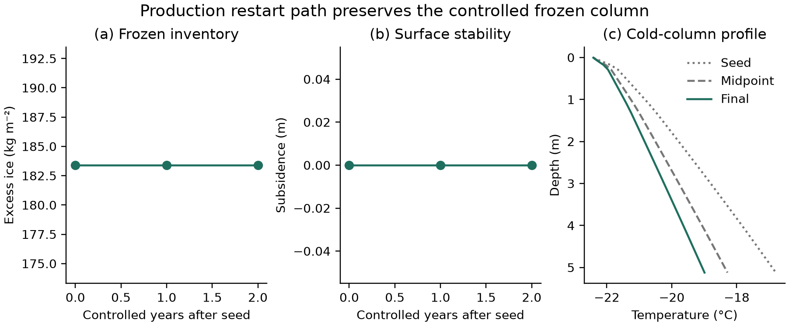

# Production TEM thermokarst validation milestone

**Date:** 2026-09-15
**Repository:** `/Users/EJafarov/projects/TEM_abrupt_thaw_dev`
**Base revision:** `419a4eb3fb1fb0ea91795a76d366396c850d5fd3`
**Branch:** `feature/thermokarst-prototype`

## Executive summary

The milestone passed all 17 predefined production checks.

1. A one-year, one-cell Toolik production run with zero excess ice completed through both the legacy thermal path and the thermokarst thermal path. The thermokarst path produced no excess ice, no subsidence, identical layer geometry, and identical frozen/unfrozen classifications. Its final soil temperature profile differed from the legacy solution by 1.22 °C RMSE (1.88 °C maximum), and total soil water differed by 1.83%. These are within the smoke-test limits of 2 °C RMSE, 2.5 °C maximum temperature difference, and 2% total-water difference.
2. A controlled column containing 183.4 kg m⁻² of excess ice was held under a constant −20 °C atmosphere. It remained completely frozen, retained all excess ice, and produced no subsidence.
3. A continuous two-year run and a one-year plus restart plus one-year run produced byte-for-byte identical final NetCDF restart files. All active-pixel restart fields were exactly equal. Both files have SHA-256 `565d93c4dd191a9f8345da7f7192577249a32ea3869c3c394087f380051ac1ff`.

This validates production execution, the zero-excess limit at smoke-test accuracy, persistence of the new state, and deterministic continuation across a restart. It does not yet validate restart during active melting and collapse.

## Code completed for this milestone

### Production-state adapter correction

The first full production execution rejected the imported state because rock layers appeared to have invalid thermal properties. The cause was C++ member shadowing: `ParentLayer` contains its own `vhcsolid` and `tcsolid`, while the thermokarst adapter was reading the uninitialized members inherited from `Layer`.

The rock import in `src/ThermokarstIntegration.cpp` now obtains volumetric heat capacity and thermal conductivity through TEM's virtual production property methods:

```cpp
Layer& mutable_layer = const_cast<Layer&>(l);
c.solid_heat = mutable_layer.getMixVolHeatCapa();
c.solid_k = mutable_layer.getThermalConductivity();
```

This makes the imported rock state consistent with the values used by the production soil solver.

### Reproducible production harness

`experiments/thermokarst/production_validation.py` now creates inputs, runs all six production cases, reads NetCDF restart state, evaluates the gates, writes CSV/JSON evidence, and generates the two figures in this report. The root `Makefile` exposes it as:

```console
make thermokarst-production-validation
```

Generated run products are ignored through `.gitignore`; the harness and test definitions remain source-controlled artifacts.

## Validation design

### Production configuration shared by all cases

- Executable: the full `dvmdostem` production driver, compiled from the repository sources.
- Spatial domain: one active cell at `(Y=0, X=0)` in the bundled Toolik demonstration input.
- Environmental module: enabled.
- Biogeochemistry, nitrogen feedback, dynamic soil biogeochemistry, dynamic soil layer, and dynamic LAI: disabled so this milestone isolates soil environmental state, heat, water, geometry, and restart behavior.
- Monthly NetCDF output: disabled; production status and restart NetCDF files enabled.
- A successful grid cell must finish with production `run_status=100`.

### Case A: zero-excess production comparison

Two one-year pre-run executions used the same natural Toolik climate and initial conditions:

- **Legacy:** thermokarst disabled.
- **Zero-excess:** thermokarst enabled with excess fraction `X=0`.

The gate checks geometry, subsidence, excess-ice inventory, frozen classifications, temperature-profile divergence, and total soil-water divergence. This is a bounded parity check because the thermokarst path uses the new energy-consistent phase solve; it is not expected to be bit-identical to the legacy thermal path.

### Case B: controlled frozen excess-ice column

A one-year seed run initialized a 20% excess-ice fraction from 0.2 to 1.0 m. Historic forcing was replaced by a spatially and temporally constant atmosphere:

- air temperature: −20 °C;
- precipitation: 0;
- net incoming radiation: 0;
- vapor pressure: 1 Pa.

Constant forcing makes each climate year interchangeable. This is necessary because the current stage driver resets its climate index to the stage-relative first year when resuming; constant forcing isolates restart serialization and continuation from that separate calendar-index behavior.

The controlled column must obey the geometric identity

\[
\Delta z_i = \Delta z_{m,i} + \frac{M_{x,i}}{\rho_i},
\]

where \(\Delta z_i\) is layer thickness, \(\Delta z_{m,i}\) is matrix thickness, \(M_{x,i}\) is excess-ice mass per unit area, and \(\rho_i=917\ \mathrm{kg\,m^{-3}}\). It must remain below freezing, retain its excess-ice inventory, and accumulate no subsidence.

### Case C: restart-at-midrun equivalence

Both paths start from the same frozen seed restart:

- **Continuous:** two transition-stage years in one invocation.
- **Split:** one transition-stage year, write restart, then one transition-stage year resumed from that file.

The comparison requires both byte-level NetCDF equality and value-level equality of every active-pixel field. Byte equality is the stronger result and also covers metadata and storage layout.

## Results

### Zero-excess comparison

| Quantity | Observed | Acceptance limit | Result |
|---|---:|---:|:---:|
| Production status | 100 / 100 | both 100 | PASS |
| Maximum layer-thickness difference | 0 m | ≤ 1×10⁻¹² m | PASS |
| Subsidence | 0 m | ≤ 1×10⁻¹² m | PASS |
| Remaining excess ice | 0 kg m⁻² | ≤ 1×10⁻¹² kg m⁻² | PASS |
| Frozen classifications | exact | exact | PASS |
| Temperature-profile RMSE | 1.2234 °C | ≤ 2 °C | PASS |
| Maximum temperature difference | 1.8762 °C | ≤ 2.5 °C | PASS |
| Total soil-water relative difference | 1.83065% | ≤ 2% | PASS |

The geometry and phase classifications satisfy the intended zero-excess behavior exactly. The thermal and water states are close but not numerically identical. The new solver's final profile is colder through most of the column. This result is sufficient for the present smoke milestone, but longer multi-year comparisons and seasonal flux diagnostics are required before claiming scientific equivalence to the legacy solver.



### Frozen-column and restart equivalence

| Quantity | Observed | Acceptance limit | Result |
|---|---:|---:|:---:|
| Production status | 100 / 100 / 100 / 100 | all 100 | PASS |
| Final restart files | byte-identical | exact | PASS |
| Active-pixel fields | exact | exact | PASS |
| Initial excess ice | 183.4 kg m⁻² | diagnostic | — |
| Final excess ice | 183.4 kg m⁻² | inventory change ≤ 1×10⁻¹² kg m⁻² | PASS |
| Final subsidence | 0 m | ≤ 1×10⁻¹² m | PASS |
| Maximum geometry-identity error | 6.94×10⁻¹⁸ m | ≤ 1×10⁻¹² m | PASS |
| Water-budget residual | 1.66×10⁻¹⁰ kg m⁻² | ≤ 1×10⁻⁷ kg m⁻² | PASS |
| Energy-budget residual | −9.24×10⁻⁶ J m⁻² | magnitude ≤ 1×10⁻³ J m⁻² | PASS |
| Warmest final soil layer | −18.991 °C | < 0 °C and all frozen flags = 1 | PASS |

The matrix column is 5.4217 m and the excess ice adds 0.2000 m, giving 5.6217 m total thickness. The inventory and surface elevation remain stable throughout the controlled run, as expected for a no-melt case.



## Other tests

The existing thermokarst suite also passed:

- 26/26 core process and remapping tests;
- NetCDF restart round trip;
- legacy-restart compatibility;
- 26/26 core tests compiled and run with UndefinedBehaviorSanitizer.

The core suite includes analytical melt cases, pore-ice ordering, partial and complete collapse, water and energy budgets, drainage and ponding, conservative split/merge remapping, phase-boundary preservation, restart continuation, invalid-input rejection, conduction budgets, and timestep sensitivity.

AddressSanitizer could not execute on this macOS host: leak detection was reported unsupported and the non-leak run terminated in the sanitizer runtime before test output. This does not affect the successful production, normal, or UndefinedBehaviorSanitizer runs.

## Reproduction

From `/Users/EJafarov/projects/TEM_abrupt_thaw_dev`, with the production executable and Python environment already built:

```console
make thermokarst-test
make thermokarst-production-validation
```

The production harness can also be invoked directly:

```console
.venv-thermokarst/bin/python experiments/thermokarst/production_validation.py \
  --binary ./dvmdostem
```

Machine-readable outcomes are included with this report in `production-validation-summary.json` and `production-validation-checks.csv`.

## Interpretation and next validation

This milestone verifies that the new state enters the actual TEM driver, survives production NetCDF restart I/O, preserves frozen excess ice, and resumes deterministically. The exact restart match indicates that roots, fronts, drainage state, accumulators, and all other serialized active-pixel variables reproduce the continuous path for this controlled case.

The next validation should force excess-ice melting across the midpoint restart. It should compare the time and magnitude of subsidence, routed meltwater, enthalpy and water residuals, front positions, root remapping, and post-collapse layer geometry between continuous and resumed runs. That test should either preserve an absolute climate-year index in restart state or continue to use explicitly periodic forcing so calendar selection cannot confound restart equivalence.
