# Samoylov polygon-tundra validation report

**Reference:** Bender et al. (2026) — Rim vs Center polygon tundra (Bender-inspired, not CLM reproduction)

**Harness:** `experiments/thermokarst/samoylov_validation.py`

## Summary

| Phase | Status | Command |
|---|---|---|
| 0 — pipeline | **PASS** (12/12 gates) | `make thermokarst-samoylov-validation` |
| 1 — paper-depth ice + obs gates | **PARTIAL** (4/7 gates) | `make thermokarst-samoylov-phase1-validation` |
| 2 — century run 1901–2014 | **PARTIAL** (2/5 gates) | `make thermokarst-samoylov-phase2-validation RUN=1` |
| Hydrology tuning | **complete** (`swap_cmt` ranked best) | `make thermokarst-samoylov-hydrology-tune` |

Resume long runs with `--reuse`. Figures below are copied from the latest harness output directories under `experiments/thermokarst/`.

## Observation provenance

Reference curves live in `experiments/thermokarst/samoylov_validation/obs/`. Soil temperature, snow, and ALT targets are digitized approximations from Bender et al. (2026) Fig. 2. GSWP3+Boike forcing uses Boike station data (PANGAEA.905230) for bias correction.

## Phase 0 — pipeline

- Spin-up: 1 PR + 10 EQ years
- Transient: 13 TR years
- Forcing: synthetic dry tundra climatology
- Ice: shallow band 0–0.5 m (Rim/Center)
- Gates: 12/12 passed

## Phase 0 figures

### Phase 0 — subsidence by case

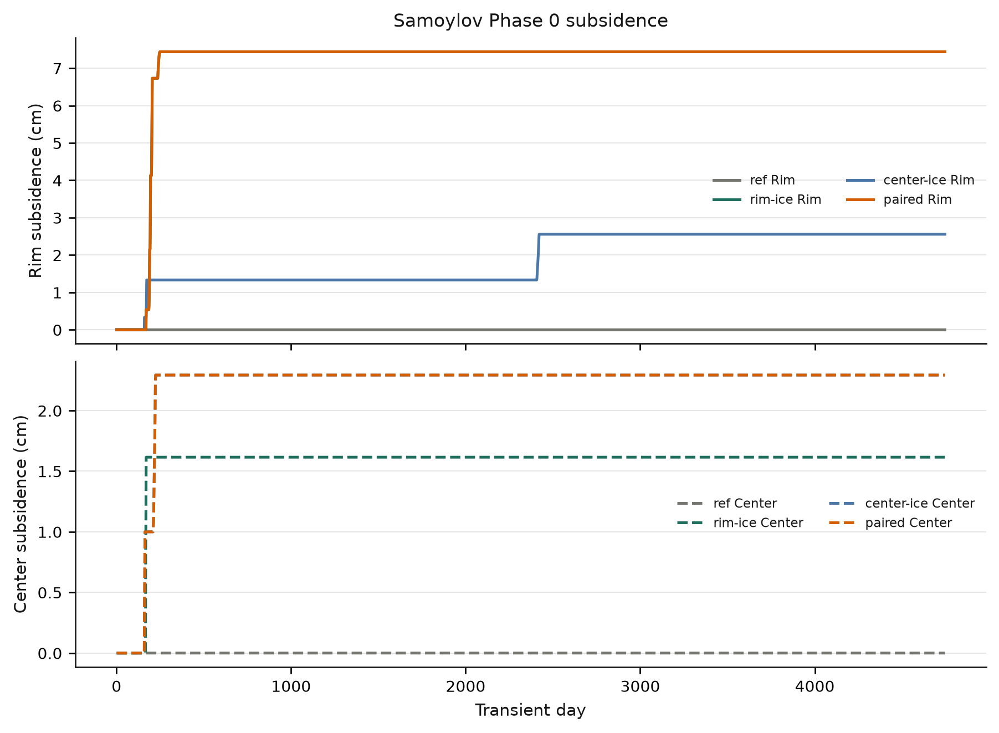

### Phase 0 — paired soil temperature climatology

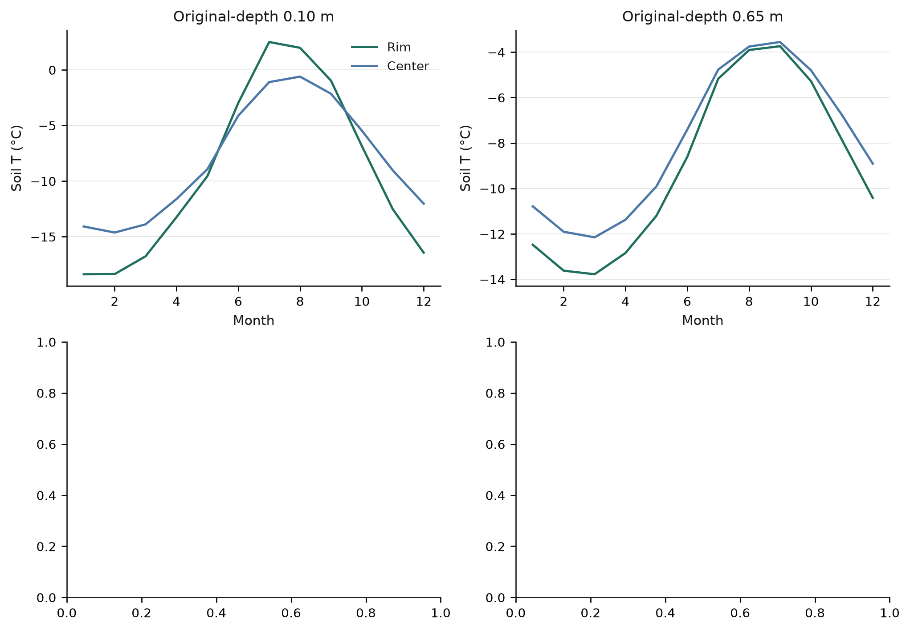

### Phase 0 — paired snow depth climatology

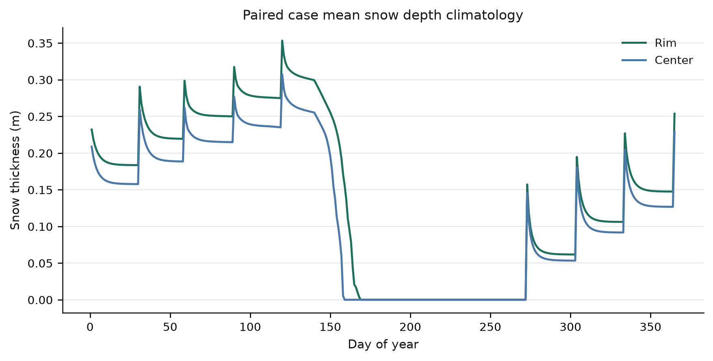

## Phase 1 — paper-depth ice + observation gates

- Spin-up: 1 PR + 30 EQ years
- Transient: 13 TR years
- Forcing: gswp3_boike (236 mm yr⁻¹)
- Ice: Rim {'fraction': 0.3, 'top': 0.25, 'bottom': 2.5}, Center {'fraction': 0.2, 'top': 0.25, 'bottom': 3.0}

### Gates

- Hard: 2/2 passed
- Soft: 2/5 passed

### Soft gate failures

- **Center September ALT**: {"model_m": NaN, "obs_m": 0.49} (criterion: 0.35–0.60 m)
- **Rim September ALT**: {"model_m": 0.04566062592143406, "obs_m": 0.47} (criterion: 0.35–0.85 m)
- **Center end-season snow > Rim**: {"center_m": 0.0, "rim_m": 0.912789524521288, "delta_m": -0.912789524521288} (criterion: Δ > 0.10 m)

## Phase 1 figures

### Phase 1 — soil temperature at 10 cm

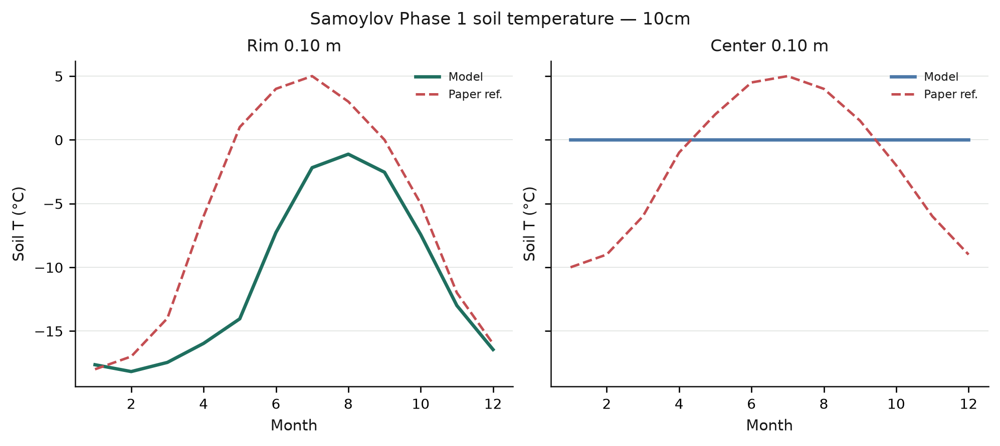

### Phase 1 — soil temperature at 65 cm

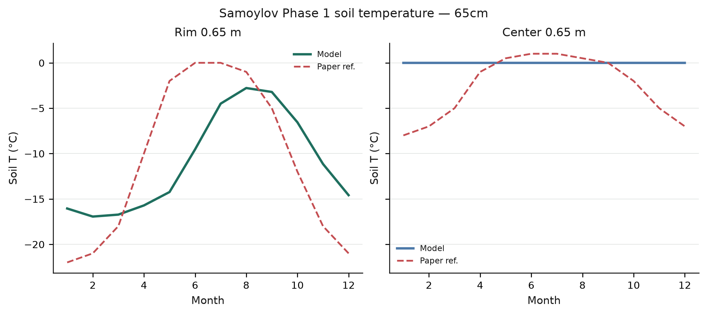

### Phase 1 — snow depth vs paper reference

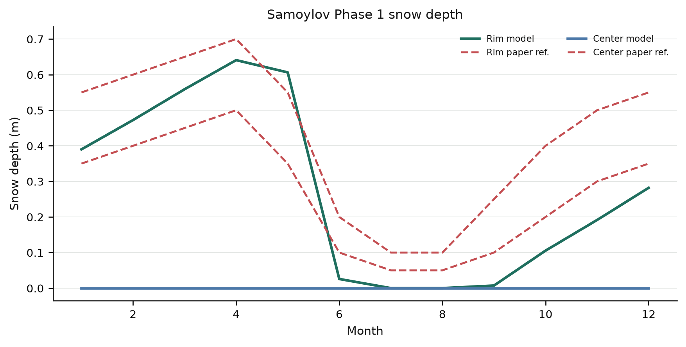

### Phase 1 — subsidence

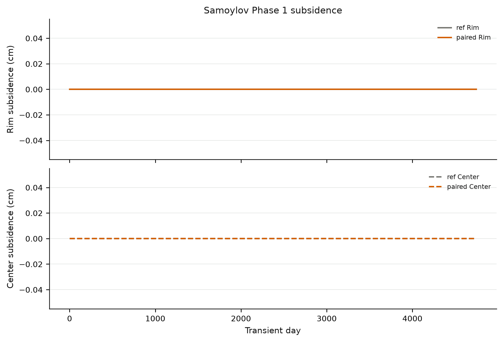

### Phase 1 — September max active layer

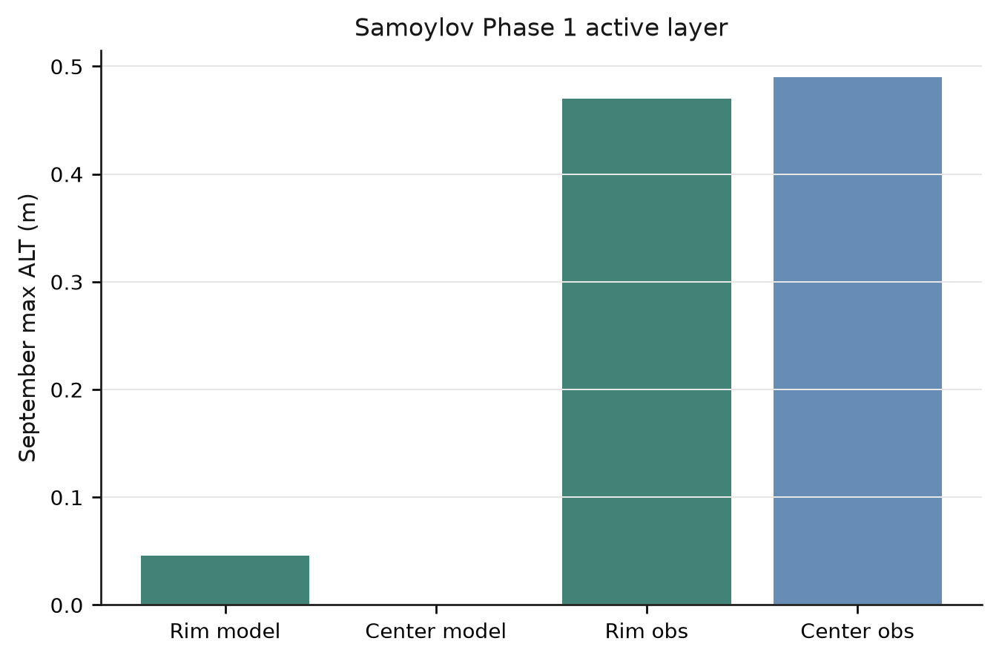

## Phase 2 — century run (1901–2014)

- Mode: full run
- Spin-up: 1 PR + 150 EQ (baseline 1930–1950)
- Transient: 114 TR years
- Forcing: gswp3_boike

### Gates

- Hard: 2/2 passed
- Soft: 0/3 passed

### Soft gate failures

- **century cumulative subsidence (paired)**: {"(0, 0)": 0.0, "(0, 1)": 0.0} (criterion: 0.05–0.50 m on at least one cell)
- **Center ALT deepening since 1901**: {"trend_m": NaN, "target_m": 0.1} (criterion: ≈ 0.10 m (last 20 yr − first 20 yr Sept max))
- **Center summer pond > Rim**: {"delta_m": -1.0986035628779538} (criterion: Center TKPOND > Rim (JJA mean))

## Phase 2 figures

### Phase 2 — century subsidence (1901–2014)

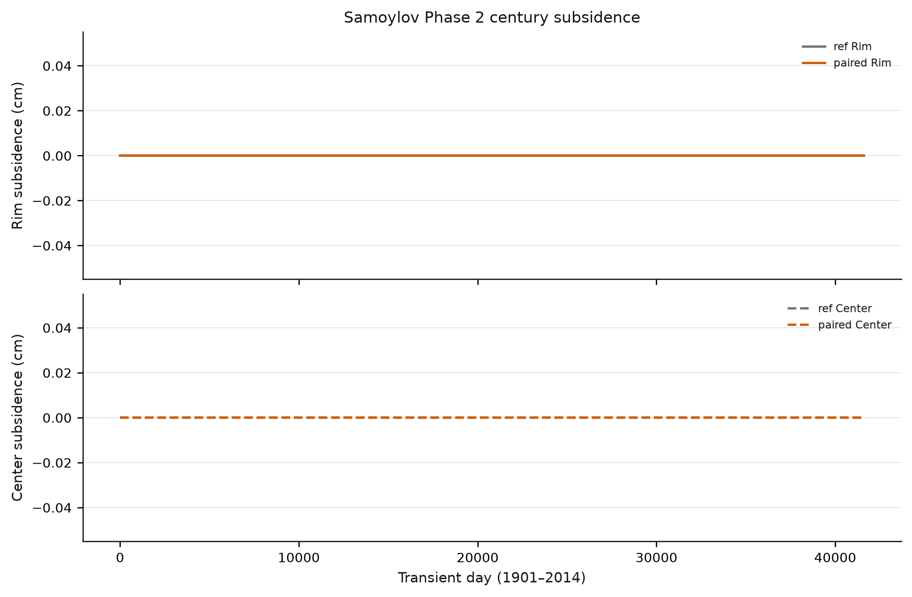

### Phase 2 — active-layer trajectory

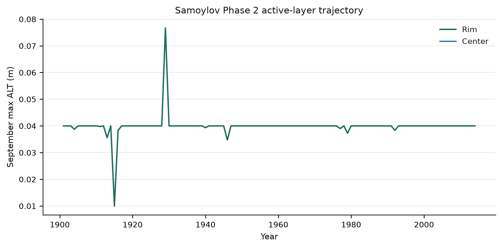

## Hydrology tuning

Five drainage/CMT variants on the paired Rim/Center layout (10 EQ + 13 TR, GSWP3+Boike). Ranking favors Center peak snow and summer pond exceeding Rim; none of the variants achieved the paper snow/pond contrast (Center snow remained 0 m in all runs).

- Recommended variant: **swap_cmt**
- Artifacts: `samoylov_hydrology_tune_results/` (`variant_comparison.csv`, `summary.json`)

## Hydrology tuning figures

### Hydrology tuning — peak snow by drainage/CMT variant

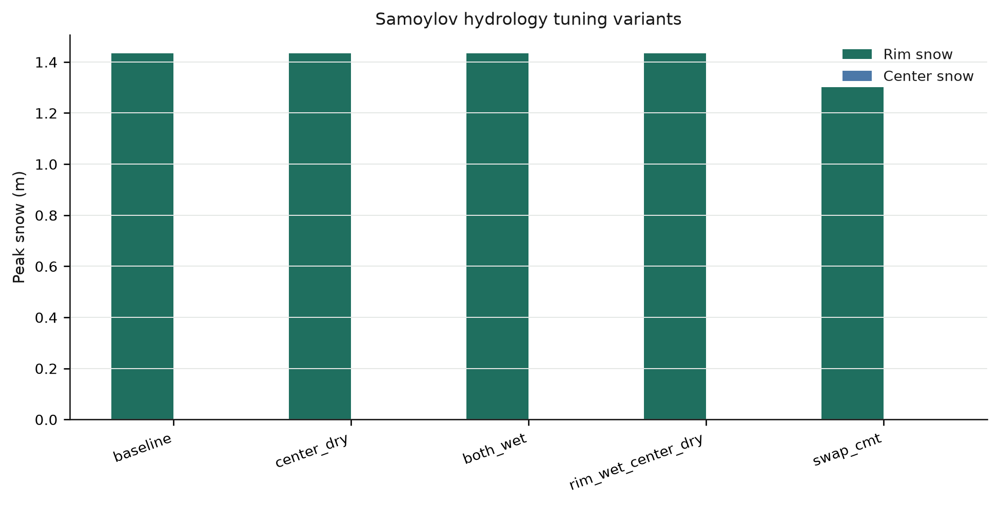

