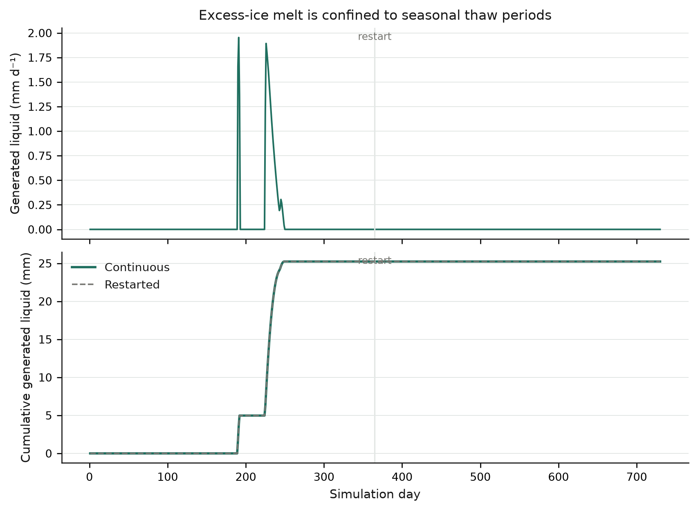
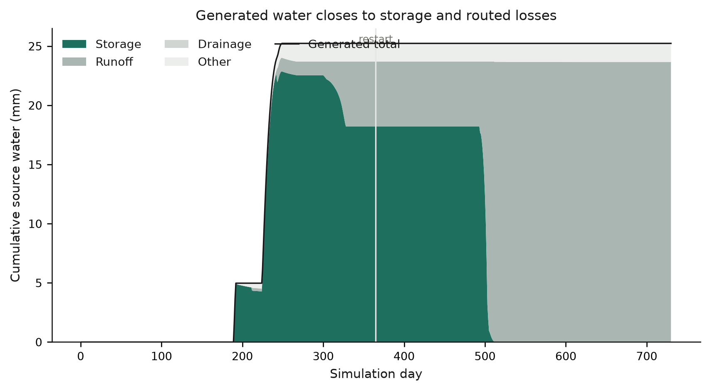
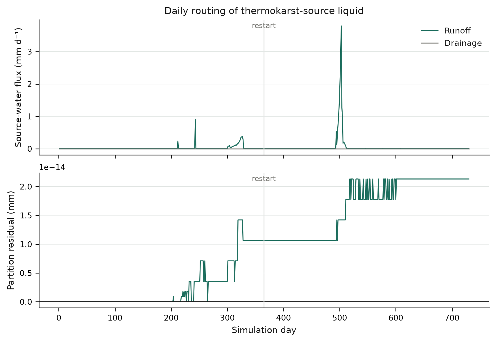
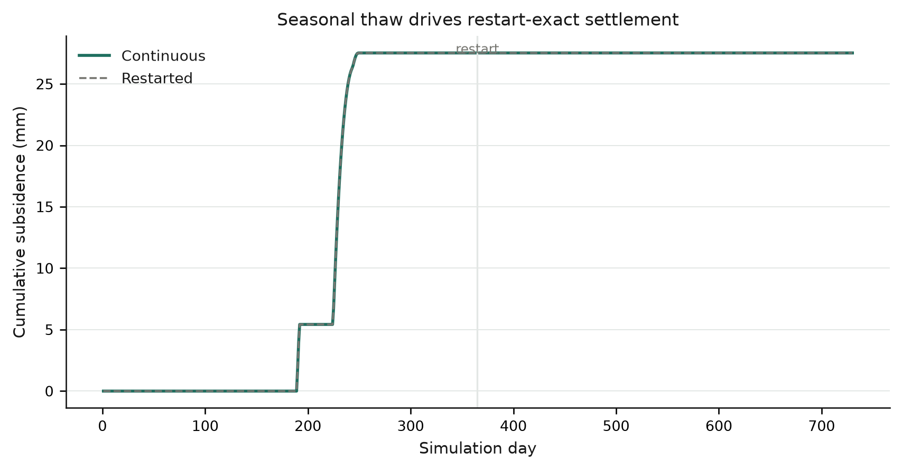
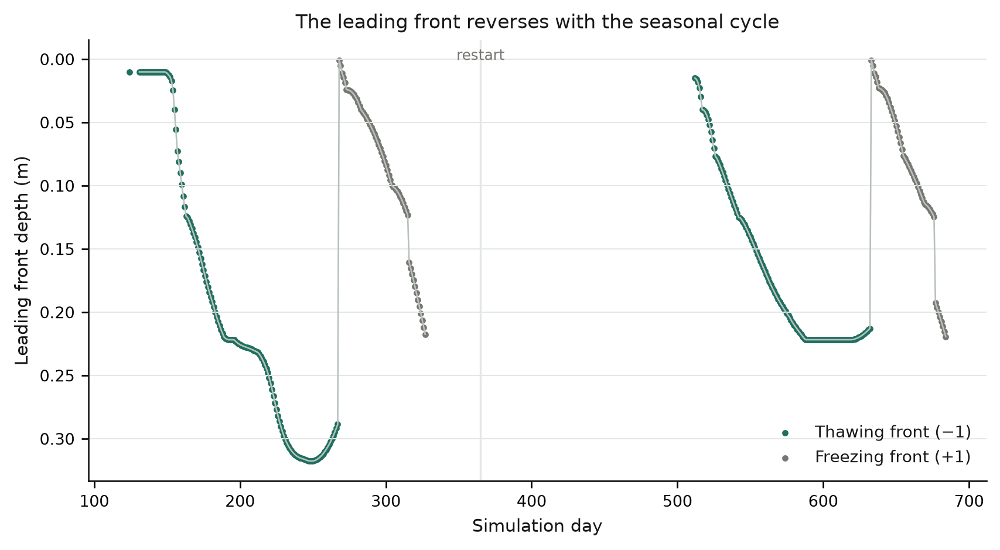

# Seasonal thermokarst production-diagnostic validation

**Date:** 2026-09-16
**Repository:** `/Users/EJafarov/projects/TEM_abrupt_thaw_dev`
**Validation base revision:** `7005df4fd01274ba44ec82d0c083d8789141847f`
**Implementation lineage:** `4129e2b4` (production plumbing), `462de021` (first seasonal harness)
**Branch:** `feature/thermokarst-prototype`

## Executive summary

The daily production diagnostic for thermokarst-source water passed **7 of 7** validation gates under a two-year, exactly periodic seasonal forcing. The diagnostic records excess-ice liquid generation; retained source water; source-water runoff, drainage, and other loss; cumulative subsidence; and leading front depth/type.

The column generated **25.237478 mm** of thermokarst-source water and subsided **27.521787 mm**. Of the generated water, **23.648179 mm** was routed to runoff, **1.578774 mm** to the residual “other” pathway, **0 mm** to drainage, and **0.010526 mm** remained stored. The zero drainage value is a tested outcome for this poorly drained Toolik cell, not a missing output.

The diagnostic partition closed to **2.13×10⁻¹⁴ mm**. Every daily diagnostic value was identical between a continuous two-year run and two one-year runs separated by a production NetCDF restart. A diagnostics-disabled control produced an identical final restart, demonstrating that output and tracer bookkeeping do not alter TEM continuation.

## Implementation

### Production fields

| NetCDF variable | Meaning | Units | Temporal form |
|---|---|---:|---|
| `TKLIQGEN` | Liquid generated by excess-ice loss | mm d⁻¹ | daily increment |
| `TKLIQSTORAGE` | Thermokarst-source water retained in the column | mm | end-of-day state |
| `TKLIQRUNOFF` | Thermokarst-source runoff | mm d⁻¹ | daily increment |
| `TKLIQDRAINAGE` | Thermokarst-source drainage | mm d⁻¹ | daily increment |
| `TKLIQOTHER` | Source water assigned to ET or unresolved water loss | mm d⁻¹ | daily increment |
| `TKSUBSIDENCE` | Cumulative surface settlement | m | end-of-day state |
| `TKFRONT` | Leading phase-change front depth | m | end-of-day state |
| `TKFRONTTYPE` | Leading front type: −1 thawing, +1 freezing | 1 | end-of-day state |

`ThermokarstState` restart version 2 stores cumulative generated water, tracer storage, runoff, drainage, and other loss. Version-1 restart files remain readable: their original ten state values are loaded and the five new counters begin at zero. Pre-feature restart files remain version zero.

### Generation and partition equations

Excess-ice loss produces liquid mass exactly once:

\[
G_t = \max(0, X_{t-1}-X_t), \qquad
\Delta z_t = \frac{G_t}{\rho_i}.
\]

Here (X) is excess-ice mass in kg m⁻², (G) is numerically equal to mm water, and \(\rho_i=917\;\mathrm{kg\,m^{-3}}\). The tracer is bookkeeping only. It does not change phase equilibrium, temperature, Richards flow, runoff decisions, or layer geometry.

The diagnostic uses a documented complete-mixing closure. If \(S_{t-1}\) is retained source water and \(L_t\) is liquid available to daily hydrology, the mobile tracer fraction is

\[
f_t = \frac{\min(S_{t-1}+G_t,L_t)}{L_t},
\]

with (f_t=0) when (L_t=0). Source runoff and drainage are the production fluxes multiplied by (f_t), subject to the available tracer mass. The remaining inferred liquid loss is classified as `TKLIQOTHER`; this includes evapotranspiration and any unresolved daily liquid closure. Retained mass follows

\[
S_t = S_{t-1}+G_t-R_t-D_t-O_t.
\]

Retained tracer remains storage when it refreezes. On later thaw it becomes mobile under the same whole-column mixing assumption. This preserves source-water mass through freeze–thaw reversal without changing the physical water state.

### Code paths

- `src/ThermokarstIntegration.cpp` diagnoses excess-ice mass loss after the energy-consistent phase solve.
- `src/Soil_Env.cpp` partitions the source-water tracer after production runoff, ponding, infiltration, Richards flow, and plant/soil water loss.
- `src/EnvData.cpp` and `include/EnvData.h` retain daily values until NetCDF output.
- `src/Runner.cpp`, `include/OutputHolder.h`, and `config/output_spec.csv` expose the eight standard output variables.
- `src/RestartThermokarst.cpp`, `src/RestartData.cpp`, and `src/Cohort.cpp` persist version-2 counters and load shorter version-1 state vectors safely.

## Validation design

### Forcing and initialization

A one-year frozen seed was produced at −20 °C with zero precipitation and radiation. The two validation years then repeated the same 12 monthly values exactly:

- Air temperature: −20, −18, −12, −4, 4, 10, 12, 8, 2, −5, −12, −18 °C.
- Precipitation: 8, 7, 6, 7, 10, 18, 24, 22, 16, 12, 9, 8 mm month⁻¹.
- Net incoming radiation driver: 0, 2, 6, 12, 18, 22, 20, 14, 8, 3, 0, 0.

Every source climate year contains this same cycle. TEM can therefore restart its stage-relative climate index without selecting a different forcing year.

The test uses one Toolik demonstration grid cell, 20% excess-ice fraction from 0.2–1.0 m, environmental processes enabled, and BGC/dynamic-layer features disabled. Five production cases are compared: frozen seed, continuous two-year run, split first year, resumed second year, and a continuous diagnostics-disabled control.

## Results

### Generated liquid

Melt occurred only during the first summer because the phase front reached and consumed the thermally accessible part of the initialized excess-ice interval. Continuous and restarted cumulative curves overlap exactly.



### Storage, runoff, drainage, and other loss

The stacked components equal cumulative generated water throughout the run. Storage increases during melt, then declines as production hydrology routes the mixed source water. Runoff is the dominant pathway. Drainage remains exactly zero for the selected cell.



The daily routing figure shows runoff timing and the partition residual. The maximum absolute residual is 2.13×10⁻¹⁴ mm.



### Subsidence

Subsidence occurs in the same two melt pulses as `TKLIQGEN` and remains irreversible during winter refreezing. Continuous and resumed values match exactly on all 730 days.



### Moving phase front

The leading front is thawing on 259 diagnostic days and freezing on 112 days. Missing points represent days without an internal phase boundary. The front deepens through summer, reverses during autumn cooling, and repeats the pattern in year two.



## Acceptance results

| Test | Observed | Criterion | Result |
|---|---:|---:|:---:|
| Production completion | five runs at status 100 | all complete | PASS |
| Seasonal excess-ice melt | 25.237478 mm | >0 mm | PASS |
| Freeze–thaw reversal | 259 thawing / 112 freezing front-days | both >0 | PASS |
| Source-water partition closure | 2.13×10⁻¹⁴ mm | ≤1×10⁻⁹ mm | PASS |
| Daily restart equivalence | maximum difference 0 | ≤1×10⁻¹² | PASS |
| Thermokarst physical restart state | exact | exact | PASS |
| Diagnostic passivity | exact final restart | exact | PASS |

The continuous and resumed files differ in the pre-existing `growingttime`, `growingttimeA`, and `vegsnow` fields. The first two are vegetation phenology accumulators outside this mechanism; BGC is disabled in this test. `vegsnow` differs only by 5.55×10⁻¹⁷. All thermokarst, soil temperature/water/phase, front, water-table, and geometry restart fields are exact. This limitation is recorded rather than folded into the thermokarst acceptance gate.

## Regression tests

- Core thermokarst numerical suite: **26/26 passed**.
- NetCDF version-2 round trip: **passed**.
- Pre-feature restart compatibility: **passed**.
- Version-1 short-state restart compatibility: **passed**.
- Seasonal production gates: **7/7 passed**.
- All five SVG plots passed vector preflight and all PNG plots were inspected at final size.

## Reproduction

From `/Users/EJafarov/projects/TEM_abrupt_thaw_dev`:

```console
make thermokarst-test
.venv-thermokarst/bin/python \
  experiments/thermokarst/seasonal_diagnostics_validation.py \
  --binary ./dvmdostem
```

Ignored run products are written to `experiments/thermokarst/seasonal_diagnostics_results/`. Source-controlled evidence includes this report, summary JSON, acceptance CSV, daily diagnostic CSV, and PNG/SVG figures.

## Interpretation and limitations

This milestone validates a deterministic source-water accounting diagnostic, not an isotope or pore-scale transport tracer. The complete-mixing assumption can mobilize stored source water whenever column liquid becomes available; it does not resolve preferential flow, individual layers, lateral flow, or solute transport. `TKLIQOTHER` groups evapotranspiration with any remaining daily liquid loss and should be split further before process attribution studies.

The test confirms daily output, restart persistence, mass closure, and freeze–thaw behavior for one poorly drained Toolik cell. A well-drained cell or parameterized drainage experiment is still needed to exercise a nonzero `TKLIQDRAINAGE` branch. Broader validation should add multiple community types, rain-on-thaw events, and longer runs with BGC and dynamic soil processes enabled.
