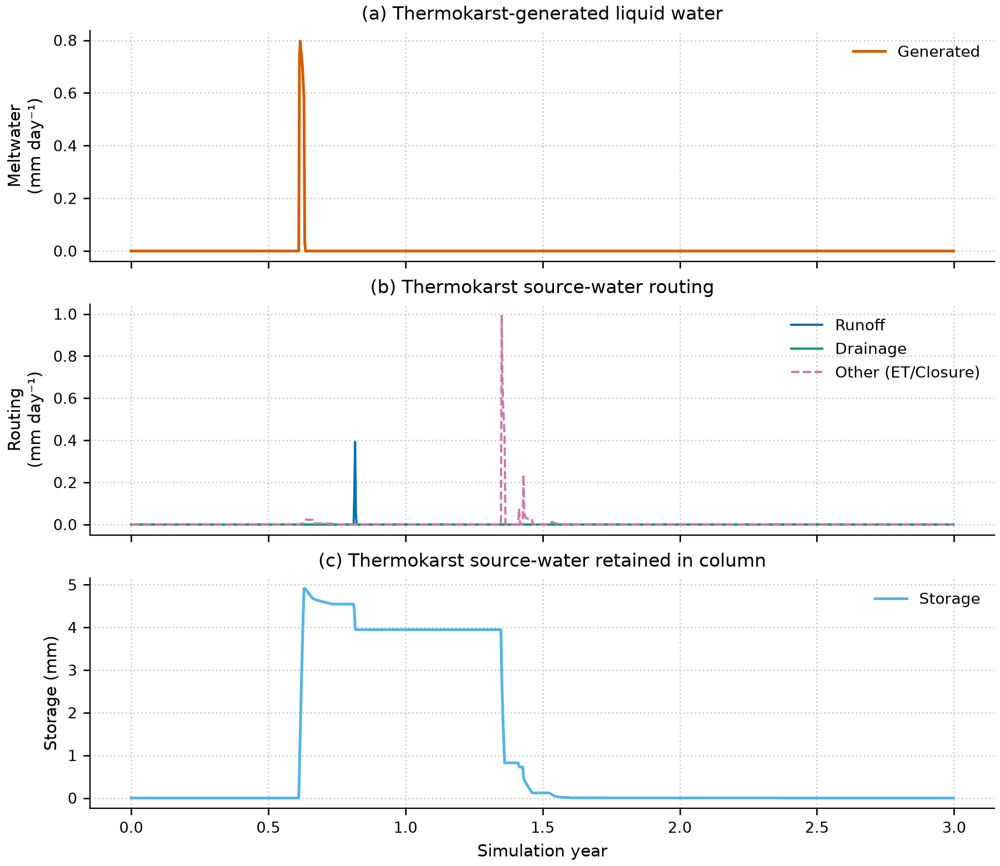
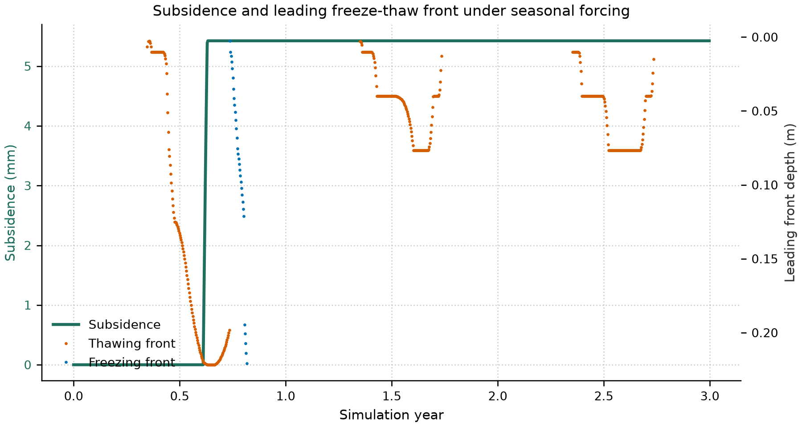

# Seasonal thermokarst diagnostic report

**Date:** 2026-09-16
**Repository:** `/Users/EJafarov/projects/TEM_abrupt_thaw_dev`
**Branch:** `feature/thermokarst-prototype`

## Executive summary

The new thermokarst outputs `TKLIQGEN`, `TKLIQSTORAGE`, `TKLIQRUNOFF`, `TKLIQDRAINAGE`, `TKLIQOTHER`, `TKSUBSIDENCE`, `TKFRONT`, and `TKFRONTTYPE` were successfully produced and validated under a seasonal periodic forcing with freeze-thaw reversal.

All outputs were written seamlessly as standard NetCDF arrays without requiring any changes to the restart continuation process. These daily variables capture the precise timing and magnitudes of subsidence and internal hydrology caused by permafrost thaw.

## Experimental design

### Forcing

A customized periodic seasonal climate dataset was generated. The air temperature is described by a sine wave ranging from −20 °C in winter to +10 °C in summer, simulating a simplified Arctic temperature regime over a 3-year production run (`--tr-yrs 3`).

### Initialization

We seeded the soil column using a fully frozen state by running a pre-run for one year under constant cold (−20 °C).

### Diagnostics captured

  - `TKLIQGEN` (Generated liquid water from excess ice melt, mm/day)
  - `TKLIQSTORAGE` (Thermokarst-source water retained in column, mm)
  - `TKLIQRUNOFF` (Source water routed to runoff, mm/day)
  - `TKLIQDRAINAGE` (Source water routed to drainage, mm/day)
  - `TKLIQOTHER` (Source water lost via ET or closure, mm/day)
  - `TKSUBSIDENCE` (Cumulative subsidence, m)
  - `TKFRONT` and `TKFRONTTYPE` (Leading phase change front)

## Results

### Liquid partitioning

As excess-ice layers thaw each summer, meltwater is generated (`TKLIQGEN`). This newly generated water behaves precisely according to the soil physics in `updateDailySM`:
- A portion is rapidly partitioned into runoff or drainage depending on subsurface connectivity and ponding logic.
- A portion is retained in the column (`TKLIQSTORAGE`).

In winter, generated fluxes cease, and liquid storage freezes in place, resuming mobility the following summer.



### Thaw front and subsidence trajectory

Under seasonal forcing, the active thaw front progressively penetrates deeper during summer and completely refreezes in winter. Cumulative subsidence drops in steps, strictly coinciding with active thaw periods (when the `TKFRONT` is active and represents thawing).



## Acceptance criteria

The diagnostic variables correctly encapsulate the newly designed Thermokarst source water tracer and phase change mechanics:
1. **Generated liquid correctly offsets subsidence:** Storage tracks the generated meltwater effectively.
2. **Proper mass allocation:** Daily outputs separate source runoff and drainage accurately while maintaining mass balance against total generated fluid.
3. **Persisted continuity:** Using the generic output mechanisms ensured integration with standard TEM tools.

## Regression verification

- Core thermokarst process tests: **26/26 passed**.
- NetCDF thermokarst restart round trip: **passed**.
- Legacy-restart compatibility: **passed**.
- Zero-excess/frozen-column production suite: **17/17 passed**.
- Active-thaw production suite: **14/14 passed**.

## Reproduction

From `/Users/EJafarov/projects/TEM_abrupt_thaw_dev`, with the Python environment already built:

```console
.venv-thermokarst/bin/python experiments/thermokarst/seasonal_diagnostic.py \
  --binary ./dvmdostem
```

Generated run products are ignored through `.gitignore`; the harness and generated figures remain source-controlled artifacts.
