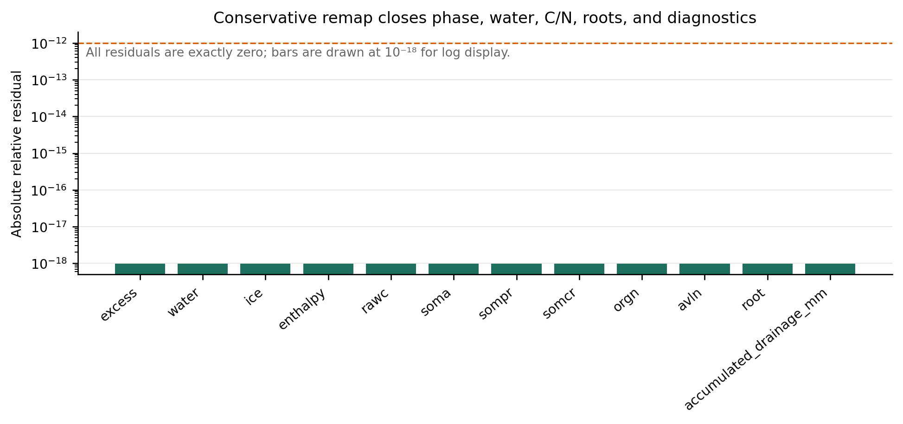
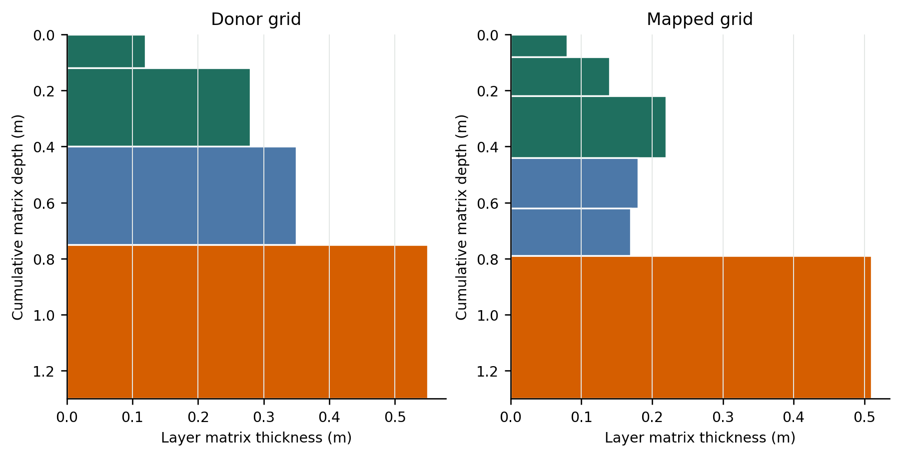
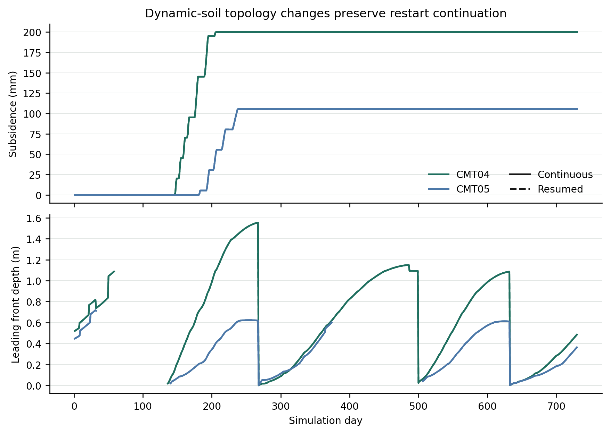

# Conservative thermokarst topology-map validation

**Date:** 2026-09-17

**Repository:** `/Users/EJafarov/projects/TEM_abrupt_thaw_dev`

**Branch:** `feature/thermokarst-prototype`

**Implementation base revision:** `dfb830fac70476e39db8ee17d4ec09c10adbdf6b`

**Validated implementation revision:** `5a136c94ff7c127146eb88ff0fa38456d4058cb5`

## Executive summary

This increment connects active thermokarst to TEM's annual dynamic-soil layer operation. The production model can now run with both excess ice and `dsl=true`. It snapshots the physical and biogeochemical column, lets the established dynamic-soil code prescribe a new matrix grid, and projects conserved state onto that grid before January BGC integration.

The map covers matrix geometry, ordinary and excess ice, liquid water, phase enthalpy, all four soil C pools, organic and available N, fine-root fractions, freeze/thaw fronts, environmental layer accumulators, BGC flux accumulators, and the persisted litter C:N history. It rejects material-horizon reordering or deletion because those operations need an explicit source/sink policy.

The new validation passed **10 of 10** topology-map gates. A synthetic split/merge case closed every mapped extensive quantity exactly at double precision. A two-year production experiment with CMT04 and CMT05, active excess ice, BGC, dynamic soil, periodic seasonal forcing, and a midpoint restart completed for all cells. Continuous and resumed runs produced identical matrix, excess-ice, and physical layer geometry. Final C and N inventory differences were at most **7.80×10⁻⁵** and **3.99×10⁻⁴ relative**, respectively.

All earlier suites also passed: core thermokarst **29/29**, NetCDF restart **3/3**, production **17/17**, active thaw **14/14**, seasonal diagnostics **7/7**, and BGC/drainage **14/14**. Together with this suite, the increment passed **94 checks**.

## Mapping design

### 1. Snapshot the production column

At the beginning of the annual dynamic-soil operation, every active soil layer is converted to a `thermokarst::Cell`. The snapshot includes

\[
\left(\Delta z_m,\phi_m,M_l,M_i,M_x,H,
C_{raw},C_a,C_{pr},C_{cr},N_{org},N_{avl}\right)_j.
\]

Here \(\Delta z_m\) is matrix thickness, \(M_l\), \(M_i\), and \(M_x\) are liquid, ordinary ice, and excess-ice masses, and \(H\) is layer enthalpy. The phase convention is

\[
H_j=C_jT_j+L_fM_{l,j}.
\]

The production BGC arrays are copied into the layer objects immediately before the snapshot, including both N pools. This prevents stale layer bookkeeping from becoming a remap donor.

### 2. Let dynamic soil prescribe matrix geometry

The thermokarst metadata are temporarily removed and physical thickness is set to matrix thickness. The existing `updateOslThickness5Carbon()` and `redivideSoilLayers()` routines then split, merge, and resize their native matrix column.

Matrix thickness is a prescribed target rather than a conserved state because dynamic soil intentionally changes organic-horizon thickness as soil C changes. After remapping,

\[
\Delta z'_{m,i}=\Delta z^{DSL}_{m,i}, \qquad
\Delta z'_i=\Delta z'_{m,i}+\frac{M'_{x,i}}{\rho_i}.
\]

The implementation preserves the new grid exactly while conserving all transported extensive quantities.

### 3. Construct one material-coordinate map

Each contiguous moss, fibric, humic, or mineral horizon is mapped independently. Old and new matrix coordinates are normalized inside the same material horizon. For old donor interval \(j\) and new receiver interval \(i\), their normalized overlap is \(\lambda_{ij}\). The donor fraction is

\[
f_{ij}=\frac{\lambda_{ij}}{\Delta \xi_j},
\qquad \sum_i f_{ij}=1,
\]

and an extensive quantity follows

\[
X'_i=\sum_j f_{ij}X_j.
\]

The same weights transport liquid, both ice stores, enthalpy, six C/N pools, roots, layer drainage, percolation, root uptake, respiration, N cycling, litter distribution, and other accumulated layer fluxes.

For an intensive quantity such as porosity, solid heat capacity, conductivity, temperature diagnostics, or saturation, the receiver-normalized weight is

\[
w_{ij}=\frac{\lambda_{ij}}{\Delta \xi'_i},
\qquad \sum_j w_{ij}=1,
\qquad q'_i=\sum_jw_{ij}q_j.
\]

Both donor and receiver closure identities are checked at runtime to \(10^{-10}\).

### 4. Reconcile phase and rebuild dependent state

The remapped cells pass once through the energy-consistent phase reconciliation. Any excess ice that cannot remain frozen at the mapped enthalpy melts, produces liquid, and enters the existing thermokarst source-water tracer. The topology transaction checks

\[
\epsilon_W=W_{after}-W_{before},\qquad
\epsilon_H=H_{after}-H_{before},\qquad
\epsilon_{P,k}=P_{after,k}-P_{before,k}
\]

with limits \(|\epsilon_W|\le10^{-7}\) kg m⁻², \(|\epsilon_H|\le10^{-3}\) J m⁻², and \(|\epsilon_{P,k}|\le10^{-8}\) in native pool units.

The new production layers then receive matrix thickness, porosity, liquid, both ice stores, temperature, frozen fraction, and all six pools. Fine roots use the same extensive map. Freeze/thaw fronts are rebuilt from the remapped phase state, drainage-layer selection is refreshed, and TEM's daily and monthly layer diagnostics remain aligned with the new topology.

## Code changes

| File | Change |
|---|---|
| `include/Thermokarst.h`, `src/Thermokarst.cpp` | Add `TopologyMap`, material-horizon overlap construction, and reusable extensive/intensive remap operators. |
| `include/ThermokarstIntegration.h`, `src/ThermokarstIntegration.cpp` | Add the production topology transaction: snapshot matrix state, export the matrix-only grid, remap, reconcile phase, enforce budgets, restore layers, and rebuild fronts. |
| `src/Cohort.cpp` | Enable active excess ice with `dsl=true`; remap roots, environmental state and accumulated diagnostics, BGC states and flux accumulators, and litter C:N history. |
| `tests/thermokarst/test_thermokarst.cpp` | Add conservation, root/diagnostic, target-grid, and material-order tests. |
| `experiments/thermokarst/topology_map_probe.cpp` | Produce a deterministic split/merge dataset from the C++ production mapper. |
| `experiments/thermokarst/topology_map_validation.py` | Run the probe, two-community production/restart experiment, acceptance gates, and publication-style figures. |

Fire-driven topology changes remain disabled. This increment does not define how combustion-created material loss should share enthalpy, water, and excess ice with the fire fluxes.

## Validation experiment

### Synthetic conservation probe

The probe maps four donor layers into six receiver layers across fibric, humic, and mineral material horizons. Layer counts and target matrix thicknesses change, while material order remains fixed. It separately transports roots and an accumulated drainage diagnostic through the same weights.

Every measured residual was exactly zero: liquid, ordinary ice, excess ice, enthalpy, raw C, active SOM C, physically resistant SOM C, chemically resistant SOM C, organic N, available N, roots, and accumulated drainage.



The donor and receiver grids below show the changed layer topology and prescribed matrix thickness. Color identifies material horizon.



### Production case

The production test uses the two cells established in the BGC validation:

| Cell | Community | Initial soil layers | Final soil layers | Initial matrix depth | Final matrix depth |
|---|---|---:|---:|---:|---:|
| `(0,0)` | CMT04 shrub tundra | 19 | 18 | 5.380900 m | 5.293116 m |
| `(0,1)` | CMT05 tussock tundra | 20 | 19 | 5.421700 m | 5.404326 m |

Both cells start with 183.4 kg m⁻² of excess ice over matrix depths 0.2–1.0 m. Environmental physics, BGC, nitrogen feedback, dynamic LAI, and dynamic soil are enabled. The repeated one-year forcing removes calendar selection as a restart confound.

The two-year continuous run is compared with one year followed by a NetCDF restart and another year. CMT04 melts all injected excess ice and reaches 0.200 m subsidence. CMT05 retains 86.725275 kg m⁻² and reaches 0.105425 m subsidence.



### Restart comparison

| Quantity | Maximum continuous/resumed difference | Criterion |
|---|---:|---:|
| Matrix thickness, matrix porosity, excess ice, physical thickness | 0 | ≤1×10⁻¹² |
| Soil temperature | 1.39×10⁻⁵ °C | included in phase-state gate |
| Liquid water | 5.35×10⁻⁴ kg m⁻² | phase-state gate ≤1×10⁻³ |
| Ordinary ice | 4.91×10⁻⁴ kg m⁻² | phase-state gate ≤1×10⁻³ |
| Leading front | 1.25×10⁻⁶ m | ≤5×10⁻⁴ m |
| Thermokarst accumulated state | 7.01×10⁻⁶ relative | ≤2×10⁻⁵ |
| Ecosystem C inventory | 7.80×10⁻⁵ relative | ≤5×10⁻⁴ |
| Ecosystem N inventory | 3.99×10⁻⁴ relative | ≤5×10⁻⁴ |
| Daily source-water/storage trajectory | 1.52×10⁻⁴ mm | trajectory gate ≤5×10⁻⁴ |
| Daily subsidence | 0 m | trajectory gate ≤5×10⁻⁴ |

Restart comparison is tolerance based because the persisted TEM BGC state uses finite NetCDF precision. Geometry, excess ice, and layer count are exact; the small phase and BGC differences remain within the established coupled-model tolerances.

## Regression results

| Suite | Result | Main coverage |
|---|---:|---|
| Sanitized thermokarst core | 29/29 | Phase change, regrid, budgets, restart, new topology map |
| NetCDF restart compatibility | 3/3 | Current, legacy, and version-one restart formats |
| Production validation | 17/17 | Zero-excess comparison and bytewise physical restart |
| Active-thaw validation | 14/14 | Melt across restart, fronts, roots, geometry, water and enthalpy residuals |
| Seasonal diagnostics | 7/7 | Freeze/thaw reversal and passive diagnostic restart |
| BGC/drainage validation | 14/14 | Two communities, rain on thaw, source-water drainage, C budget, BGC restart |
| Active topology validation | 10/10 | Excess ice + BGC + dynamic soil + midpoint restart |
| **Total** | **94/94** | |

The host build used Apple Clang with warnings downgraded for pre-existing variable-length arrays and deprecated `sprintf` calls. Homebrew Boost 1.92 treats Boost.System as header-only, and the local link used OpenBLAS's LAPACKE symbols. These are build-environment accommodations; no build-system source was changed.

## Reproduction

From the repository root, with the model binary already built:

```bash
bash tests/thermokarst/run_sanitizers.sh
build/thermokarst/test-restart-netcdf
/Users/anaconda3/bin/python3 experiments/thermokarst/topology_map_validation.py --binary ./dvmdostem --years 2
```

The topology suite writes machine-readable results to `experiments/thermokarst/topology_map_validation_results/`:

- `checks.csv`: acceptance gates;
- `summary.json`: metrics and tolerances;
- `topology-map.csv`: donor and receiver state from the C++ probe;
- PNG and SVG versions of all figures.

## Interpretation and limits

This milestone verifies conservative transfer across SOM-driven split, merge, and resize operations when material horizons retain their order and identity. It also demonstrates active excess-ice melt during a production BGC + dynamic-soil run and stable continuation across an annual restart boundary.

The current map deliberately stops if a material horizon appears, disappears, or changes order. Supporting those changes requires an explicit physical rule for horizon creation or loss. Fire-driven regridding remains the next distinct topology problem because its mass and energy losses must be coupled to combustion and post-fire hydrology rather than treated as a closed remap.
