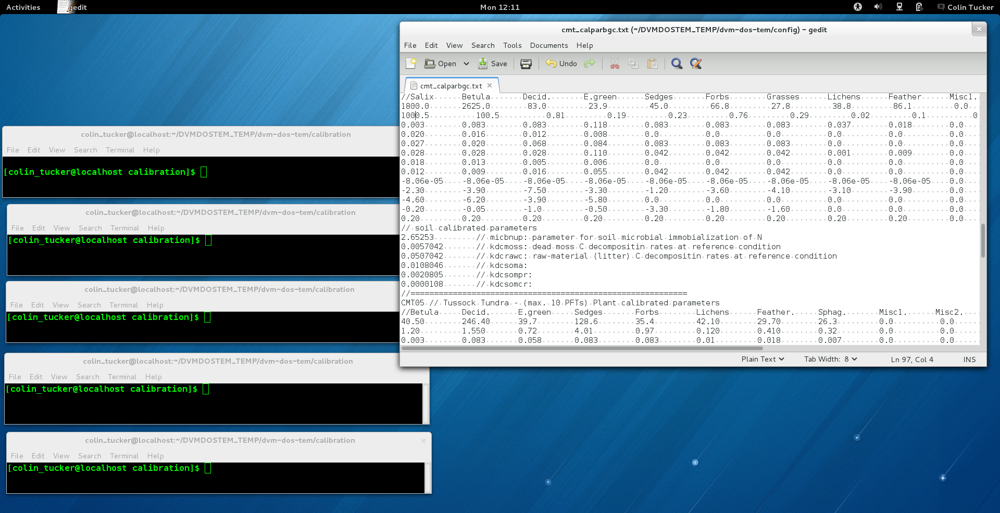
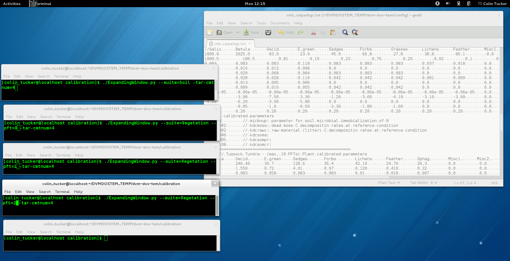
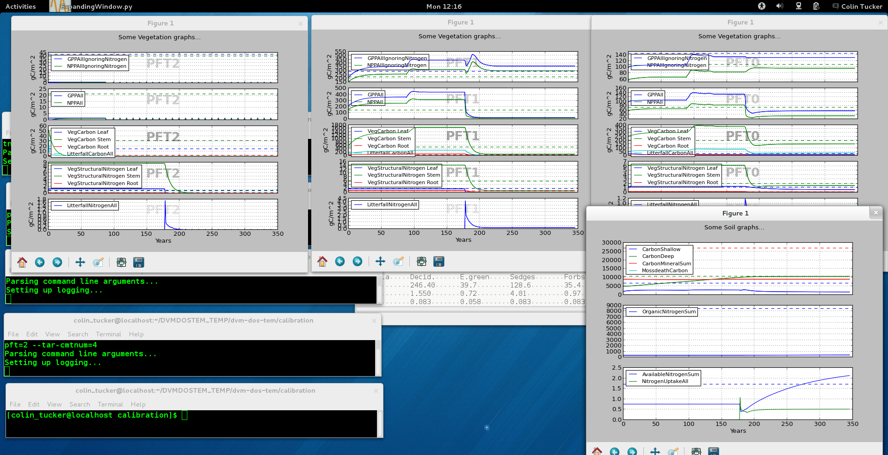
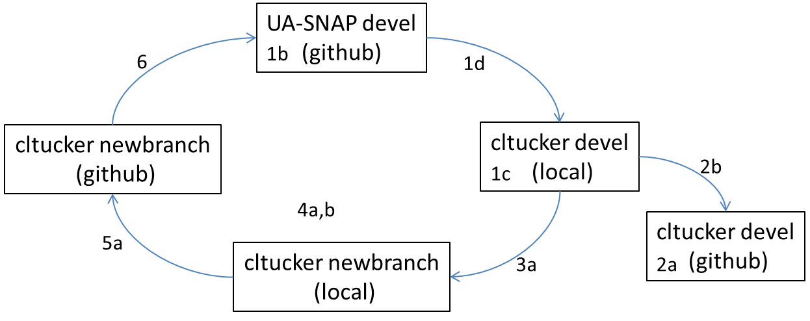

# Using the DVM-DOS-TEM calibrator

> NOTE: As of 09/19/2016, this document could use substantial revision to
incorporate our use of PEST.

In general, here are the steps:

1. Get the latest version from github.
2. Install correct software (matplotlib, jsoncpp, readline, other?).
3. Compile the source code.
4. Set up all of the parameter and config files.
5. Set up all of the input `.nc` files (climate, soil, fire, veg map, etc)
6. Set up the correct target values.
6. Run the model in calibration mode while running the plotting script in 
multiple other windows.

# Details for above steps

## Get the lastest version from github.
  - `cd ~/dvm-dos-tem`
  - `git remote add upstream git@github.com:ua-snap/dvm-dos-tem`
  - (first time) `git checkout –b devel upstream/devel`
  
  or 
  
  - (subsequently) `git pull –ff-only upstream devel`

## Install the correct software (matplotlib, jsoncpp, readline, other?).
The calibration viewer(s) requires some additional Python tools beyond what 
the model itself requires. See the `booststrap-system.sh` for details.

## Compile the source code.
You may need to make some minor edits to the Makefile or SConstruct, and or 
set some environment variables.

### Set up environment variables for your local machine

1. Look thru the scripts in the `env-setup-scripts` folder and see if one of 
the existing scripts might work for you or provide a starting point to create 
your own custon setup script. For relatively "clean" installations of Fedora, 
and Ubuntu, it should be possible to just set a few environment variables. Here 
is an example for Fedora from Colin:

    ~~~
    echo "Setting up site specific includes..."
    export SITE_SPECIFIC_INCLUDES="-I/home/colin_tucker/boost_1_55_0 -I/usr/include/jsoncpp"
    echo "Setting up site specific libs..."
    export SITE_SPECIFIC_LIBS="-L/home/colin_tucker/boost_1_55_0/stage/lib -L/user/lib64"
    echo "Setting the path for loading libraries..."
    export LD_LIBRARY_PATH="/usr/lib64:/home/colin_tucker/boost_1_55_0/stage/lib:$LD_LIBRARY_PATH" 
    ~~~
   
For other systems, the setup may be more complicated and may require a less 
straightforward setup script.

2. Run (actually source) your setup script:

  ~~~
  source setup-env-for-ctucker-Fedora19.sh
  ~~~

  > NOTE: This needs to be run each time you start a new terminal window! To
  avoid having to run the "environment setup script", you can add the commands
  to your `~/.bashrc` or similar file.

## Set up all of the parameter and config files.

You must set up all of the parameter files before working with the calibrator: 
the ecosystem will crash with some of the default values.

1. Eventually there will be default parameter values for each of the community 
types in the Alaska Integrated Ecosystem Model on github. These values still 
need to be setup for some of the ecosytem types; presently the values in the
various parameter files are mostly placeholders! 
> NOTE: PLEASE don’t push your local edits of these files to github, unless you 
are really sure you should be. It is tedious to track these changes down. 
> Non-AIEM communities should be stored in your own repository (fork???).

2. All the files in the `parameters/` directory have blocks of values 
that are labled with a "Community Type Code". The key for the AIEM project is 
shown here:

    ~~~
    0 = blank
    1 = black spruce forest
    2 = white spruce forest
    3 = boreal deciduous forest
    4 = shrub tundra
    5 = tussock tundra
    6 = wet sedge tundra
    7 = heath tundra
    8 = maritime forest
    ~~~
    
3. Setup configuration settings in the `config/` directory.

## Set up all of the input netcdf files (climate, soil, fire, veg map, etc)

Run the `scripts/create_region_input.py` script to create a dataset for the 
area (community type?) you'd like to calibratte.

1. You will need to know the site you are calibrating to, because you will need 
to extract the grid, cohort and climate ids for that site.

2. This will allow you to pull the correct data from the full regional netcdf 
files, without having to reformat all the files each time. As of 9/22/15
this process is not completely automatic and requires some thought and 
double checking to make sure you are getting the dataset you have in mind.

## Set up the target values

1. For now, the target values are being read from `calibration_targets.py`. 

2. Eventually we probably need to be reading these from text file or 
spreadsheets rather than having python tables.
> NOTE: There is a start at a function in `calibration_targets.py` that can 
write Excel workbooks. 

## Run the model in calibration mode

1. The calibrator relies on having multiple terminals open while running the 
model, one for each suite of outputs, each pft being observed.  These can be 
opened and closed at what ever time and all prior data for the current run will 
be plotted.

2. The command line arguments are very well documented, just use the `-–help` 
flag to see a menu.

3. The default module settings should be as follows:
  - 1st 100 years – env module only
  - Press continue
  - env and bgc modules only

  The dvm, dsb and nfeed/avln modules can be turned on dynamically as calibration proceeds.

4. The calibrated parameter file (calparbgc) is manipulated directly during 
the calibration process.  Save yourself a headache by saving a master copy, and 
then saving a descriptively named copy at key steps in the calibration process.

### Example: Calibrating shrub tundra with no disturbance.

1. Open several terminals, 1 for each pft, 1 for soil, 1 for running the model. 
Also open cmt_calparbgc.txt

2. Start the python plotting script for each pft and soil in separate terminals. 
Use `./calibration-viewer.py --help` for menu.

3. Start the model. Remember to use `-–cal-mode`

    ~~~
    (devel)$ ./dvmdostem --cal-mode --log-level note -p 100 -m 10000 
    ~~~
    
4. Pause the mode with `CTRL+c`; Press ‘c’ to continue at the `Enter command>` 
prompt.

5. It is good at this point to press crtl+C (pause) right away to check the all 
the settings are correct. 
  - `print module settings` will show which modules are on or off.
  - `print calparbgc` will show the current values of the calibrated parameters.
  - `help` will explain everything.

6. Calibrate Cmax and Krb as described elsewhere.  This can be done coarsely at 
first for all pfts. 
  - To calibrate, pause the model using `crtl+c`
  - edit the parameters in cmt_calparbgc.txt, save the file
  - press `r` (reload) in the model terminal
  - press `c` (continue) in the model terminal

7. Turn dvm on, calibrate cmax and krb more precisely.
8. Increase Nuptake higher than you expect it to be.
9. Turn nfeed on and avln on.
10. Calibrate N cycle.

-------------------------

# MORE OLD NOTES

2. Push this version into *your* fork on github.
  - (a) `git remote add origin git@github.com:my-github-username/dvm-dos-tem`
  - (b) `git push origin devel`

3. IF you plan to make any edits to the code that you want to save on github, CREATE A NEW BRANCH:
  - (a) `git checkout –b my-new-branch-descriptive-title`

4. After making edits, save (commit) them locally:
  - (a) `git add path/to/files/*  # you can specify one or many files` 
  - (b) `git commit –m “message saying what these commits do."`

5. Push these commits to your personal github repository (fork).
  - (a) `git push origin my-new-branch-descriptive-title`

6. If your changes are awesome and should be shared, issue a pull request into UA-SNAP devel. From there the process for testing and acceptance is a little fuzzy.

## Images for above steps

Overview:

Step 1:

Step 2a:

Step 2b:

Step 3a:

Step 3b:

